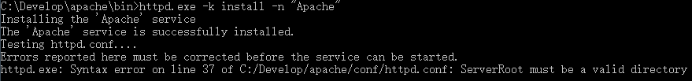
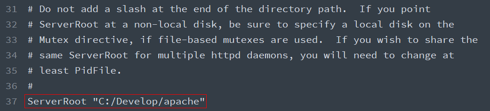
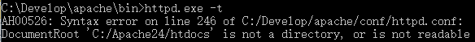
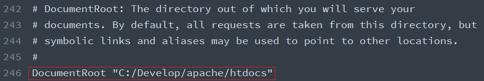
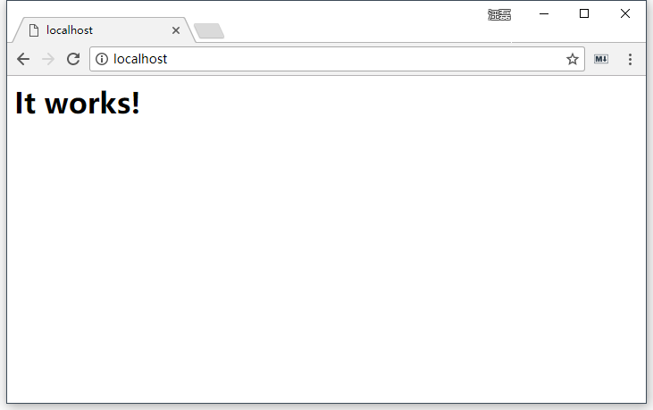
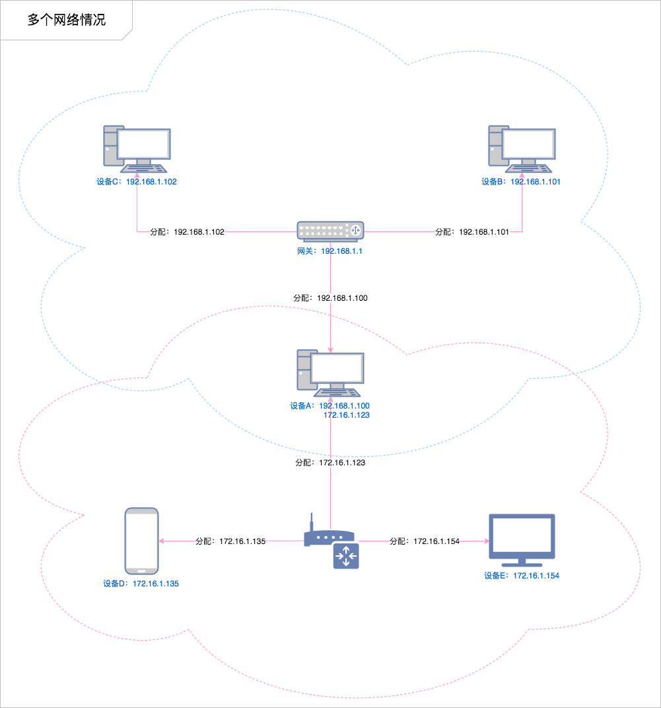
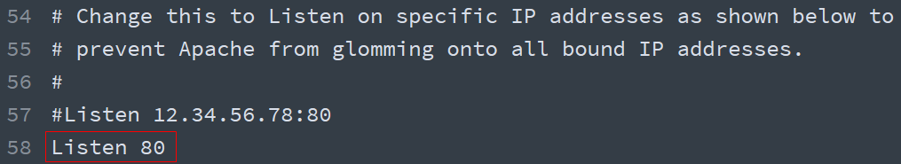
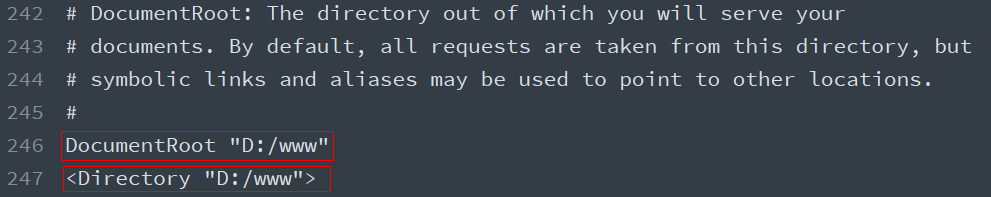
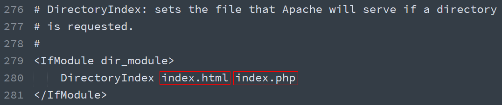
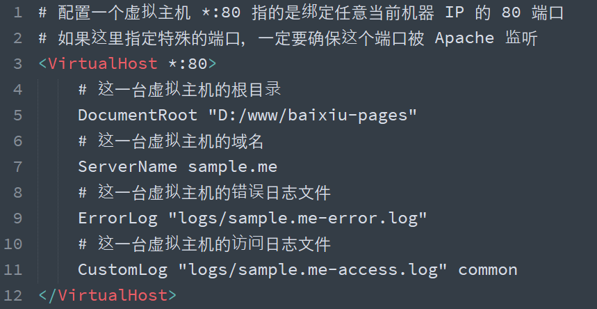

# 第1章 服务端开发基础

## 在浏览器输入一个地址到看到网站内容经历了什么

1. 用户在浏览器地址栏中输入网站域名
2. 浏览器拿到该域名自动去请求 **DNS服务器查询** 用户输入的域名对应的 `ip` 地址
3. 浏览器拿到 `ip` 地址之后，通过ip地址+端口号（HTTP默认80）和服务器建立连接（通过 **三次握手** ）
4. 三次握手建立连接成功之后
5. 浏览器将用户输入的 `url` 地址通过 `HTTP` 协议包装成 **请求报文** ，然后通过 `Socket（服务器ip地址和端口号）` 发送到服务器
6. 当HTTP服务器接收到客户端浏览器发送过来的请求报文时候，按照 `HTTP` 协议将请求报文解析出来
7. 然后服务器拿到请求报文中的请求信息（例如请求路径url），做相应的业务逻辑处理操作
8. 当业务逻辑处理完毕之后，服务器将要发送给客户端的数据按照 `HTTP` 协议包装成 **响应报文**
9. 然后服务器将响应报文数据发送给客户端浏览器
10. 当浏览器接收到服务器发送给自己的响应报文数据的时候，浏览器根据 `HTTP` 协议将报文内容解析出来
11. 浏览器拿到响应报文体中的数据开始 **解析渲染html、css，执行 JavaScript**
12. 如果在解析的过程（从上到下）中，发现有外链的标签（link、css、img）
13. 浏览器会自动对该标签指向的 路径地址 发起新的请求，同上。

## 命令行基础

> 图形用户界面让简单的任务更容易完成，而命令行界面 使完成复杂的任务成为可能


当使用图形用户界面时，我们需要另一个和 shell 交互的叫做终端仿真器的程序。 在 Windows 上，一般使用操作系统自带的 `cmd` 或者 `powershell`。 在 Linux 上，如果是图形用户界面，那么可以使用 `terminal` 或者 `konsole`、`gnome-terminal`之类 的终端仿真器，但基本上，它们都完成同样的事情，让我们能访问 shell， 你可能会因为附加的一些花俏功能而喜欢上某个终端。


关于名字，如果有人提到：控制台、终端、bash、shell、terminal 等，一般都是指上面这些。


打开命令行

- 方式一：开始菜单搜索 `cmd`
- 方式二：`win` + `r` 输入 `cmd`

常用命令

- pwd（print working directory）
- cd（change directory）
  - 切换到指定路径（相对路径或绝对路径）
- ls（list files）
  - `ls` 列出当前目录文件
  - `ls 目录路径` 列出指定路径文件
  - `ls -a` 列出文件并显示隐藏文件或目录
- cp（copy）
  - `cp 源路径 目标路径`
  - cp 在复制目录的时候，不会复制里面的子文件或子目录
  - -r （recursive）递归复制
- mv（move）：移动文件或者目录，还可以重命名文件或目录
- mkdir（make directory）：创建目录
- rm（remove）：删除文件或目录
  - -rf 递归删除：直接将整个目录包括里面的内容都删掉
- rmdir 目录名称
  - 只能删除空目录
- clear：清屏
- touch 文件名
  - 根据文件名创建新的文件
- cat 文件名
  - 查看指定的文本文件

```bash
# print working directory 打印当前工作目录
pwd

# change directory 切换目录
cd

# 回到上一级目录
cd ..

# directory 列出当前目录列表
dir

# 列出指定路径的目录列表
dir 目录路径

# copy 拷贝
cp 源 目标

# list files 列出目录列表
# 同 dir，仅适用于类 Unix 操作系统
ls

# 创建目录
mkdir

# 删除文件
remove

# 清屏
clear
```

退出命令行

- 直接关闭即可
- 或者输入 `exit` 也可以退出


命令行练习

```
1. 在桌面下创建一个叫做 `itcast` 的目录
2. 在 itcast 目录下，分别创建 `dir1` 和 `dir2` 两个子目录
3. 复制 `code/scripts/main.js` 文件到 `itcast` 目录中
4. 复制 `code` 目录下的 `js` 目录到 `itcast` 目录中
5. 将 `itcast/main.js` 文件重命名为 `main-main.js`
6. 将 `main-main.js` 文件移动到 dir1 中
7. 将 `dir1` 中的 `main-main.js` 文件移动到 dir2 中
8. 将 `itcast/js` 目录删除
```

以后多使用，就会越用越熟。

## 建立你的第一个网站（目标）

> **前端开发**最终还是属于**Web 开发**中的一个分支，想要成为一名合格的前端开发人员，就必须要**充分理解 Web 的概念**。

构建一个专业的网站是一项巨大的工作！对于新手我们应该从小事做起，也就是说咱们不可能立马就要求自己能够开发出跟淘宝一样的电商平台，但是对咱们来说建立一个属于自己的 Blog 网站并不难（其实再大的系统也是由一些基础功能叠加出来的），所以咱们就从这个话题开始聊。

## 如何建立一个 Blog 网站

> 提问：到底什么是网站？
>
> - 可以在浏览器上通过一个地址直接访问使用
> - 用于提供一种（或多种）特定服务的一系列具备相关性的网页组合的整体
> - 例如：博客、门户、电商、在线教育等

有了明确的目标过后，我们需要规划具体的业务方案，学习特定的技能，完成各项功能，解决各种过程中出现的问题。

### 之前学习了什么？

在之前的学习过程中，我们很专注，没有关心这些东西在整体中是什么角色，起到什么作用。这里我们是时候总结一下我们之前学过了的内容：

- 网页开发技术（硬性）
  - HTML —— 网页内容结构（GUI）
  - CSS —— 网页外观样式（GUI）
  - JavaScript —— 编程语言，可以用于调用浏览器提供的 API
  - Web APIs —— 网页交互（业务功能）DOM BOM
  - jQuery —— 糖果而已，不是必要的
- 编程能力 / 编程思想 / 解决问题的思路（软性）
  - 我要做什么（我要得到什么），我目前有什么（我能拿到什么）

至此，我们已经可以独立完成网页开发了，具体能完成的东西就是一个一个的网页，而且还能给这个页面加上一些动态的交互。但是这距离成为一个网站还有一些路要走。

```flow
webpage=>operation: 网页开发
website=>operation: 网站开发
application=>operation: 应用开发

webpage(right)->website(right)->application
```

### 还需要学习什么？

想要完成完整的 Web 网站，还需要学习什么？

- 搭建 WEB 服务器
- HTTP（浏览器与服务端的通讯协议）
- 服务端开发（动态网页技术）
- 数据库操作
- AJAX（浏览器与服务端的数据交互方式）

## 搭建 Web 服务器

> - 服务器（提供服务）指的就是一台**安装特定的软件的公共计算机**，用于专门用于提供特定的服务。
>   - 按照服务类型的不同，又划分为：Web 服务器、数据库服务器、文件服务器等等。
> - 客户端（使用服务）指的是在一次服务过程中使用这个服务的设备（网络端点）。
>   - 目前咱们最常见的客户端就是浏览器

本地静态网页，如果想要成为一个网站，首先要完成的第一件事就是有一台公共的 Web 服务器，把这一系列的页面放到这台 Web 服务器上，让用户可以通过服务器的地址访问到这些网页。


> 提问：为什么不放在我们自己电脑上呢？

那么，哪里有这样的服务器呢？

我们手头上的电脑都可以是一台服务器，因为服务器是一个相对的概念，只要能提供服务就可以是一个服务器（提供服务的时候就是服务端，使用服务的时候就是客户端）。

既然服务器就是安装特定的软件的计算机，那么要让自己的成为 Web 服务器就是要安装一个 Web 服务器软件。

### Web 服务器软件

- Nginx ········································ 反向代理
- Apache ····································· PHP
- IIS ·············································· ASP.NET
- Tomcat  ····································· Java

### 安装 Web 服务器软件

这里我们选择一个比较常用的 Web 服务器软件：Apache HTTP Server。

> 如果使用的是安装版，与其他软件相同，安装无外乎就是一路点下一步，只是需要注意安装目录路径中不要有中文。

由于最新的 Apache 已经不提供 Windows 的安装版本了，所以我们这里使用的是解压版。

> - 下载地址：https://www.apachelounge.com/download/
> - 使用说明：https://httpd.apache.org/docs/current/platform/windows.html

安装方式如下，先解压到纯英文路径的文件夹，然后执行以下命令：

```shell
# 注意：需要使用管理员身份运行命令行！！！
# 切换到 Apache 解压路径中的 bin 目录
$ cd <解压目录>/bin
# 安装 Apache 服务，-n 参数是指定服务名称
$ httpd.exe -k install -n "Apache"
# 如果需要卸载 Apache，可以执行以下命令
$ httpd.exe -k uninstall -n "Apache"
```

执行安装命令过后会报一个错，原因是默认的配置文件有问题，需要先调整一下配置文件 `conf/httpd.conf`，才能正常启动服务。



找到 Apache 解压目录中的 conf 目录下的 httpd.conf 文件，定位到 37 行，将 `c:/Apache24` 改为解压目录，我这里解压到路径是 `C:/Develop/apache`，所以我这里修改



修改完以后，执行以下命令重新测试配置文件是否通过。

```shell
$ httpd.exe -t
```

这里任然报错：



通过错误信息得知，这里是因为另外一个地方配置的目录不存在导致的，所以接着调整 246 行的 `DocumentRoot` 选项：



随即，我们发现这个配置文件中有很多默认配置选项中的路径都是 `c:/Apache24`，所以我们批量都修改为我们解压的目录路径。

然后重新执行 `httpd.exe -t` 测试配置文件，这时候应该提示 `Syntax OK`。

> 如果有关于 `ServerName` 的警告提示，不用管它，暂时还不会影响我们接下来的使用和操作。

接着运行以下命令重新启动 Apache 服务：

```shell
# 注意：需要使用管理员身份运行命令行！！！
$ httpd.exe -k start -n "Apache"
# 重新启动 Apache 服务
$ httpd.exe -k restart -n "Apache"
# 停止 Apache 服务
$ httpd.exe -k stop -n "Apache"
```

回到浏览器中，地址栏输入：http://localhost/，回车访问，这时正常应该看到 `It works!`



### 提供 Web 服务

启动 Apache，让别人可以使用你机器上安装的 Apache 提供的 Web 服务，访问你机器上的网站。**这种情况下你的机器就是服务器，别人的机器就是客户端**。

**注意**：

- 确保配置文件语法检查通过
- 确保 `80` 端口没有被其他程序占用
- 确保防火墙允许 `80` 端口的请求，或者干脆关掉防火墙
- 如果出现 **Forbidden** 情况，确保配置文件 `httpd.conf` 中 247 行（`DocumentRoot` 之后）的 `Directory` 配置的与 `DocumentRoot` 路径相同
- 我们在开发阶段大多数都是自己访问自己机器上的网站，那这种情况下，我们既是服务端又是客户端。**对于新手来说，最常见的问题就是分不清楚哪是客户端应该有的，哪是服务端应该有的。**这种时候一定要保持清醒，客户端就是浏览器能看到的，代码以及 Apache 相关的文件和配置都是服务端的。

## 网络基础概念（必要）

### IP 地址

> Internet Protocol Address

设备在某一个网络中的地址，目前最常见的格式：`[0-255].[0-255].[0-255].[0-255]` 即为四个 0-255 的数字组成。

作用就是标识一个网络设备（计算机、手机、电视）在**某一个具体的网络**当中的地址。

127.0.0.1 是本地回环地址

#### 单个网络情况

在单个局域网下，结构非常简单，就是我们所连接的网络设备（网关）给我们分配了一个地址，在**这个范围之内**我们都可以通过这个地址找到我们的这个设备。


#### 多个网络情况

但是当一个设备同时处于多个网络下（比如同时连接了有线网卡和无线网卡），就会变得稍微复杂一点：



> 例如：
>
> 小明这个同学同时报名了两个课程，在 A 班级小明是班长，所有 A 班级的同学都管他叫班长（叫班长就能找到他）。而在 B 班级小明是课代表，所有 B 班的同学都管他叫课代表（叫课代表就能找到他）。
>
> 同样的一个人在不同的环境有不同的身份，这些身份只有特定的环境才生效。

> 纸上得来终觉浅，绝知此事要躬行！多尝试，多思考才能更好的理解这个问题。

### 域名

由于 IP 地址都是没有规律的一些数字组成的，很难被人记住，不利于传播，所以就有人想出来要给 IP 起名字（别名）。

> 域名是需要花钱注册的

### DNS

通过宽带运营商提供的服务器解析一个域名背后对应的 IP，这个过程叫做 **DNS 寻址**，帮你完成 DNS 寻址过程的服务器叫做 **DNS 服务器**。

> `C:\Windows\System32\drivers\etc\hosts` 文件是本机的 DNS 依据
>
> **注意**：
>
> - 只能影响本机的 DNS 寻址
> - 必须以管理员权限运行的编辑器才有权利修改 `hosts` 文件

### 端口

计算机本身是一个封闭的环境，就像是一个大楼，如果需要有数据通信往来，必须有门，这个门在术语中就叫端口，每一个端口都有一个编号（0-65535）

> 可以通过 `netstat` 监视本机端口使用情况
>
> 占门过程叫做监听
>
> http 默认的端口 80
>
> https 默认的端口是 443

## 请求响应流程


1. 用户打开浏览器
2. 地址栏输入我们需要访问的网站网址（URL）
3. 浏览器通过 DNS 服务器获取即将访问的网站 IP
4. 浏览器发起一个对这个 IP 的请求
5. 服务端接收到这个请求，进行相应的处理（如果是静态文件请求，就读取这个文件）
6. 服务端将处理完的结果返回给客户端浏览器
7. 浏览器将服务端返回的结果呈现到界面上

## 配置 Apache

> 配置文档：http://httpd.apache.org/docs/current/
>
> 配置文件中行首的 `#` 指的是注释

### 监听端口

**监听端口**可以随意修改为任意一个未被其他程序监听的端口，可以通过设置配置文件 `httpd.conf` 中的 `Listen` 指令后面的数字修改。



### 网站根目录

> **网站根目录**就是存放我们网站文件的最顶层目录，通常 URL 中域名后面的第一个斜线对应（映射）的就是网站根目录。
>
> **注**：动态网站情况会比较特殊，需要单独考虑，不一定是这个规则。
>
> 默认文档指的是我们在在访问一个目录时（没有指定其他访问哪个文件），默认返回的文件叫做默认文档

默认 Apache 的网站根目录是安装目录中的 `htdocs` 文件夹，为了方便对网站文件的管理，一般我们会将其设置在一个自定义目录中（如果你不介意其实也无所谓）。

如果需要设置网站根目录，可以通过修改配置文件 `httpd.conf` 中的网站根目录选项切换。



### 默认文档

> 当客户端访问的是一个目录而不是具体文件时，服务端默认返回这个目录下的某个文档（文件），这个文档就称之为**默认文档**。

配置文件 `httpd.conf` 的 280 行的 `DirectoryIndex`，默认文档可以配置多个（有前到后依次去找，找到为止，如果没找到任何一个则启用目录浏览）：



### 虚拟主机

如果一台机器上只有一个网站的话，没有任何问题，但是如果想要在一台机器上部署多个站点，就必须通过配置虚拟主机的方式解决。

> 由于后期对虚拟主机的配置操作非常常见，所以我们一般将虚拟主机的配置单独放到一个配置文件中，然后在主配置文件中引入，避免破坏主配置文件中的其他配置。
>
> `Include conf/extra/httpd-vhosts.conf` 配置的作用就将另外一个配置文件引入（使其生效）

具体的操作方式就是在主配置文件 `httpd.conf` 的 505 行取消注释：


然后找到 Apache 的虚拟主机配置文件，添加一个如下的虚拟主机配置节点，然后重新启动 Apache。

> 这个文件中有两个默认的示例配置，可以注释掉



如果真的要使用 `baixiu.com` 这个域名的话，就只能通过修改 `hosts` 文件达到目的，原因很简单：这个域名不是我们自己的，我们没有办法修改这个域名在公网上的 DNS。

> 注意：
>
> - 如果使用了虚拟主机，则默认必须全部使用虚拟主机，即之前的默认网站也必须通过虚拟主机方式配置，否则访问不到。参考：http://skypegnu1.blog.51cto.com/8991766/1532454
>
> - 如果虚拟主机的端口使用的不是 `80`，则需要在主配置文件中添加一个对这个端口的监听：
>
>   

## 静态网站与动态网站

至此，我们已经可以把这些静态页面放到服务器上了，客户端也可以通过域名请求这个网站，但是对于我们来说，Apache 能够完成的事情过于简单，无外乎就是找到你请求对应的文件 → 读取文件 → 将文件内容响应给客户端浏览器（**文件原封不动的给你**）。无法满足让网页内容动起来（动态变化）的需求。

于是乎，就有人提出了服务端动态网页的概念，这种实现这种概念的技术有很多种：JSP、ASP.NET、PHP、Node 等等。

这些技术的原理就是：不再将 HTML 固定写死，每次用户请求时，动态执行一段代码，临时生成一个用户想要的 HTML 页面。


**动态网站指的也就是每次请求时服务端动态生成 HTML 返回给用户的这种网站。**

这里我们选择 PHP 作为我们了解服务端动态网页开发的技术方案，注意：我们学习的重心不在 PHP，而是了解服务端开发，以及某些其他对前端开发有帮助的东西。

