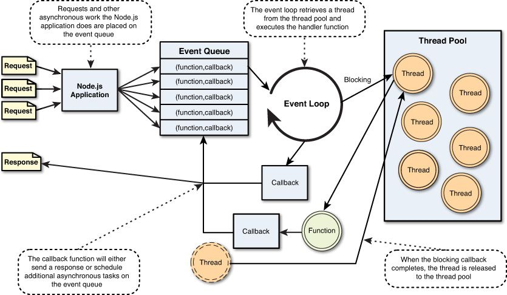
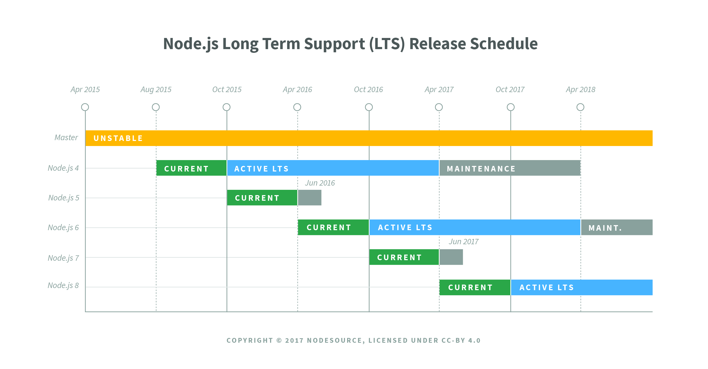

# 第2章 Node.js 介绍

## Node.js 是什么

以下引自 [Node.js 官网](https://nodejs.org/en/)：

> Node.js® is a JavaScript runtime built on [Chrome's V8 JavaScript engine](https://developers.google.com/v8/).

- 不是编程语言
- 也不是框架和库
- 是一个 JavaScript 运行时（环境）
  - 能解析和执行 JavaScript 代码（严格来说应该是 ECMAScript 代码）
- 构建于 Chrome V8 JavaScript 引擎之上
- 为 JavaScript 提供了服务端编程的能力
  - 文件IO
  - 网络IO
- 从技术角度它的能力和 Java、PHP、Python、Perl、Ruby 等服务端技术类似

## Node 的特点

- 事件驱动
- 非阻塞 IO（异步） 模型
- 单线程
- 跨平台

## Node 的运行机制

多线程处理机制：

传统的 Web 服务器（Apache、Tomcat、IIS）：

- 请求进来
- Web 服务器开启一个线程来处理用户请求
- 同一时间有 n 请求，服务器就需要开启 n 个线程
  - 一个线程最少得消耗 8MB 内存
  - 对于一个 8GB 内存的服务器来说，它能应对的并发数是 1024 * 8 / 8 = 1024个并发

事件驱动处理模型：

- Node 中低层封装了一堆的异步操作 API
  - 文件操作
  - 网络操作
  - ...
- JavaScript 语言本身是单线程的

### Event Loop（事件循环）

- [菲利普·罗伯茨：到底什么是Event Loop呢？](https://youtu.be/8aGhZQkoFbQ)
- [The Node.js Event Loop, Timers, and `process.nextTick()`](https://nodejs.org/en/docs/guides/event-loop-timers-and-nexttick/)
- [阮一峰 - JavaScript 运行机制详解：再谈Event Loop](http://www.ruanyifeng.com/blog/2014/10/event-loop.html)

## Node 发展历史

> 以下内容节选自：[来自朴灵大大的 -- Node.js 简史](https://cnodejs.org/topic/555d3d54e684c4c8088a0d78)

Node.js不是凭空出现的项目，也**不是某个Web前端工程师为了完成将JavaScript应用到服务端的理想而在实验室里捣鼓出来的**。它的出现主要归功于**Ryan Dahl历时多年的研究**，以及一个恰到好处的节点。2008年**V8随着Chrome浏览器**的出世，JavaScript 脚本语言的执行效率得到质的提升，这给Ryan Dahl带来新的启示，他原本的研究工作与V8之间碰撞出火花，于是带来了一个基于事件的高性能Web服务器。

上图为Node.js创始人Ryan Dahl。

Ryan Dahl的经历比较奇特，他并非科班出身的开发者，在2004年的时候他还在纽约的罗彻斯特大学数学系读博士，期间有研究一些分形、分类以及p-adic分析，这些都跟开源和编程没啥关系。2006年，也许是厌倦了读博的无聊，他产生了『世界那么大，我想去看看』的念头，做出了退学的决定，然后一个人来到智利的Valparaiso小镇。那时候他尚不知道找一个什么样的工作来糊口，期间他曾熬夜做了一些不切实际的研究，如如何通过云进行通信。下面是这个阶段他产出的中间产物，与后来苹果发布的iCloud似乎有那么点相似。

从那起，Ryan Dahl不知道是否因为生活的关系，他开始学习网站开发了，走上了码农的道路。那时候Ruby on Rails很火，他也不例外的学习了它。从那时候开始，Ryan Dahl的生活方式就是接项目，然后去客户的地方工作，在他眼中，拿工资和上班其实就是去那里旅行。此后他去过很多地方，如阿根廷的布宜诺斯艾利斯、德国的科隆、奥地利的维也纳。

Ryan Dahl经过两年的工作后，成为了高性能Web服务器的专家，从接开发应用到变成专门帮客户解决性能问题的专家。期间他开始写一些开源项目帮助客户解决**Web服务器的高并发性能问题**，尝试过的语言有Ruby、C、Lua。当然这些尝试都最终失败了，只有其中通过C写的HTTP服务库libebb项目略有起色，基本上算作libuv的前身。这些失败各有各的原因，Ruby因为虚拟机性能太烂而无法解决根本问题，C代码的性能高，但是让业务通过C进行开发显然是不太现实的事情，Lua则是已有的同步I/O导致无法发挥性能优势。虽然经历了失败，但Ryan Dahl大致的感觉到了解决问题的关键是要通过**事件驱动**和**异步I/O**来达成目的。

在他快绝望的时候，**V8引擎**来了。V8满足他关于高性能Web服务器的想象：

**没有历史包袱，没有同步I/O**。不会出现一个同步I/O导致事件循环性能急剧降低的情况。
**V8性能足够好**，远远比Python、Ruby等其他脚本语言的引擎快。
**JavaScript语言的闭包特性非常方便**，比C中的回调函数好用。
于是在2009年的2月，按新的想法他提交了项目的第一行代码，这个项目的名字最终被定名为 `node`。

**2009年5月**，Ryan Dahl正式向外界宣布他做的这个项目。2009年底，Ryan Dahl在柏林举行的JSConf EU会议上发表关于Node.js的演讲，之后Node.js逐渐流行于世。

以上就是**Node.js项目的由来，是一个专注于实现高性能Web服务器优化的专家，几经探索，几经挫折后，遇到V8而诞生的项目**。

- 2009年5月，Ryan Dahl 在 github 上发布了最初的 Node 版本
- 2010年底，Ryan Dahl 加入 Joyent 公司全职负责 Node 的发展
- 2011年7月，Node 在微软的支持下发布了 Windows 版
- 2012年1月底，Ryan Dahl 将掌门人身份转交给了 Isaac Z.Schlueter，自己转向一些研究项目
- 2014年12月，多为重量级Node开发者不满 Joyent 对 Node 的管理，自立门户创建了 `io.js`
- 2015年9月，Node 与 io.js 合并，Node 的版本从 0.12.7 直接升级到了 4.0.0
- 合并后的 io.js 和 Node 在 Joyent 公司的维护下并行了两个版本：
  - 一个是4.x.x 还是原来的 Node，这个版本是稳定版
  - 一个是5.x.x，目前已经更新到了 6.8.1，其实就是 io.js，最新特性版，不建议生产环境使用
- Node 计划在 2016 年 10月底正式发布 Node 7.0
  - 7.0 已经最大限度的支持了很多的 ES6 新语法
  - 而且提高了整体的执行性能，提供了一些别的API

Node 各个重要版本发展阶段：

1.0之前等了6年，而从1.0到8.0，只用了2年时间。

- 从v0.1到0.12用了6年
- 2015-01-14发布了v1.0.0版本（io.js）
- 2.x（io.js）
- 3.x（io.js）
- 2015年09月Node.js基金会已发布Node.js V4.0版 与io.js合并后的第一个版本
- 2015年10月Node.jsv4.2.0将是首个lts长期支持版本
- 2016年底发布到4.2.4 && 5.4.0
- 2016年3月20日v4.4.0 LTS（长期支持版本）和v5.9.0 Stable（稳定版本）
- 2016 年底 v6.0 支持95%以上的es6特性 ， v7.0通过flag支持async函数，99%的es6特性
- 2017年2月发布v7.6版本，可以不通过flag使用async函数

## Node 能做什么

> - Node 打破了过去 JavaScript 只能在浏览器中运行的局面
> - 前后端编程环境统一，大大降低了前后端语言切换的代价
>
> [知乎 - JavaScript能做什么，该做什么？](https://www.zhihu.com/question/20796866)
> Atwood's Law: any application that can be written in JavaScript, will eventually be written in JavaScript.
> 凡是能用 JavaScript 写出来的，最终都会用 JavaScript写出来。

- Web 服务器
- 命令行工具
- 网络爬虫
- 桌面应用程序开发（Electron）
- ......

## 结语

JavaScript 长久以来一直被限制在浏览器的沙箱中运行， 它的能力取决于浏览器中间层提供的支持多少。 Node 将高性能的 V8 带到了服务器端，使 JavaScript 也可以开发出实时高性能的服务器。 在 Node 中，不再与CSS样式表，DOM树打交道， 可以随意的访问本地文件，搭建 WebSocket 服务器，连接数据库等系统级底层操作。 Node 不处理 UI，只关心数据，无论是本地数据还是网络数据。 前后端编程统一，大大降低了前后端编程切换的代码。

对于前端工程师而言，自己熟悉的 JavaScript 如今竟然可以在另一个地方大放异彩， 不谈其他原因，仅仅因为好奇，也值得去关注和探究它。

## 相关链接

- [Node.js 官方文档](https://nodejs.org/en/docs/)
- [Node.js 中文文档（非官方）](http://nodejs.cn/)
- [深入浅出 Node.js](https://read.douban.com/ebook/12053349/)
- [Node.js 权威指南](https://book.douban.com/subject/25892704/)
- [Node.js 实战](https://book.douban.com/subject/25870705/)
- [Node.js 实战](https://book.douban.com/subject/25867920/)
- [Node.js实战（第2季）](https://book.douban.com/subject/26642320/)
- [Node.js 中文社区](http://cnodejs.org/)
- [Node.js 包教不包会](https://github.com/alsotang/node-lessons)
- [EcmaScript 6 入门](http://es6.ruanyifeng.com/)
- [七天学会 NodeJS](https://github.com/nqdeng/7-days-nodejs)
- ......
