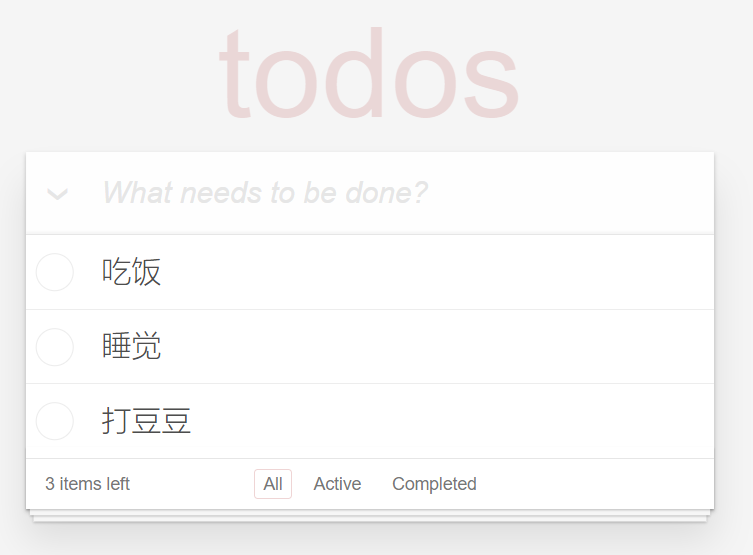
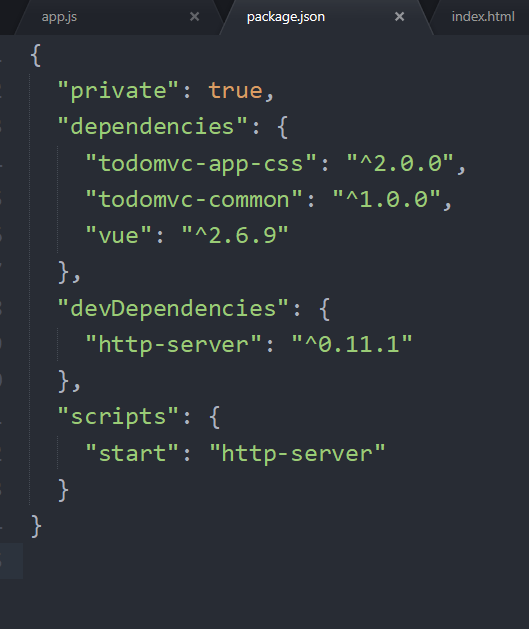

# 第4章 基础案例 - TodoMVC



> 学习目标：
> - 掌握 Vue 中常用的实例选项
> - 掌握 Vue 常用指令

## 案例介绍

- [TodoMVC](http://todomvc.com/)

## 知识点

- 数据绑定
- 计算属性 computed
- 侦听器 watch
- Class 与 Style 样式处理
- 条件渲染
- 列表渲染
- 事件处理
- 表单输入双向数据绑定
- 组件...

---

## 需求说明

- [TodoMVC 需求说明](https://github.com/tastejs/todomvc/blob/master/app-spec.md)
- [脑图整理的需求说明](http://naotu.baidu.com/file/b935b732b2dbf1b2ff12a3291d7f24e5?token=f1973a115e68f4e1)

- [x] 列表展示
  - [x] 有数据
  - [x] 无数据
- [x] 添加任务
- [x] 删除任务
- [ ] 任务项
  - [ ] 切换单个任务项的完成状态
  - [ ] 任务项的完成状态样式
- [ ] 切换所有任务的完成状态
- [ ] 显式剩余任务数量
- [ ] 清除所有已完成任务项
- [ ] 

---

## 开始

### 下载模板

- [TodoMVC 模板仓库](https://github.com/tastejs/todomvc-app-template)

```bash
# 下载模板到本地，重命名为 todomvc-vue
# --depth=1 表示只下载最后一次的 commit，其它历史记录不要，这样可以提高下载速度
git clone https://github.com/tastejs/todomvc-app-template.git todomvc-vue --depth=1

# 切换到 todomvc-vue 目录中，安装依赖项
cd todomvc-vue
npm install

# 打开 todomvc-vue 中的 index.html 预览模板
```

```bash
# 安装依赖
npm i
```

导入 vue

```bash
npm i vue
```

hello world

```javascript
new Vue({
	el: '#app', // 在够用的情况下范围尽量小
	data: {
		message: 'TodoMVC'
	}
})

```


---

### 安装 Web 服务工具

http-server

安装

```bash
npm i --save-dev http-server
```

配置

```json
{
  "private": true,
  "dependencies": {
    "todomvc-app-css": "^2.0.0",
    "todomvc-common": "^1.0.0",
    "vue": "^2.6.9"
  },
  "devDependencies": {
    "http-server": "^0.11.1"
  },
  "scripts": {
    "start": "http-server"
  }
}

```

启动（无论你是什么编辑器）

```bash
npm start
```

### --save 和 --save-dev



- `npm install --save 包名`
  - 作用：安装第三方包
  - `--save` 可以省略
  - 将依赖信息写入 `dependencies` 选项中

- `npm install --save-dev 包名`
  - 作用：安装第三方包
  - `--save-dev` 不能省略
  - 将一来信息写入 `devDependencies` 选项中
- `npm install`
  - 作用：安装 package.json 文件中所有的依赖项，`dependencies` 和 `devDependencies`
- `npm install --production`
  - 作用：只安装 dependencies 中的依赖项
- 结论
  - 核心依赖通过 `--save` 存储到 dependencies 中
  - 开发依赖（工具类）通过 `--save-dev` 存储到 devDependencies 中


## 任务列表

```html{2,15}
...
<template v-if="todos.length > 0">
  <section class="main">
    <input
      id="toggle-all"
      class="toggle-all"
      type="checkbox"
      v-bind:checked="getToggleAllStatus()"
      @change="handleToggleAll">
    <label for="toggle-all">Mark all as complete</label>
    <ul class="todo-list">
      <!-- These are here just to show the structure of the list items -->
      <!-- List items should get the class `editing` when editing and `completed` when marked as completed -->
      <li
        v-for="(item, index) in todos"
        v-bind:class="{completed: item.done}">
        <div class="view">
          <input class="toggle" type="checkbox" v-model="item.done">
          <label>{{ item.title }}</label>
          <button @click="handleRemoveTodo(index)" class="destroy"></button>
        </div>
        <input class="edit" value="Rule the web">
      </li>
    </ul>
  </section>
  <!-- This footer should hidden by default and shown when there are todos -->
  <footer class="footer">
    <!-- This should be `0 items left` by default -->
    <span class="todo-count"><strong>0</strong> item left</span>
    <!-- Remove this if you don't implement routing -->
    <ul class="filters">
      <li>
        <a class="selected" href="#/">All</a>
      </li>
      <li>
        <a href="#/active">Active</a>
      </li>
      <li>
        <a href="#/completed">Completed</a>
      </li>
    </ul>
    <!-- Hidden if no completed items are left ↓ -->
    <button class="clear-completed">Clear completed</button>
  </footer>
</template>
...
```

## 添加任务

```html
...
<input
  class="new-todo"
  placeholder="What needs to be done?"
  v-on:keyup.enter="handleAddTodo">
...
```

```javascript{4}
...
methods: {
  ...
  handleAddTodo (e) {
    const {target} = e // target 就是触发该事件的 DOM
    const {value} = target
    const {todos} = this

    // 拿到数组最后一个元素的 id + 1 就可以得到一个唯一不重复的 id
    // 当数组是空的时候根本就没有最后一项，所以 todos[todos.length - 1] 的结果就是 undefined
    // undefined.id 不就报错了吗？
    const lastTodo = todos[todos.length - 1]

    // 如果有最后一个元素，则让该元素.id + 1，否则默认给个 1
    const id = lastTodo ? lastTodo.id + 1 : 1

    if (value.trim().length !== 0) {
      this.todos.push({
        id, // 当 key 和 value 名字一样的时候，可以简写, id 等价于 id: id
        title: value,
        done: false
      })

      // 操作 DOM 清空文本框
      target.value = ''
    }
  },
  ...
}
...
```

## 切换所有任务的完成状态

```html{6,7}
...
<input
  id="toggle-all"
  class="toggle-all"
  type="checkbox"
  v-bind:checked="getToggleAllStatus()"
  @change="handleToggleAll">
...
```

```javascript{4,11}
...
methods: {
  ...
  handleToggleAll (e) {
    const checked = e.target.checked
    this.todos.forEach((item) => {
      item.done = checked
    })
  },

  getToggleAllStatus () {
    let status = true
    this.todos.forEach(item => {
      if (item.done === false) {
        status = false
      }
    })
    return status
  },
  ...
}
...
```

## 删除单个任务

```html{2}
...
<button @click="handleRemoveTodo(index)" class="destroy"></button>
...
```

```javascript{4}
...
methods: {
  ...
  handleRemoveTodo (delIndex) {
    this.todos.splice(delIndex, 1)
  },
  ...
}
...
```

## 删除所有已完成任务

```html{4}
...
<button
  class="clear-completed"
  @click="handleClearAllDone">Clear completed</button>
...
```

```javascript{4}
...
methods: {
  ...
  handleClearAllDone () {
    for (let i = 0; i < this.todos.length; i++) {
      const item = this.todos[i]
      if (item.done === true) {
        this.todos.splice(i, 1)
        i-- // 在遍历过程中删除元素之后，让索引减一次，防止有漏网之鱼
      }
    }
  },
  ...
}
...
```

## 显示所有剩余未完成任务数

方法方式：

```html{2}
...
<span class="todo-count"><strong>{{ getRemaining() }}</strong> item left</span>
...
```

```javascript{4}
...
methods: {
  ...
  getRemaining () {
    let count = 0
    this.todos.forEach(item => {
      if (item.done === false) {
        count++
      }
    })
    return count
  }
  ...
}
...
```

计算属性方法：

```html{2}
...
<strong>{{ remaining }}</strong> item left</span>
...
```

```javascript{4}
...
computed: {
  ...
  remaining () {
    let count = 0
    this.todos.forEach(item => {
      if (item.done === false) {
        count++
      }
    })
    return count
  }
  ...
}
...
```

## 数据过滤

- window.onhashchange 事件
- 展示过滤结果数组


## 持久化存储

```javascript{6,12}
...
new Vue({
  ...
  data: {
    ...
    todos: JSON.parse(window.localStorage.getItem('todos')) || []
    ...
  },
  ...
  watch: {
    ...
    todos: {
      handler () { // 固定的 handler ，当 todos 发生改变会自动调用 handler 方法
        // 本地存储只能存储字符串，所以这里要把数组转成字符串再存储
        window.localStorage.setItem('todos', JSON.stringify(this.todos))
      },
      deep: true // deep 配置为 true 表示深度监视
    }
    ...
  },
  ...
})
...
```
