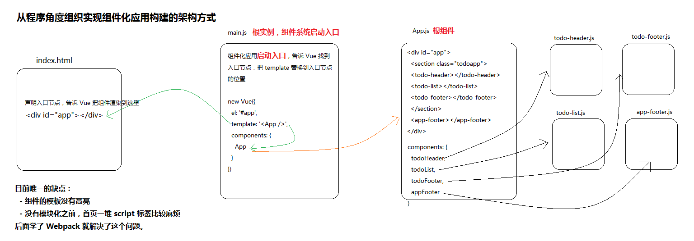

# 第5章 组件基础

> 学习目标
> - 了解组件的概念
> - 掌握组件的定义
> - 了解组件的组织方式
> - 掌握组件通信

组件 (Component) 是 Vue.js 最强大的功能之一。组件可以扩展 HTML 元素，封装可重用的代码。


组件就是对局部视图（HTML、CSS、JavaScript） 的封装（小到一个 button，大到整个页面，轮播图、选项卡....）。

组件还可以由其他组件组成，就像乐高积木一样。组件化开发的好处就是开发效率高，可重用性，可维护性好。

从使用角度，组件也叫作 自定义元素。

当前主流的开发思想都是组件化思想，把一个复杂的页面分而治之。

## 通过 Element-UI 感受组件的威力

Element 是基于 Vue 开发的一个知名的第三方组件库，它能帮助我们更加快速的构建应用。

> [Element 官网](http://element-cn.eleme.io/)

安装：

```bash
npm i element-ui
```


```html
<!DOCTYPE html>
<html>
<head>
  <meta charset="UTF-8">
  <!-- 引入样式 -->
  <link rel="stylesheet" href="https://unpkg.com/element-ui/lib/theme-chalk/index.css">
</head>
<body>
  <div id="app">
    <el-button @click="visible = true">按钮</el-button>
    <el-dialog :visible.sync="visible" title="Hello world">
      <p>欢迎使用 Element</p>
    </el-dialog>
  </div>
</body>
  <!-- 先引入 Vue -->
  <script src="https://unpkg.com/vue/dist/vue.js"></script>
  <!-- 引入组件库 -->
  <script src="https://unpkg.com/element-ui/lib/index.js"></script>
  <script>
    new Vue({
      el: '#app',
      data: function() {
        return { visible: false }
      }
    })
  </script>
</html>

```

---

## 使用组件

组件的定义方式分为两种，全局定义和局部定义：

- 全局组件定义在全局，在任意组件中都可以直接使用
- 局部组件定义在组件内部，只能在当前组件使用
- 建议把通用的组件定义在全局，把不通用的组件定义在局部

### 全局注册

注册：

```
Vue.component('my-component', {
  template: '<div>A custom component!</div>'
});

// 创建根实例
new Vue({
  el: '#example'
});
```

在模板中使用组件：

```
<div id="example">
  <my-component></my-component>
</div>
```

渲染结果：

```
<div id="example">
  <div>A custom component!</div>
</div>
```


> 总结：
>
> - 可以在任何组件中被使用的组件（就好比全局变量）
> - 如果应用中把所有组件都定义成全局组件，名字就不能冲突
> - 使用场景：多个页面都需要使用的组件建议定义成全局

### 局部注册

你不必把每个组件都注册到全局。你可以通过某个 Vue 实例/组件的实例选项 `components` 注册仅在其作用域中可用的组件：

注册：

```javascript
new Vue({
  // ...
  components: {
    // <my-component> 将只在父组件模板中可用
    'my-component': {
      template: '<div>A custom component!</div>'
    }
  }
});
```

使用：

```
<div id="example">
  <div>A custom component!</div>
  <my-component></my-component>
</div>
```

> 总结：
>
> - 只能在它的父组件(定义所属的组件)中被使用，不会污染全局（就好比函数内定义的变量）
> - 使用组件的时候，会先在自己的 components 中找，如果找不到，**直奔** 全局找
> - 局部组件 **只能** 在父组件中被使用，爷爷、后代。。。都不行
> - 使用场景：不需要在其它组件中被使用的组件建议定义成局部

---

### 组件的模板

- DOM 模板
- 字符串模板
- .vue 单文件组件中的 `template` 模板

### 组件的 `data` 必须是函数

构造 Vue 实例时传入的各种选项大多数都可以在组件里使用。只有一个例外：data 必须是函数。

```
Vue.component('simple-counter', {
  template: '<button v-on:click="counter += 1">{{ counter }}</button>',
  data: function () {
    return { counter: 0 }
  }
});

new Vue({
  el: '#example-2'
});
```

### 组件的作用域是独立的

- 组件无法访问外部作用域成员
- 外部作用域也无法访问组件内部成员

### 组件组合

组件设计初衷就是要配合使用的，最常见的就是形成父子组件的关系：组件 A 在它的模板中使用了组件 B。它们之间必然需要相互通信：父组件可能要给子组件下发数据，子组件则可能要将它内部发生的事情告知父组件。然而，通过一个良好定义的接口来尽可能将父子组件解耦也是很重要的。这保证了每个组件的代码可以在相对隔离的环境中书写和理解，从而提高了其可维护性和复用性。
在 Vue 中，父子组件的关系可以总结为 prop 向下传递，事件向上传递。父组件通过 prop 给子组件下发数据，子组件通过事件给父组件发送消息。看看它们是怎么工作的。


---

## 组件化构建 TodoMVC



---

## 组件通信


在树形结构里面，组件之间有几种典型的关系：父子关系、兄弟关系、没有直接关系。

相应地，组件之间有以下几种典型的通讯方案：

- 直接的父子关系
- 直接的父子关系
- 没有直接关系
- 利用 cookie 和 localstorage 进行通讯。
- 利用 session 进行通讯。


- 父传子 Props Down
- 子通知父亲 Events Up

- 通过 ref 父亲直接访问子组件
  - 给子组件起个 ref
  - 然后在父组件中通过 `this.$refs.子组件ref名`
- 子组件可以在内部通过 `this.$parent` 直接访问父组件
- 非父子关系
  - 事件通信 Events Bus
  - Global Bus
- 集中式状态管理 Vuex


## 父子组件通信：Props Down

**1. 在父组件中通过子组件标签属性传递数据**

```
<child message="hello!"></child>
```

**2. 在子组件显式地用 `props` 选项声明它预期的数据并使用**

```
Vue.component('child', {
  // 必须显式的声明接收 props
  props: ['message'],
  // 就像 data 一样，prop 也可以在模板中使用
  // 同样也可以在 vm 实例中通过 this.message 来使用
  template: '<span>{{ message }}</span>'
});
```

### camelCase vs. kebab-case

HTML 特性是不区分大小写的。所以，当使用的不是字符串模板时，camelCase (驼峰式命名) 的 prop 需要转换为相对应的 kebab-case (短横线分隔式命名)。

```
Vue.component('child', {
  // 在 JavaScript 中使用 camelCase
  props: ['myMessage'],
  template: '<span>{{ myMessage }}</span>'
});
```

```
<!-- 在 HTML 中使用 kebab-case -->
<child my-message="hello!"></child>
```

如果你使用字符串模板，则没有这些限制。

### 动态 Prop

与绑定到任何普通的 HTML 特性相类似，我们可以用 `v-bind` 来动态地将 `prop` 绑定到父组件的数据。每当父组件的数据变化时，该变化也会传导给子组件：

```
<div>
  <input v-model="parentMsg">
  <br>
  <child v-bind:my-message="parentMsg"></child>
</div>
```

你也可以使用 v-bind 的缩写语法：

```
<child :my-message="parentMsg"></child>
```


### 字面量语法 vs 动态语法

初学者常犯的一个错误是使用字面量语法传递数值：

```
<!-- 传递了一个字符串 "1" -->
<comp some-prop="1"></comp>
```

因为它是一个字面量 prop，它的值是字符串 "1" 而不是一个数值。如果想传递一个真正的 JavaScript 数值，则需要使用 v-bind，从而让它的值被当作 JavaScript 表达式计算：

```
<!-- 传递真正的数值 -->
<comp v-bind:some-prop="1"></comp>
```

### 单向数据流

Prop 是单向绑定的：当父组件的属性变化时，将传导给子组件，但是反过来不会。这是为了防止子组件无意间修改了父组件的状态，来避免应用的数据流变得难以理解。

另外，每次父组件更新时，子组件的所有 prop 都会更新为最新值。这意味着你不应该在子组件内部改变 prop。如果你这么做了，Vue 会在控制台给出警告。

在两种情况下，我们很容易忍不住想去修改 prop 中数据：

1. Prop 作为初始值传入后，子组件想把它当作局部数据来用
2. Prop 作为原始数据传入，由子组件处理成其它数据输出

对这两种情况，正确的应对方式是：

**1. 定义一个局部变量，并用 prop 的值初始化它：**

```
props: ['initialCounter'],
data: function () {
  return { counter: this.initialCounter }
}
```

**2. 定义一个计算属性，处理 prop 的值并返回：**

```
// ...
props: ['size'],
computed: {
  normalizedSize: function () {
    return this.size.trim().toLowerCase()
  }
},
```

!> 注意在 JavaScript 中对象和数组是引用类型，指向同一个内存空间，如果 prop 是一个对象或数组，在子组件内部改变它会影响父组件的状态。

### Prop 验证

我们可以为组件的 prop 指定验证规则。如果传入的数据不符合要求，Vue 会发出警告。这对于开发给他人使用的组件非常有用。
要指定验证规则，需要用对象的形式来定义 prop，而不能用字符串数组：

```
Vue.component('example', {
  props: {
    // 基础类型检测 (`null` 指允许任何类型)
    propA: Number,
    // 可能是多种类型
    propB: [String, Number],
    // 必传且是字符串
    propC: {
      type: String,
      required: true
    },
    // 数值且有默认值
    propD: {
      type: Number,
      default: 100
    },
    // 数组/对象的默认值应当由一个工厂函数返回
    propE: {
      type: Object,
      default: function () {
        return { message: 'hello' }
      }
    },
    // 自定义验证函数
    propF: {
      validator: function (value) {
        return value > 10
      }
    }
  }
});
```

`type` 可以是下面原生构造器：

- String
- Number
- Boolean
- Function
- Object
- Array
- Symbol

type 也可以是一个自定义构造器函数，使用 instanceof 检测。

当 prop 验证失败，Vue 会抛出警告 (如果使用的是开发版本)。
注意 prop 会在组件实例创建之前进行校验，所以在 default 或 validator 函数里，诸如 data、computed 或 methods 等实例属性还无法使用。

---

## 父子组件通信：Events Up

我们知道，父组件使用 prop 传递数据给子组件。但子组件怎么跟父组件通信呢？这个时候 Vue 的自定义事件系统就派得上用场了。

**1. 在子组件中调用 `$emit()` 方法发布一个事件**

```
Vue.component('button-counter', {
  template: '<button v-on:click="incrementCounter">{{ counter }}</button>',
  data: function () {
    return {
      counter: 0
    }
  },
  methods: {
    incrementCounter: function () {
      this.counter += 1
      // 发布一个名字叫 increment 的事件
      this.$emit('increment')
    }
  },
});
```

**2. 在父组件中提供一个子组件内部发布的事件处理函数**

```
new Vue({
  el: '#counter-event-example',
  data: {
    total: 0
  },
  methods: {
    incrementTotal: function () {
      this.total += 1
    }
  }
});
```

**3. 在使用子组件的模板的标签上订阅子组件内部发布的事件**

```
<div id="counter-event-example">
  <p>{{ total }}</p>
  <!-- 
    订阅子组件内部发布的 increment 事件
    当子组件内部 $commit('increment') 发布的时候，就会调用到父组件中的 incrementTotal 方法
  -->
  <button-counter v-on:increment="incrementTotal"></button-counter>
</div>
```

### 给组件绑定原生事件

有时候，你可能想在某个组件的根元素上监听一个原生事件。可以使用 `v-on` 的修饰符 `.native`。例如：

```
<my-component v-on:click.native="doTheThing"></my-component>
```

### `.sync` 修饰符

在一些情况下，我们可能会需要对一个 prop 进行“双向绑定”。
就是当一个子组件改变了一个带 .sync 的 prop 的值时，这个变化也会同步到父组件中所绑定的值。

在使用子组件的时候加上 `.sync` 修饰符：

```
<comp :foo.sync="bar"></comp>
```

在子组件内部更新 `foo` 的值时，显示的触发一个更新事件：

```
this.$emit('update:foo', newValue);
```

---

## 非父子组件通信：Event Bus

有时候，非父子关系的两个组件之间也需要通信。在简单的场景下，可以使用一个空的 Vue 实例作为事件总线：

```
var bus = new Vue();
```

```
// 触发组件 A 中的事件
bus.$emit('id-selected', 1);
```

```
// 在组件 B 创建的钩子中监听事件
bus.$on('id-selected', function (id) {
  // ...
});
```

---

## 专业组件通信大杀器：Vuex

在复杂的情况下，我们应该考虑使用专门的 [状态管理模式](https://vuex.vuejs.org/zh-cn/)。

---

## 使用插槽分发内容

---

## 组件其它
