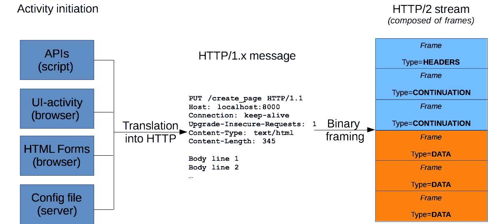

# 第7章 Web 开发


## HTTP 协议

### 概述

HTTP是一种能够获取如 HTML 这样的网络资源的** [protocol](https://developer.mozilla.org/en-US/docs/Glossary/protocol)(通讯协议)。它是在 Web 上进行数据交换的基础，是一种 client-server 协议，也就是说，请求通常是由像浏览器这样的接受方发起的。一个完整的Web文档通常是由不同的子文档拼接而成的，像是文本、布局描述、图片、视频、脚本等等。


> 参考链接：
>
> - https://developer.mozilla.org/zh-CN/docs/Web/HTTP/Overview


### HTTP 消息报文

HTTP消息是服务器和客户端之间交换数据的方式。有两种类型的消息︰ 

- 请求--由客户端发送用来触发一个服务器上的动作
- 响应--来自服务器的应答。

HTTP消息由采用ASCII编码的多行文本构成。在HTTP/1.1及早期版本中，这些消息通过连接公开地发送。在HTTP/2中，为了优化和性能方面的改进，曾经可人工阅读的消息被分到多个HTTP帧中。

Web 开发人员或网站管理员，很少自己手工创建这些原始的HTTP消息︰ 由软件、浏览器、 代理或  服务器完成。他们通过配置文件（用于代理服务器或服务器），API （用于浏览器）或其他接口提供HTTP消息。



HTTP 请求和响应具有相似的结构，由以下部分组成︰

1. 一行起始行用于描述要执行的请求，或者是对应的状态，成功或失败。这个起始行总是单行的。
2. 一个可选的HTTP头集合指明请求或描述消息正文。
3. 一个空行指示所有关于请求的元数据已经发送完毕。
4. 一个可选的包含请求相关数据的正文 (比如HTML表单内容), 或者响应相关的文档。 正文的大小有起始行的HTTP头来指定。

起始行和  HTTP 消息中的HTTP 头统称为请求头，而其有效负载被称为消息正文。


### 请求报文


请求由以下元素组成：

- 一个HTTP的[method](https://developer.mozilla.org/en-US/docs/Web/HTTP/Methods)，经常是由一个动词像[`GET`](https://developer.mozilla.org/zh-CN/docs/Web/HTTP/Methods/GET), [`POST`](https://developer.mozilla.org/zh-CN/docs/Web/HTTP/Methods/POST) 或者一个名词像[`OPTIONS`](https://developer.mozilla.org/zh-CN/docs/Web/HTTP/Methods/OPTIONS)，[`HEAD`](https://developer.mozilla.org/zh-CN/docs/Web/HTTP/Methods/HEAD)来定义客户端的动作行为。通常客户端的操作都是获取资源（GET方法）或者发送[HTML form](https://developer.mozilla.org/en-US/docs/Web/Guide/HTML/Forms)表单值（POST方法），虽然在一些情况下也会有其他操作。
- 要获取的资源的路径，通常是上下文中就很明显的元素资源的URL，它没有[protocol](https://developer.mozilla.org/en-US/docs/Glossary/protocol)（`http://`），[domain](https://developer.mozilla.org/en-US/docs/Glossary/domain)（`developer.mozilla.org`），或是TCP的[port](https://developer.mozilla.org/en-US/docs/Glossary/port)（HTTP一般在80端口）。
- HTTP协议版本号。
- 为服务端表达其他信息的可选头部[headers](https://developer.mozilla.org/en-US/docs/Web/HTTP/Headers)。
- 对于一些像POST这样的方法，报文的body就包含了发送的资源，这与响应报文的body类似。


#### 起始行

HTTP请求是由客户端发出的消息，用来使服务器执行动作。*起始行 (start-line)* 包含三个元素：

1. 一个 *HTTP 方法*，一个动词 (像 [`GET`](https://developer.mozilla.org/zh-CN/docs/Web/HTTP/Methods/GET), [`PUT`](https://developer.mozilla.org/zh-CN/docs/Web/HTTP/Methods/PUT) 或者 [`POST`](https://developer.mozilla.org/zh-CN/docs/Web/HTTP/Methods/POST)) 或者一个名词 (像 [`HEAD`](https://developer.mozilla.org/zh-CN/docs/Web/HTTP/Methods/HEAD) 或者 [`OPTIONS`](https://developer.mozilla.org/zh-CN/docs/Web/HTTP/Methods/OPTIONS)), 描述要执行的动作. 例如, `GET` 表示要获取资源，`POST` 表示向服务器推送数据 (创建或修改资源, 或者产生要返回的临时文件)。

2. 请求目标 (request target)，

   通常是一个URL，或者是协议、端口和域名的绝对路径，通常以请求的环境为特征。请求的格式因不同的 HTTP 方法而异。它可以是：

   - 一个绝对路径，末尾跟上一个 ' ? ' 和查询字符串。这是最常见的形式，称为 *原始形式 (origin form)*，被 GET，POST，HEAD 和 OPTIONS 方法所使用。
     `POST / HTTP 1.1GET /background.png HTTP/1.0HEAD /test.html?query=alibaba HTTP/1.1OPTIONS /anypage.html HTTP/1.0`
   - 一个完整的URL，被称为 *绝对形式 (absolute form)*，主要在 GET 连接到代理时使用。
     `GET http://developer.mozilla.org/en-US/docs/Web/HTTP/Messages HTTP/1.1`
   - 由域名和可选端口（以`':'`为前缀）组成的 URL 的 authority component，称为 *authority form*。 仅在使用 CONNECT 建立 HTTP 隧道时才使用。
     `CONNECT developer.mozilla.org:80 HTTP/1.1`
   - *星号形式 (asterisk form)*，一个简单的星号`('*')`，配合 OPTIONS 方法使用，代表整个服务器。
     `OPTIONS * HTTP/1.1`

3. *HTTP 版本 (HTTP version*)*，*定义了剩余报文的结构，作为对期望的响应版本的指示符。


#### Headers

来自请求的 [HTTP headers](https://developer.mozilla.org/en-US/docs/Web/HTTP/Headers) 遵循和 HTTP header 相同的基本结构：不区分大小写的字符串，紧跟着的冒号 `(':')` 和一个结构取决于 header 的值。 整个 header（包括值）由一行组成，这一行可以相当长。

有许多请求头可用，它们可以分为几组：

- *General headers，*例如 [`Via`](https://developer.mozilla.org/zh-CN/docs/Web/HTTP/Headers/Via)，适用于整个报文。
- *Request headers，*例如 [`User-Agent`](https://developer.mozilla.org/zh-CN/docs/Web/HTTP/Headers/User-Agent)，[`Accept-Type`](https://developer.mozilla.org/zh-CN/docs/Web/HTTP/Headers/Accept-Type)，通过进一步的定义(例如 [`Accept-Language`](https://developer.mozilla.org/zh-CN/docs/Web/HTTP/Headers/Accept-Language))，或者给定上下文(例如 [`Referer`](https://developer.mozilla.org/zh-CN/docs/Web/HTTP/Headers/Referer))，或者进行有条件的限制 (例如 [`If-None`](https://developer.mozilla.org/zh-CN/docs/Web/HTTP/Headers/If-None)) 来修改请求。
- *Entity headers，*例如 [`Content-Length`](https://developer.mozilla.org/zh-CN/docs/Web/HTTP/Headers/Content-Length)，适用于请求的 body。显然，如果请求中没有任何 body，则不会发送这样的头文件。


#### Body

请求的最后一部分是它的 body。不是所有的请求都有一个 body：例如获取资源的请求，GET，HEAD，DELETE 和 OPTIONS，通常它们不需要 body。 有些请求将数据发送到服务器以便更新数据：常见的的情况是 POST 请求（包含 HTML 表单数据）。

Body 大致可分为两类：

- Single-resource bodies，由一个单文件组成。该类型 body 由两个 header 定义： [`Content-Type`](https://developer.mozilla.org/zh-CN/docs/Web/HTTP/Headers/Content-Type) 和 [`Content-Length`](https://developer.mozilla.org/zh-CN/docs/Web/HTTP/Headers/Content-Length).
- [Multiple-resource bodies](https://developer.mozilla.org/en-US/docs/Web/HTTP/Basics_of_HTTP/MIME_types#multipartform-data)，由多部分 body 组成，每一部分包含不同的信息位。通常是和  [HTML Forms](https://developer.mozilla.org/en-US/docs/Web/Guide/HTML/Forms) 连系在一起。

### 响应报文


响应报文包含了下面的元素：

- HTTP协议版本号。
- 一个状态码（[status code](https://developer.mozilla.org/en-US/docs/Web/HTTP/Status)），来告知对应请求执行成功或失败，以及失败的原因。
- 一个状态信息，这个信息是非权威的状态码描述信息，可以由服务端自行设定。
- HTTP [headers](https://developer.mozilla.org/en-US/docs/Web/HTTP/Headers)，与请求头部类似。
- 可选项，比起请求报文，响应报文中更常见地包含获取的资源body。


#### 状态行

HTTP 响应的起始行被称作 *状态行* *(status line)*，包含以下信息：

1. *协议版本*，通常为 `HTTP/1.1。`
2. *状态码 (**status code)*，表明请求是成功或失败。常见的状态码是 [`200`](https://developer.mozilla.org/zh-CN/docs/Web/HTTP/Status/200)，[`404`](https://developer.mozilla.org/zh-CN/docs/Web/HTTP/Status/404)，或 [`302`](https://developer.mozilla.org/zh-CN/docs/Web/HTTP/Status/302)。
3. *状态文本 (status text)*。一个简短的，纯粹的信息，通过状态码的文本描述，帮助人们理解该 HTTP 消息。

一个典型的状态行看起来像这样：`HTTP/1.1 404 Not Found。`


#### Headers

响应的  [HTTP headers](https://developer.mozilla.org/en-US/docs/Web/HTTP/Headers) 遵循和任何其它 header 相同的结构：不区分大小写的字符串，紧跟着的冒号 (`':'`) 和一个结构取决于 header 类型的值。 整个 header（包括其值）表现为单行形式。

有许多响应头可用，这些响应头可以分为几组：

- *General headers，*例如 [`Via`](https://developer.mozilla.org/zh-CN/docs/Web/HTTP/Headers/Via)，适用于整个报文。
- *Response headers，*例如 [`Vary`](https://developer.mozilla.org/zh-CN/docs/Web/HTTP/Headers/Vary) 和 [`Accept-Ranges`](https://developer.mozilla.org/zh-CN/docs/Web/HTTP/Headers/Accept-Ranges)，提供其它不符合状态行的关于服务器的信息。
- *Entity headers*，例如 [`Content-Length`](https://developer.mozilla.org/zh-CN/docs/Web/HTTP/Headers/Content-Length)，适用于请求的 body。显然，如果请求中没有任何 body，则不会发送这样的头文件。


#### Body

响应的最后一部分是 body。不是所有的响应都有 body：具有状态码 (如 [`201`](https://developer.mozilla.org/zh-CN/docs/Web/HTTP/Status/201) 或 [`204`](https://developer.mozilla.org/zh-CN/docs/Web/HTTP/Status/204)) 的响应，通常不会有 body。

Body 大致可分为三类：

- Single-resource bodies，由**已知**长度的单个文件组成。该类型 body 由两个 header 定义：[`Content-Type`](https://developer.mozilla.org/zh-CN/docs/Web/HTTP/Headers/Content-Type) 和 [`Content-Length`](https://developer.mozilla.org/zh-CN/docs/Web/HTTP/Headers/Content-Length)。
- Single-resource bodies，由**未知**长度的单个文件组成，通过将 [`Transfer-Encoding`](https://developer.mozilla.org/zh-CN/docs/Web/HTTP/Headers/Transfer-Encoding) 设置为 `chunked 来`使用 chunks 编码。
- [Multiple-resource bodies](https://developer.mozilla.org/en-US/docs/Web/HTTP/Basics_of_HTTP/MIME_types#multipartform-data)，由多部分 body 组成，每部分包含不同的信息段。但这是比较少见的。


### 请求方法

| 请求方法 | 说明                                                         |
| -------- | ------------------------------------------------------------ |
| GET      | GET方法请求一个指定资源的表示形式. 使用GET的请求应该只被用于获取数据 |
| POST     | POST方法用于将实体提交到指定的资源，通常导致状态或服务器上的副作用的更改. |
| PUT      | PUT方法用请求有效载荷替换目标资源的所有当前表示              |
| PATCH    | PATCH方法用于对资源应用部分修改                              |
| DELETE   | DELETE方法删除指定的资源                                     |
| HEAD     | HEAD方法请求一个与GET请求的响应相同的响应，但没有响应体      |
| OPTIONS  | OPTIONS方法用于描述目标资源的通信选项                        |
| TRACE    | TRACE方法沿着到目标资源的路径执行一个消息环回测试            |
| CONNECT  | CONNECT方法建立一个到由目标资源标识的服务器的隧道            |


> 参考资料：
>
> - https://developer.mozilla.org/zh-CN/docs/Web/HTTP/Methods

### 返回结果的HTTP状态码

#### 1xx 临时响应

> 临时响应，表示临时响应并需要请求者继续执行操作的状态代码

| 状态码 | 说明                                                         |
| ------ | ------------------------------------------------------------ |
| 100    | **继续**，请求者应当继续提出请求。 服务器返回此代码表示已收到请求的第一部分，正在等待其余部分 |
| 101    | **切换协议**，请求者已要求服务器切换协议，服务器已确认并准备切换 |

#### 2xx 成功

> 表示成功处理了请求的状态代码

| 状态码 | 说明                                                 |
| ------ | ---------------------------------------------------- |
| 200    | **成功**，服务器已成功处理了请求                     |
| 201    | **已创建**，请求成功并且服务器创建了新的资源         |
| 204    | **无内容**，服务器成功处理了请求，但没有返回任何内容 |
|        |                                                      |


#### 3xx 重定向

> 表示要完成请求，需要进一步操作。 通常，这些状态代码用来重定向

| 状态码 | 说明                                                         |
| ------ | ------------------------------------------------------------ |
| 301    | **永久移动**，请求的网页已永久移动到新位置。 服务器返回此响应（对 GET 或 HEAD 请求的响应）时，会自动将请求者转到新位置 |
| 302    | **临时移动**，服务器目前从不同位置的网页响应请求，但请求者应继续使用原有位置来进行以后的请求 |
| 304    | **未修改**，自从上次请求后，请求的网页未修改过。 服务器返回此响应时，不会返回网页内容 |
| 307    | **临时重定向**，服务器目前从不同位置的网页响应请求，但请求者应继续使用原有位置来进行以后的请求 |


#### 4xx 请求错误

> 表示请求可能出错，妨碍了服务器的处理

| 状态码 | 说明 |
| ------ | ---- |
| 400 |   （错误请求） 服务器不理解请求的语法。  |
| 401 |   （未授权） 请求要求身份验证。 对于需要登录的网页，服务器可能返回此响应。  |
| 403 |   （禁止） 服务器拒绝请求。  |
| 404 |   （未找到） 服务器找不到请求的网页。  |
| 405 |   （方法禁用） 禁用请求中指定的方法。  |
| 406 |   （不接受） 无法使用请求的内容特性响应请求的网页。  |
| 407 |   （需要代理授权） 此状态代码与 401（未授权）类似，但指定请求者应当授权使用代理。  |
| 408 |   （请求超时）  服务器等候请求时发生超时。  |
| 409 |   （冲突）  服务器在完成请求时发生冲突。 服务器必须在响应中包含有关冲突的信息。  |
| 410 |   （已删除）  如果请求的资源已永久删除，服务器就会返回此响应。  |
| 411 |   （需要有效长度） 服务器不接受不含有效内容长度标头字段的请求。  |
| 412 |   （未满足前提条件） 服务器未满足请求者在请求中设置的其中一个前提条件。  |
| 413 |   （请求实体过大） 服务器无法处理请求，因为请求实体过大，超出服务器的处理能力。  |
| 414 |   （请求的 URI 过长） 请求的 URI（通常为网址）过长，服务器无法处理。  |
| 415 |   （不支持的媒体类型） 请求的格式不受请求页面的支持。  |
| 416 |   （请求范围不符合要求） 如果页面无法提供请求的范围，则服务器会返回此状态代码。  |
| 417 |   （未满足期望值） 服务器未满足”期望”请求标头字段的要求。 |


#### 5xx 服务器错误

> 表示服务器在尝试处理请求时发生内部错误。 这些错误可能是服务器本身的错误，而不是请求出错

| 状态码 | 说明 |
| ------ | ---- |
| 500 |   （服务器内部错误）  服务器遇到错误，无法完成请求。  |
| 501 |   （尚未实施） 服务器不具备完成请求的功能。 例如，服务器无法识别请求方法时可能会返回此代码。  |
| 502 |   （错误网关） 服务器作为网关或代理，从上游服务器收到无效响应。  |
| 503 |   （服务不可用） 服务器目前无法使用（由于超载或停机维护）。 通常，这只是暂时状态。  |
| 504 |   （网关超时）  服务器作为网关或代理，但是没有及时从上游服务器收到请求。  |
| 505 |   （HTTP 版本不受支持） 服务器不支持请求中所用的 HTTP 协议版本。 |


### HTTP 首部

> 参考链接：
>
> - https://developer.mozilla.org/zh-CN/docs/Web/HTTP/Headers

## 电话打通，没有响应

```javascript
// 0. 加载 http 核心模块
const http = require('http')

// 1. 创建服务器，得到 Server 实例
const server = http.createServer()

// 2. 监听客户端的 request 请求事件，设置请求处理函数
server.on('request', (request, response) => {
  // request.header
  console.log('收到客户端的请求了')
})

// 3. 绑定端口号，启动服务器
//    真正需要通信的应用程序
//    如何从 a 计算机的 应用程序 通信到 b 计算机的 应用程序
//    ip 地址用来定位具体的计算机
//    port 端口号用来定位具体的应用程序
//    联网通信的应用程序必须占用一个端口号，同一时间同一个端口号只能被一个应用程序占用
//    开发测试的时候使用一些非默认端口，防止冲突
server.listen(3000, function () {
  console.log('Server is running at port 3000.')
})


```


## 很傻的服务器

Node 服务器不同于 APache，默认能力非常的简单，一切请求都需要自己来处理。

```javascript
// 0. 加载 http 核心模块
const http = require('http')

// 1. 创建服务器，得到 Server 实例
const server = http.createServer()

// 2. 监听客户端的 request 请求事件，设置请求处理函数
//    req 请求对象（获取客户端信息）
//    res 响应对象（发送响应数据）
//      end() 方法
server.on('request', (req, res) => {
  // 发送响应数据
  // res.write('hello')
  // res.write(' hello')
  // res.write(' hello')
  // res.write(' hello')
  // res.write(' hello')
  // res.write(' hello')
  // res.write(' hello')

  // 数据写完之后，必须告诉客户端，我的数据发完了，你可以接收处理了
  // 否则客户端还是会一直等待
  // 结束响应，挂断电话
  // res.end()

  const client = req.socket

  // 推荐
  res.end(`
    您的 ip 地址：${client.remoteAddress}
    您的 port 端口号：${client.remotePort}
`)
})

// 3. 绑定端口号，启动服务器
//    真正需要通信的应用程序
//    如何从 a 计算机的 应用程序 通信到 b 计算机的 应用程序
//    ip 地址用来定位具体的计算机
//    port 端口号用来定位具体的应用程序
//    联网通信的应用程序必须占用一个端口号，同一时间同一个端口号只能被一个应用程序占用
//    开发测试的时候使用一些非默认端口，防止冲突
server.listen(3000, function () {
  console.log('Server is running at port 3000.')
})

```

## 根据不同 url 地址处理不同请求

网站中的资源都是通过 `url` 地址来定位的，所以我就可以在请求处理函数获取客户端的请求地址，然后根据不同的请求地址处理不同的响应。

```javascript
// 0. 加载 http 核心模块
const http = require('http')

// 1. 创建服务器，得到 Server 实例
const server = http.createServer()

// 2. 监听客户端的 request 请求事件，设置请求处理函数
//    req 请求对象（获取客户端信息）
//    res 响应对象（发送响应数据）
//      end() 方法
// 任何请求都会触发 request 请求事件
// /a /b /c /dsanjdasjk
// req 请求对象中有一个属性：url 可以获取当前客户端的请求路径
server.on('request', (req, res) => {
  // console.log(req.url)
  // 127.0.0.1:3000/abc
  // 一切请求路径都始终是以 / 开头
  // / index page
  // /login login page
  // /about about me
  // 其它的 404 Not Found.
  // res.end('index page')
  
  const url = req.url

  // 通常情况下，都会把 / 当作首页
  // 因为用户手动输入地址，不加任何路径，浏览器会自动补上 / 去请求
  if (url === '/') {
    console.log('首页')
    res.end(`
<h1>首页</h1>
<ul>
<li>
  <a href="/login">登陆</a>
</li>
<li>
  <a href="/reg">注册</a>
</li>
</ul>
`)
  } else if (url === '/login') {
    console.log('登陆')
    res.end('login page')
  } else if (url === '/reg') {
    console.log('注册')
    res.end('reg page')
  } else {
    console.log('404 不认识')
    res.end('404 Not Found.')
  }
})

server.listen(3000, function () {
  console.log('Server is running at port 3000.')
})

```


## 解决中文乱码问题

- `Content-Type`
  - 根据不同的内容类型所对应的数据也不一样，具体查询：http://tool.oschina.net/commons
- html 文件中的 `<meta charset="UTF-8" />`
  - html 文件需要如果声明了 meta-charset 则可以不写 Content-Type
- 建议每个响应都告诉客户端我给你发送的 Content-Type 内容类型是什么

## 处理页面中的多个请求

```javascript
/**
 * http 结合 fs 发送文件内容
 */

const http = require('http')
const fs = require('fs')

const server = http.createServer()

server.on('request', (req, res) => {
  const url = req.url
  console.log(url)
  if (url === '/') {
    fs.readFile('./views/index.html', (err, data) => {
      if (err) {
        return res.end('404 Not Found.')
      }
      // 响应数据类型只能是：字符串 和 二进制数据
      // TypeError: First argument must be a string or Buffer
      // res.end(123)

      res.setHeader('Content-Type', 'text/html; charset=utf-8')
      res.end(data)
    })
  } else if (url === '/css/main.css') {
    fs.readFile('./views/css/main.css', (err, data) => {
      if (err) {
        return res.end('404 Not Found.')
      }
      // 响应数据类型只能是：字符串 和 二进制数据
      // TypeError: First argument must be a string or Buffer
      // res.end(123)

      res.setHeader('Content-Type', 'text/css; charset=utf-8')
      res.end(data)
    })
  } else if (url === '/js/main.js') {
    fs.readFile('./views/js/main.js', (err, data) => {
      if (err) {
        return res.end('404 Not Found.')
      }
      // 响应数据类型只能是：字符串 和 二进制数据
      // TypeError: First argument must be a string or Buffer
      // res.end(123)

      res.setHeader('Content-Type', 'application/x-javascript; charset=utf-8')
      res.end(data)
    })
  } else if (url === '/img/ab2.jpg') {
    fs.readFile('./views/img/ab2.jpg', (err, data) => {
      if (err) {
        return res.end('404 Not Found.')
      }
      // 响应数据类型只能是：字符串 和 二进制数据
      // TypeError: First argument must be a string or Buffer
      // res.end(123)

      // 只有文本类型需要加 charset 编码
      // 图片不是文本，所以不用加编码
      res.setHeader('Content-Type', 'image/jpeg')
      res.end(data)
    })
  }
})

server.listen(3000, () => {
  console.log('running...')
})
```

