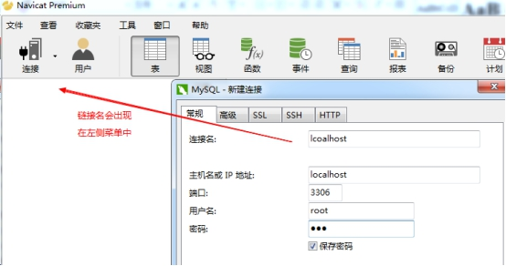
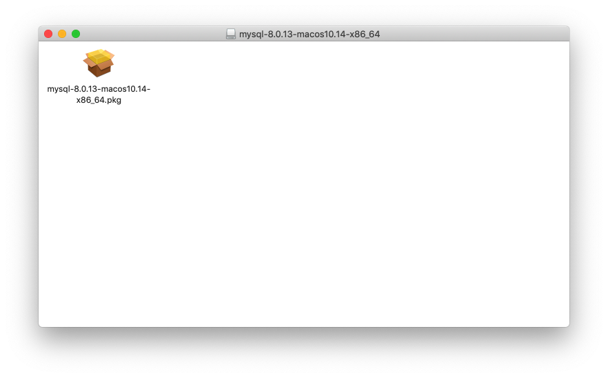
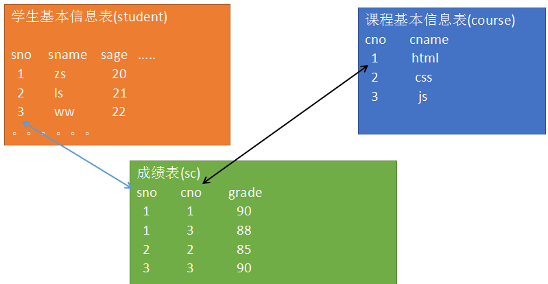

# 第9章 数据库


## 数据库入门

### 什么是数据库

存储数据的仓库。

常见的数据库: MySQL、 Oracle、 Sqlserver、 DB2。

### MySQL 安装与配置

参考链接：

- https://dev.mysql.com/doc/refman/8.0/en/mysql-installer.html

#### window

1) 解压


2) 选择版本


3) 安装 --- 傻瓜操作

注意： 安装路径不能有中文


4) 安装完成后会在桌面上产生该图标


5) 使用客户端链接MySQL服务器

① 点击“链接”按钮 ---  选择要链接的数据库种类


 ② 配置链接信息

   用户名： root          该用户是MySQL服务器系统的最高用户，拥有该系统的所有权限
   密码：  root             phpstudy中MySQL系统root用户的默认密码




  ③ 点击“localhost”结果


 

 

左侧的localhost下的内容都是数据库名称。

  **information_schema、mysql、performance_schema 这三个是系统数据库（千万别动）。**
  其他的都是自建数据库

看到上图，说明已经使用navicat 客户端正常链接到了 MySQL服务器了。


#### macOS




查看启动状态


参考链接：

- https://dev.mysql.com/doc/refman/8.0/en/osx-installation-pkg.html

#### Linux

参考链接：

- https://dev.mysql.com/doc/refman/8.0/en/linux-installation.html


## 使用navicat创建数据库

在 'localhost' 上点击鼠标右键， 选择 '新建数据库'


 

填写数据库名称 和 字符集（建议设置，也可以不设置）


information_schema、 mysql、 performance——schema 这三个是系统数据库（==千万别动==）


##  使用navicat创建数据表

双击 'study' --->  '表'（右键） --->  '新建表'


设置数据表的字段名、数据类型


设置四个字段


- sno： 学生学号， 整型， 勾选不是null代表该列数据不能为空，钥匙代表主键
- sname： 学生姓名，字符串类型
- sage： 学生年龄
- sgender： 学生性别


主键： 有两个特点（唯一，非空），能够定位到唯一的一行数据

自动递增： 数字自增长


保存后使用F5刷新，能够看到新建好的表


手动添加数据：


## SQL语句

   结构化查询语言，IBM首先创建的。


###  **数据查询**

语法格式: 

SELECT  字段名1, 字段名2, ......

  FROM 表名	

```
  [ WHERE <条件表达式> ]

  [ ORDER BY <字段名> [ ASC|DESC ]]

  [ LIMIT  START, LENGTH] 
```

 

使用的表:


sno： 学号

sname： 姓名

snickname： 昵称

sage： 年龄

sgender： 性别

stime： 入学时间

### 基本查询

语法格式:  select  字段名1, 字段名2,....  from  表名 

 案例1: 查询所有学生的学号和姓名

 表: student

 字段:  sno、 sname

```sql
select sno,sname from student
```


 案例2: 查询学生的全部信息 (全部字段信息)

 表: student

 字段:  sno, sname, snickname, sage, sgender, stime


 

*是通配符，代表所有字段。

###  带where子句的查询

select  field1, field2... from 表名     查询表中的所有数据

  where 可以使用条件来筛选查询出的结果

 

 

案例3: 查询学号为2的学生的所有信息

表: student

字段:  *

筛选条件:  sno=2


案例4: 查询年龄大于等于25的学生的学号、姓名、年龄

表： student

字段： sno， sname， sage

筛选条件： sage>=25


案例5: 查询年龄在23-28之间的学生的所有信息

表： student

字段： *

筛选条件： sage>=23  and  sage<=28

​		     sage between 23 and 28


### 模糊查询

通配符:

  %: 代表任意长度(包括0)的任意字符

  _:  代表1位长度的任意字符

```
a%b :  ab  abb  a对萨达b
a_b: acb  atb 
a_b%:  acb  a&baaad
```


like: 在执行模糊查询时，必须使用like来作为匹配条件


案例1: 查询昵称中包含 x 的学生的信息

表： student

字段： *

筛选条件： snickname  like '%x%'


案例2: 查询昵称以a字符开头并且包含n的学生的信息

表： student

字段： *

筛选条件： snickname  like  'a%n%'


###  查询结果排序

order by 可以对查询结果按某个字段的升降进行排序

  升序 asc （默认值） ，  降序 desc 

可进行排序的字段通常是  整型  英文字符串型  日期型  (中文字符串也行,但一般不用)


案例1: 查询所有学生信息，并按年龄升序排列

表: student

字段： *

筛选条件： 无

排序： order by sage asc


案例2: 查询所有女性的学生信息，并按照入学时间降序排列

表： student

字段： *

筛选条件： sgender="女"

排序： order by stime  desc


###  限制查询结果

limit 用来限制查询结果的起始点和长度

 格式:  limit  var1, var2

 var1: 起始点。 查询结果的索引，从0开始。 0代表第一条数据

 var2: 长度


案例1: 查询年龄最大的3名男性学生的信息

表： student

字段： *

筛选条件： sgender="男"

排序： order by sage  desc

限制： limit 0,3


### 关系型数据库

#### 关系型数据库简介

案例: 创建一个数据表，能够保存学生的基本信息(学号、姓名、年龄等)和学生每一科的考试成绩

1)  一张表的形式

 


缺点: 重复数据太多（数据冗余）

 

2) 关系型数据库:




使用多张数据表联合保存数据。

 核心重点： 字段的对应关系

 sc表中的 sno要和  student表中的sno对应，sc.sno的值一定要存在于 student.sno

 sc表中的cno 要和 course表中的cno对应，sc.cno的值一定要存在于course.cno


 

缺点: 表多
优点:
   数据耦合性低
   每个数据表都能够独立管理


####  student 和 dept表

   目标: 创建student和dept表用来存储学生的基本信息、学院基本信息和学生所属的学院信息


   student：学生表，所需字段  学号、姓名、性别、年龄、系别

   dept：系别表，所需字段  系号  系名


