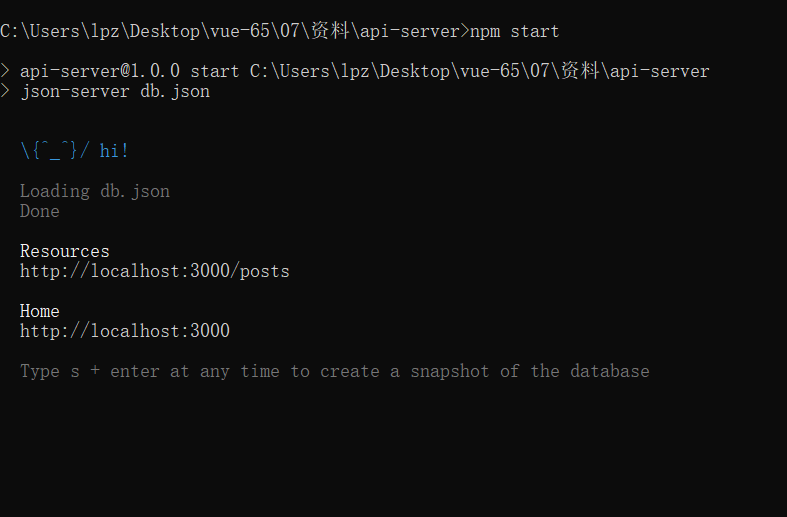
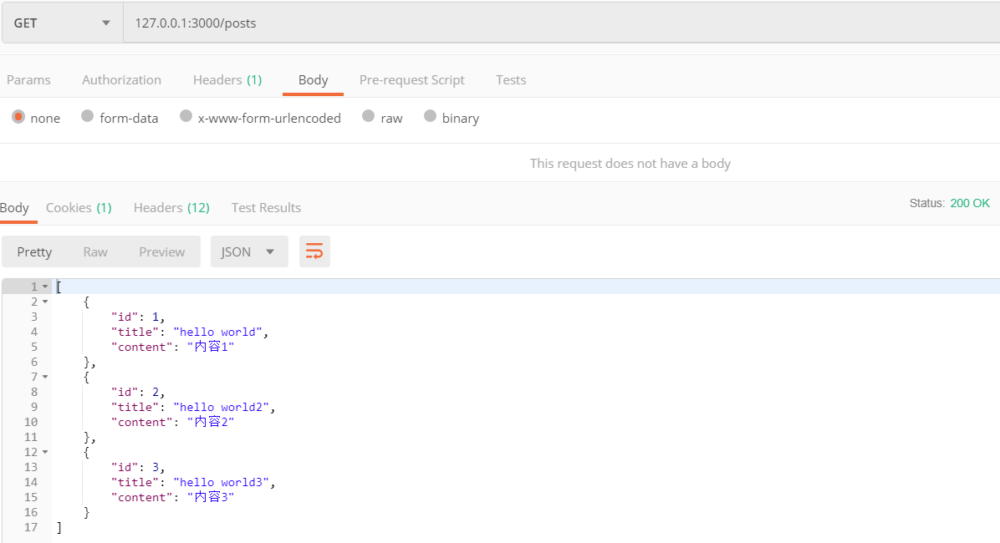
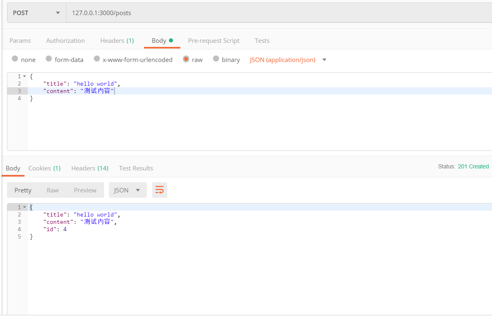
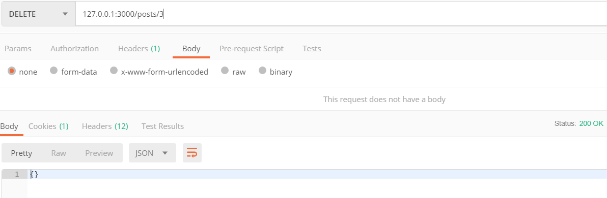
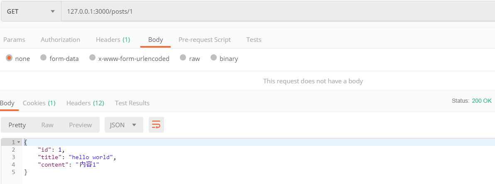
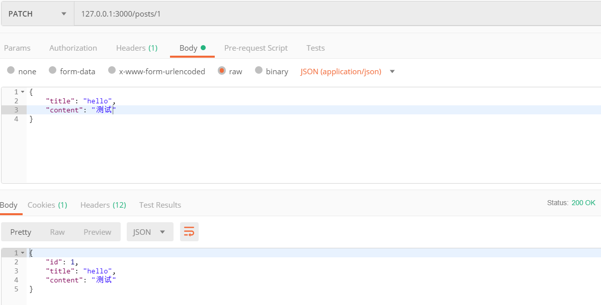
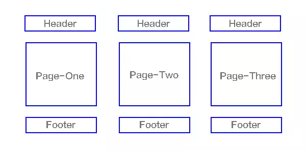
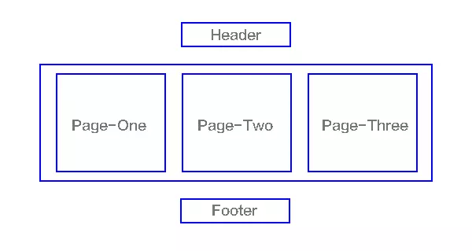

# 第10章 预热案例

- 单页面应用程序
- Vue
- Vue CLI
- axios
  - Vue 本身不提供 ajax 封装请求
  - 我们可以使用原生 XHR
  - 也可以使用jQuery 的 ajax（没必要，浪费）
  - 我们推荐更纯粹的 axios（这个库只封装了 ajax 操作）
- Vue Router 
- 模块化（ECMAScript 6 Module）
  - import
  - export
- 组件化

## 使用 Vue CLI 创建项目案例

```bash
vue create 项目名称
```

## 使用 Vue Router

安装

```bash
npm install vue-router
```

创建 `router/index.js` 并写入以下代码

```javascript
import VueRouter from 'vue-router'
import Vue from 'vue'

Vue.use(VueRouter)

// import Foo from '../views/Foo/index.vue'
import Foo from '../views/foo' // 如果加载的是一个目录，则默认加载其中的 index.xxx（js、vue） 文件
import Bar from '../views/bar'

export default new VueRouter({
  routes: [ // routes 用于配置路由表，当访问 xxx 路径的时候，展示 xxx 组件
    { path: '/foo', component: Foo },
    { path: '/bar', component: Bar }
  ]
})
```

在 `src/main.js` 中挂在路由实例到 Vue 实例中

```javascript
...
import router from './router'
...

new Vue({
  render: h => h(App),
  router
}).$mount('#app')
```

> 键名 router 是 Vue 实例选项成员（就像 data、methods 一样，固定语法），值 router 是我们在 router/inde.js 中 new 出来的 VueRouter 路由实例

最后，在 `src/App.vue` 中设置路由的出口

```html
<template>
<div id="app">
  <!-- 头部组件 -->
  <AppHeader></AppHeader>
  <!-- 侧边栏组件 -->
  <div class="main">
    <AppAside></AppAside>
    <div class="content">
      <!--
				router-view 是一个路由占位符，它是动态的，它会根据路由规则展示不同的组件。例如
				/ Home 组件
				/foo Foo组件
				/bar Bar组件
			-->
      <router-view></router-view>
    </div>
  </div>
</div>
</template>
```


## 接口服务

打开资料中的 `api-server`，双击运行 `双击启动接口服务.bat` 文件启动接口服务，接口服务默认占用 `3000` 端口号。

如果看到如下输出则说明启动成功。



> 注意：在使用接口期间不要关闭这个命令行窗口

以下接口的基准路径都是 `http://localhost:3000`

### 获取内容列表

- 请求地址 `/posts`
- 请求方法 `GET`

示例




### 添加内容

- 请求路径 `/posts`
- 请求方法 `POST`
- 请求参数

```json
{
  "title": "hello world",
  "content": "测试内容"
}
```


示例




### 删除内容

- 请求路径 `/posts/数据id`
- 请求方法 `DELETE`

示例



### 根据id获取单个内容

- 请求路径 `/posts/数据id`
- 请求方法 `GET`

示例



### 编辑内容

- 请求路径 `/posts/数据id`
- 请求方法 `PATCH`
- 请求参数

```json
{
  "title": "标题",
  "content": "内容"
}
```

示例



## Postman 接口测试工具

- 官网 https://www.getpostman.com/
- 下载
- 安装
- 使用
  - 基本使用
  - 收藏功能
  - 分享


## 单页面应用程序

### 概念

传统的多页面网站应用交互模型



单页Web应用（single page web application，SPA），就是只有一张Web页面的应用，是加载单个HTML 页面并在用户与应用程序交互时动态更新该页面的Web应用程序。




### 优点

- 非常适合前后端分离开发
  - 人员职责
    - 后端负责处理数据，提供接口
    - 前端负责页面，调用接口使用数据
  - 项目工程
    - 服务端接口项目工程
    - 前端页面项目工程
- 响应速度快，用户体验好
  - 页面切换的时候，保留公共部分，展示不同的页面内容


1. 分离前后端关注点，前端负责界面显示，后端负责数据存储和计算，各司其职，不会把前后端的逻辑混杂在一起；
2. 减轻服务器压力，服务器只用出数据就可以，不用管展示逻辑和页面合成，吞吐能力会提高几倍
3. 同一套后端程序代码，不用修改就可以用于Web界面、手机、平板等多种客户端；


### 缺点

- 不利于 SEO （搜索引擎优化）
  - Vue SSR 提供了单页面应用程序 SEO 优化问题
  - 高级概念：前后端同构
    - 服务端渲染
    - 客户端渲染
- 初次加载耗时较多
  - 单页应用有两种加载方式
  - 方式一：用户请求页面的时候，把所有的页面（组件）资源都下载下来，完了切换页面的时候速度就非常快，第一次慢一点，以后就很快了
  - 方式二：用户请求的页面的时候，只加载公共资源和当前页面资源，其它页面（组件）资源只在查看需要的时候才异步请求下载
  - 如果页面比较少，推荐第一种方式，如果页面比较多，推荐第二种方式
- 前进、后退、地址栏等，需要程序进行管理
  - hash
  - HTML5 history
  - Vue Router 都解决了


- 缺点：不利于 SEO 优化
  - 能不能解决？可以。
  - 更高级的一个概念：前后端同构
  - Vue 提供了一个服务端渲染解决方案：Vue Server Renderers（不是非常的成熟），使用成本非常高
    - 能让你在 Node 创建的 Web 服务中把 Vue 当做模板引擎来使用
  - 说白了就是服务端渲染结合单页面渲染的特点，既能拥有 SEO 优化，还能保持单页面应用的优点。
- 适合开发后台管理系统、移动端页面（交互方式就像访问原生 App 一样）

### 单页面导航路径

- 概念
- 路径
  - 一般使用锚点，也就是 hash 作为页面导航的路径标识
  - 为什么？因为正常的 url 地址会发请求，而 hash 锚点不会发请求刷新页面
- VueRouter 内部监视了 hash  的改变
  - window.onhashchange
- 然后根据 hash  的改变去展示路由规则中配置的组件
- Vue Router 默认要求  hash 导航路径都以 #/ 开头
  - 为什么？
  - 主要是为了和正常的 hash 锚点（网页内部定位，id）作区别
  - 例如我们使用锚点内部定位的时候，需要给元素起 id，我们几乎不会给这个id起名为 /xxx
  - 如果 VueRouter 没有 #/ 的规则，例如直接 #foo 就可能会和你锚点的那个 id foo 冲突。

有人会说，能不能让 url 漂亮点儿，不要使用 hash 呢？

可以。

我们可以利用 HTML5 history 的的方式使用传统的 url。（我们可以用 JavaScript 代码控制 url）。

- VueRouter 默认是 hash 路径模式
- 它也支持传统的 url 模式（HTML5 history）https://router.vuejs.org/zh/guide/#html
  - 需要额外的服务器配置


### 相关链接

- [单页应用有那些优缺点？](https://www.zhihu.com/question/20792064)
- https://juejin.im/post/5a0ea4ec6fb9a0450407725c

## 功能实现

### 列表展示

```html
<template>
<div>
  <h2>内容管理</h2>
  <div>
    <router-link to="/foo/add">添加</router-link>
  </div>
  <table>
    <thead>
      <tr>
        <th>id</th>
        <th>标题</th>
        <th>内容</th>
        <th>操作</th>
      </tr>
    </thead>
    <tbody>
      <tr v-for="item in posts" :key="item.id">
        <td>{{ item.id }}</td>
        <td>{{ item.title }}</td>
        <td>{{ item.content }}</td>
        <td>
          <a href="#">编辑</a>
          <a href="#">删除</a>
        </td>
      </tr>
    </tbody>
  </table>
</div>
</template>

<script>
import axios from 'axios'

export default {
  name: 'Foo',
  created () {
    this.loadPosts()
  },
  data () {
    return {
      posts: []
    }
  },
  methods: {
    loadPosts () {
      axios.get('http://localhost:3000/posts')
        .then(res => {
          this.posts = res.data
        })
    }
  }
}
</script>

<style>
</style>

```


### 删除

```html
<template>
<div>
  <h2>内容管理</h2>
  <div>
    <router-link to="/foo/add">添加</router-link>
  </div>
  <table>
    <thead>
      <tr>
        <th>id</th>
        <th>标题</th>
        <th>内容</th>
        <th>操作</th>
      </tr>
    </thead>
    <tbody>
      <tr v-for="item in posts" :key="item.id">
        <td>{{ item.id }}</td>
        <td>{{ item.title }}</td>
        <td>{{ item.content }}</td>
        <td>
          <router-link :to="{
            path: '/foo/edit',
            query: {
              id: item.id,
              a: 123
            }
          }">编辑</router-link>
          <a @click.prevent="handleDelete(item)" href="#">删除</a>
        </td>
      </tr>
    </tbody>
  </table>
</div>
</template>

<script>
import axios from 'axios'

export default {
  name: 'Foo',
  created () {
    this.loadPosts()
  },
  data () {
    return {
      posts: []
    }
  },
  methods: {
    loadPosts () {
      axios.get('http://localhost:3000/posts')
        .then(res => {
          this.posts = res.data
        })
    },

    handleDelete (item) {
      if (!window.confirm('确认删除吗？')) {
        return
      }

      axios.delete(`http://localhost:3000/posts/${item.id}`)
        .then(res => {
          if (res.status === 200) {
            this.loadPosts()
          }
        })
    }
  }
}
</script>

<style>
</style>

```


### 添加

```html
<template>
<div>
  <form>
    <div>
      <label for="title">标题</label>
      <input type="text" id="title" v-model="formData.title">
    </div>
    <div>
      <label for="content">内容</label>
      <textarea id="content" cols="30" rows="10" v-model="formData.content"></textarea>
    </div>
    <div>
      <!-- 
        prevetn 事件修饰符，阻止绑定元素的默认行为
       -->
      <button @click.prevent="handleAdd">提交</button>
    </div>
  </form>
</div>
</template>

<script>
import axios from 'axios'

export default {
  name: 'FooAdd',
  data () {
    return {
      // 1. 初始化一个用来存储表单数据的对象
      // 2. 然后将表单数据对象中的成员分别绑定到表单元素上
      formData: {
        title: '',
        content: ''
      }
    }
  },
  methods: {
    handleAdd () {
      // 1. 获取表单数据
      const formData = this.formData

      // 2. 发请求
      axios.post('http://localhost:3000/posts', formData)
        .then(res => {
          // 3. 根据响应结果进行后续处理
          if (res.status === 201) {
            // window.location.href = '#/foo'
            this.$router.push('/foo')
          }
        })
    }
  }
}
</script>

<style>
</style>

```


### 动态展示编辑页面

首先处理列表页的编辑链接

```html
...
<td>
  <router-link :to="{
    path: '/foo/edit',
    query: {
    	id: item.id
    }
  }">编辑</router-link>
  <a @click.prevent="handleDelete(item)" href="#">删除</a>
</td>
...
```

然后在编辑页面

```html
<template>
<div>
  <h2>编辑内容</h2>
  <form>
    <div>
      <label for="title">标题</label>
      <input type="text" id="title" v-model="formData.title">
    </div>
    <div>
      <label for="content">内容</label>
      <textarea id="content" cols="30" rows="10" v-model="formData.content"></textarea>
    </div>
    <div>
      <!-- 
        prevetn 事件修饰符，阻止绑定元素的默认行为
       -->
      <button>提交</button>
    </div>
  </form>
</div>
</template>

<script>
import axios from 'axios'

export default {
  name: 'FooEdit',
  created () {
    // 我们可以在 created 中获取路由参数
    //  $route
    //    path  当前请求路径，不包含 ? 查询字符串
    //    query 解析到的查询字符串对象
    //    params 解析到的动态路径参数
    //    fullPath 当前请求的完整路径，包含 ? 查询字符串
    //    meta 路由元数据
    // console.log(this.$route)
    this.loadPost()
  },
  data () {
    return {
      formData: {
        title: '',
        content: ''
      }
    }
  },
  methods: {
    loadPost () {
      const { id } = this.$route.query
      axios.get(`http://localhost:3000/posts/${id}`)
        .then(res => {
          this.formData = res.data
        })
    }
  }
}
</script>

<style>
</style>

```

### 提交编辑

```html
<template>
<div>
  <h2>编辑内容</h2>
  <form>
    <div>
      <label for="title">标题</label>
      <input type="text" id="title" v-model="formData.title">
    </div>
    <div>
      <label for="content">内容</label>
      <textarea id="content" cols="30" rows="10" v-model="formData.content"></textarea>
    </div>
    <div>
      <!-- 
        prevetn 事件修饰符，阻止绑定元素的默认行为
       -->
      <button @click.prevent="handleEdit">提交</button>
    </div>
  </form>
</div>
</template>

<script>
import axios from 'axios'

export default {
  name: 'FooEdit',
  created () {
    this.loadPost()
  },
  data () {
    return {
      formData: {
        title: '',
        content: ''
      }
    }
  },
  methods: {
    loadPost () {
      const { id } = this.$route.query
      axios.get(`http://localhost:3000/posts/${id}`)
        .then(res => {
          this.formData = res.data
        })
    },

    handleEdit () {
      const formData = this.formData
      // axios.patch()
      axios({
        method: 'PATCH',
        url: `http://localhost:3000/posts/${formData.id}`,
        data: formData
      }).then(res => {
        // console.log(res)
        if (res.status === 200) {
          this.$router.push('/foo')
        }
      })
    }
  }
}
</script>

<style>
</style>

```


## 编译打包

项目开发完成后，面临的就是如何将项目进行打包上线，放到服务器中。

```bash
npm run build
```


## 总结

