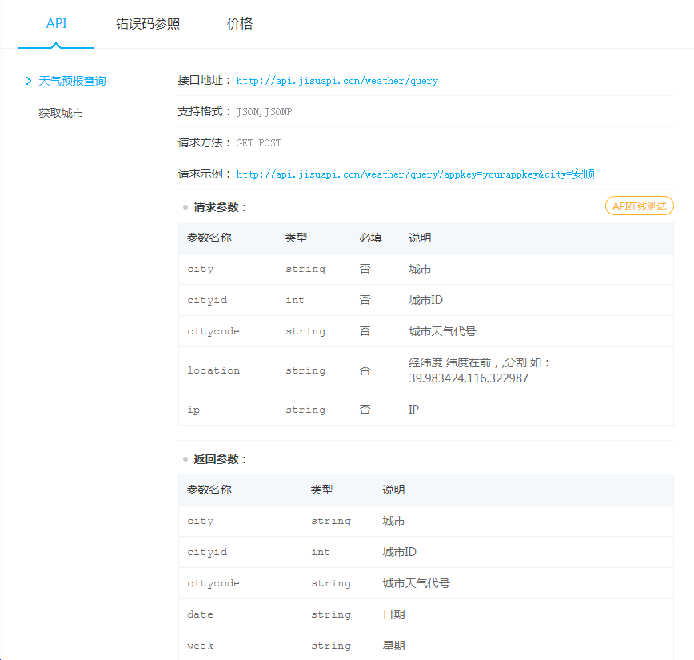

---

---

# 第12章 Ajax


## 概述

> Web 程序最初的目的就是将信息（数据）放到公共的服务器，让所有网络用户都可以通过浏览器访问。


在此之前，我们可以通过以下几种方式让浏览器发出对服务端的请求，获得服务端的数据：

- 地址栏输入地址，回车，刷新
- 特定元素的 href 或 src 属性
- 表单提交

这些方案都是我们无法通过或者很难通过代码的方式进行编程，**如果我们可以通过 JavaScript 直接发送网络请求，那么 Web 的可能就会更多，随之能够实现的功能也会更多，至少不再是“单机游戏”。**

AJAX（Asynchronous JavaScript and XML），最早出现在 2005 年的 [Google Suggest](http://google-suggest.tumblr.com/)，是在浏览器端进行网络编程（发送请求、接收响应）的技术方案，它使我们可以通过 JavaScript 直接获取服务端最新的内容而不必重新加载页面。让 Web 更能接近桌面应用的用户体验。

说白了，**AJAX 就是浏览器提供的一套 API，可以通过 JavaScript 调用，从而实现通过代码控制请求与响应。实现网络编程。**

> 能力不够 API 凑。

## 快速上手

使用 AJAX 的过程可以类比平常我们访问网页过程

```javascript
// 1. 创建一个 XMLHttpRequest 类型的对象 —— 相当于打开了一个浏览器
var xhr = new XMLHttpRequest()
// 2. 打开与一个网址之间的连接 —— 相当于在地址栏输入访问地址
xhr.open('GET', './time.php')
// 3. 通过连接发送一次请求 —— 相当于回车或者点击访问发送请求
xhr.send(null)
// 4. 指定 xhr 状态变化事件处理函数 —— 相当于处理网页呈现后的操作
xhr.onreadystatechange = function () {
  // 通过 xhr 的 readyState 判断此次请求的响应是否接收完成
  if (this.readyState === 4) {
    // 通过 xhr 的 responseText 获取到响应的响应体™
    console.log(this)
  }
}
```

### readyState

由于 `readystatechange` 事件是在 `xhr` 对象状态变化时触发（不单是在得到响应时），也就意味着这个事件会被触发多次，所以我们有必要了解每一个状态值代表的含义：

| readyState | 状态描述         | 说明                                                      |
| ---------- | ---------------- | --------------------------------------------------------- |
| 0          | UNSENT           | 代理（XHR）被创建，但尚未调用 `open()` 方法。             |
| 1          | OPENED           | `open()` 方法已经被调用，建立了连接。                     |
| 2          | HEADERS_RECEIVED | `send()` 方法已经被调用，并且已经可以获取状态行和响应头。 |
| 3          | LOADING          | 响应体下载中， `responseText` 属性可能已经包含部分数据。  |
| 4          | DONE             | 响应体下载完成，可以直接使用 `responseText`。             |

```javascript
var xhr = new XMLHttpRequest()
// 代理（XHR）被创建，但尚未调用 open() 方法。
console.log(xhr.readyState)
// => 0

xhr.open('GET', './time.php')

// open() 方法已经被调用，建立了连接。
console.log(xhr.readyState)
// => 1

xhr.send(null)

xhr.onreadystatechange = function () {
  console.log(this.readyState)
  // send() 方法已经被调用，并且已经可以获取状态行和响应头。
  // => 2
  // 响应体下载中， responseText 属性可能已经包含部分数据。
  // => 3
  // 响应体下载完成，可以直接使用 responseText。
  // => 4
}
```

通过理解每一个状态值的含义得出一个结论：一般我们都是在 `readyState` 值为 `4` 时，执行响应的后续逻辑。

```javascript
xhr.onreadystatechange = function () {
  if (this.readyState === 4) {
    // 后续逻辑......
  }
}
```

### 遵循 HTTP

本质上 XMLHttpRequest 就是 JavaScript 在 Web 平台中发送 HTTP 请求的手段，所以我们发送出去的请求任然是 HTTP 请求，同样符合 HTTP 约定的格式：

```javascript
// 设置请求报文的请求行
xhr.open('GET', './time.php')
// 设置请求头
xhr.setRequestHeader('Accept', 'text/plain')
// 设置请求体
xhr.send(null)

xhr.onreadystatechange = function () {
  if (this.readyState === 4) {
    // 获取响应状态码
    console.log(this.status)
    // 获取响应状态描述
    console.log(this.statusText)
    // 获取响应头信息
    console.log(this.getResponseHeader('Content-Type')) // 指定响应头
    console.log(this.getAllResponseHeader()) // 全部响应头
    // 获取响应体
    console.log(this.responseText) // 文本形式
    console.log(this.responseXML) // XML 形式，了解即可不用了
  }
}
```

> 参考链接：
>
> - https://developer.mozilla.org/zh-CN/docs/Web/API/XMLHttpRequest
> - https://developer.mozilla.org/zh-CN/docs/Web/API/XMLHttpRequest/Using_XMLHttpRequest

## 具体用法

### GET 请求

> 通常在一次 GET 请求过程中，参数传递都是通过 URL 地址中的 `?` 参数传递。

```javascript
var xhr = new XMLHttpRequest()
// GET 请求传递参数通常使用的是问号传参
// 这里可以在请求地址后面加上参数，从而传递数据到服务端
xhr.open('GET', './delete.php?id=1')
// 一般在 GET 请求时无需设置响应体，可以传 null 或者干脆不传
xhr.send(null)
xhr.onreadystatechange = function () {
  if (this.readyState === 4) {
    console.log(this.responseText)
  }
}

// 一般情况下 URL 传递的都是参数性质的数据，而 POST 一般都是业务数据
```

### POST 请求

> POST 请求过程中，都是采用请求体承载需要提交的数据。

```javascript
var xhr = new XMLHttpRequest()
// open 方法的第一个参数的作用就是设置请求的 method
xhr.open('POST', './add.php')
// 设置请求头中的 Content-Type 为 application/x-www-form-urlencoded
// 标识此次请求的请求体格式为 urlencoded 以便于服务端接收数据
xhr.setRequestHeader('Content-Type', 'application/x-www-form-urlencoded')
// 需要提交到服务端的数据可以通过 send 方法的参数传递
// 格式：key1=value1&key2=value2
xhr.send('key1=value1&key2=value2')
xhr.onreadystatechange = function () {
  if (this.readyState === 4) {
    console.log(this.responseText)
  }
}
```

### 同步与异步

关于同步与异步的概念在生活中有很多常见的场景，举例说明。

> 同步：一个人在同一个时刻只能做一件事情，在执行一些耗时的操作（不需要看管）不去做别的事，只是等待
>
> 异步：在执行一些耗时的操作（不需要看管）去做别的事，而不是等待

`xhr.open()` 方法第三个参数要求传入的是一个 `bool` 值，其作用就是设置此次请求是否采用异步方式执行，默认为 `true`，如果需要同步执行可以通过传递 `false` 实现：

```javascript
console.log('before ajax')
var xhr = new XMLHttpRequest()
// 默认第三个参数为 true 意味着采用异步方式执行
xhr.open('GET', './time.php', true)
xhr.send(null)
xhr.onreadystatechange = function () {
  if (this.readyState === 4) {
    // 这里的代码最后执行
    console.log('request done')
  }
}
console.log('after ajax')
```

如果采用同步方式执行，则代码会卡死在 `xhr.send()` 这一步：

```javascript
console.log('before ajax')
var xhr = new XMLHttpRequest()
// 同步方式
xhr.open('GET', './time.php', false)
// 同步方式 执行需要 先注册事件再调用 send，否则 readystatechange 无法触发
xhr.onreadystatechange = function () {
  if (this.readyState === 4) {
    // 这里的代码最后执行
    console.log('request done')
  }
}
xhr.send(null)
console.log('after ajax')
```

演示同步异步差异。

一定在发送请求 `send()` 之前注册 `readystatechange`（不管同步或者异步）

- 为了让这个事件可以更加可靠（一定触发），一定是先注册

了解同步模式即可，切记不要使用同步模式。

至此，我们已经大致了解了 AJAX 的基本 API 。

### 响应数据格式

> 提问：如果希望服务端返回一个复杂数据，该如何处理？

关心的问题就是服务端发出何种格式的数据，这种格式如何在客户端用 JavaScript 解析。

#### XML

一种数据描述手段

老掉牙的东西，简单演示一下，不在这里浪费时间，基本现在的项目不用了。

淘汰的原因：数据冗余太多

#### JSON

也是一种数据描述手段，类似于 JavaScript 字面量方式

服务端采用 JSON 格式返回数据，客户端按照 JSON 格式解析数据。


> 不管是 JSON 也好，还是 XML，只是在 AJAX 请求过程中用到，并不代表它们之间有必然的联系，它们只是数据协议罢了

### 处理响应数据渲染

> 模板引擎：
>
> - artTemplate：https://aui.github.io/art-template/

模板引擎实际上就是一个 API，模板引擎有很多种，使用方式大同小异，目的为了可以更容易的将数据渲染到HTML中

### 兼容方案

XMLHttpRequest 在老版本浏览器（IE5/6）中有兼容问题，可以通过另外一种方式代替

```javascript
var xhr = XMLHttpRequest ? new XMLHttpRequest() : new ActiveXObject('Microsoft.XMLHTTP')
```

## 封装

###  封装 $.get方法

目标： 封装一个 $.get 方法，能够发送get方式的Ajax请求，并且接收到后端的返回数据

实现思路：

1) 编写一个具体的发送get方式的Ajax请求程序，并封装为函数

2) 分装该函数的缺陷

3) 解决缺陷


代码实现：

1) 编写一个具体的发送get方式的Ajax请求程序，并封装为函数

  目标： 发送get方式的Ajax请求，能够请求到 /getData，并且能够将id=1这个数据发送到后端。还能接收到后端返回的数据


2) 分装该函数的缺陷

 ① 创建 xhr 对象时，没有考虑兼容性问题

 ② 请求的后端地址永远都是 /getData

 ③ 发送给后端的数据永远都是 id=1

 ④ 处理接收到的后端结果方式单一，只能alert()


3) 解决缺陷

  ① 创建 xhr 对象时，没有考虑兼容性问题


 ② 请求的后端地址永远都是 /getData


​    ③ 发送给后端的数据永远都是 id=1


 ④ 处理接收到的后端结果方式单一，只能alert()

   解决方案: 使用回调函数


在调用 $.get 方法时，参数3传入了一个函数（回调函数）。可以在该函数中随意写代码，操作DOM对象，或者alert弹出或者console.log输出都行。


### 封装 $.post方法

目标：$.post() 能够发送一个post方式的Ajax请求，并且能够接收到后端返回的数据

实现思路：

 1) 编写一个具体的案例
     具体案例:  封装一个post方法，能够发送ajax请求，请求 /postData ，并且能接收到 /postData 的返回数据

 2) 分析缺陷

​   ① 只能访问 /postData 程序
   ② 无法灵活向后台的 /postData 程序发送参数
   ③ 前端无法灵活接收后端返回的数据

 3) 解决缺陷


代码实现：

1) 编写一个具体的案例
     具体案例:  封装一个post方法，能够发送ajax请求，请求 /postData ，并且能接收到 /postData 的返回数据


2) 缺陷分析

   ① 请求的地址必须是 /postData

   ② 没有向后端发送数据的操作

   ③ 后端返回的结果只能被alert()


3) 解决缺陷

   ① 请求的地址必须是 /postData


​     ② 没有向后端发送数据的操作


​    ③ 后端返回的结果只能被alert()


### jQuery.ajax

在jquery中封装了4个ajax方法： `$.get  $.post  $.ajax  $.getJson`

常用前三个 `$.get  $.post  $.ajax`

#### $.get方法

 $.get(var1, var2, var3, var4);
  参数1: 请求的后端程序的地址
  参数2: 要发送到后端程序的数据，json对象/js对象（推荐）或者 字符串
  参数3: 当readyState==4时的触发函数，该函数中有一个参数，就是后端程序返回的数据
  参数4: 设置返回数据的类型:  text(默认)  json     xml


{id:1, name:"zs"}  ==>  id=1&name=zs

xhr.open('get', '/getData?id=1&name=zs');


案例1 在get.html文件中发送一个ajax请求，去请求后端的 /getData，同时将id=1数据发送给后端


参数1： 请求的后端页面的地址

参数2： 发送给后端的数据。可以使用 字符串  js对象  json对象

```
    id=1    {id:1}  {"id":1} , js对象和json对象会被自动转为 id=1的字符串

    前两个参数会组合成open方法的参数2    /getData?id=1
```

参数3： readyState=4时的回调函数，参数data就是后端返回的数据

参数4： 后端返回的数据类型，可以使用  text(默认)   json   xml

```
    后端返回的是一个普通字符串，则使用text

    后端返回的是json字符串，则使用json，相当于执行了 JSON.parse将返回的json字符串转为json对象
```


案例2 使用$.get改造用户名搜索案例

   完成功能的思路是一样的，只是发送Ajax请求的操作由原生方式变为$.get方式

1) 在搜索按钮上注册点击事件，获取关键词，发送Ajax请求并将关键词一起发送给后端

2) 后端接收关键词，编写SQL语句并执行，再将结果返回给前端

3) 前端接收后端数据，再将数据显示到网页上


代码实现:

1) 在搜索按钮上注册点击事件，获取关键词，发送Ajax请求并将关键词一起发送给后端


2) 后端接收关键词，编写SQL语句并执行，再将结果返回给前端

   使用原来 /search 地址，程序不用修改


3) 前端接收后端数据，再将数据显示到网页上


####  $.post方法

`$.post`函数的用法和`$.get`一模一样，只是发送请求方式变为post

 $.post(var1, var2, var3 , var4);    //最标准的写法
  参数1: 请求的后端程序的地址
  参数2: 要发送到后端程序的数据，json对象/js对象（推荐） 或者 字符串
  参数3: 当readyState=4时的触发函数，该函数中有一个参数，就是后台程序返回的数据
  参数4: 设置返回数据的类型:  text(默认)  json    xml


案例: 在post.html文件中发送一个ajax请求，去请求后端的 /postData ，同时将id=1数据发送给后端


## 跨域

## 1.1 什么是ajax跨域

简单来说，就是网站A去调用网站B的数据。
常见案例： hao123.com的天气预报。


但是Ajax跨域存在一个问题 --- 浏览器的同源策略，该策略会阻止ajax跨域访问
同源策略（Same origin policy）是一种约定，它是浏览器的一种安全功能。 
同源:  同协议，同域名，同端口；   不同源则为跨域


同源限制案例:
127.0.0.1:3000/index ---> index.html 中使用ajax请求 127.0.0.1:8888/getData，并获取到返回的数据

因为端口号不一样，所以是不同的服务器


实现思路:

1) 创建 127.0.0.1:3000 服务器，并显示index.html页面；在index.html页面中使用jquery 方式发送Ajax请求，请求 127.0.0.1:8888/getData

2) 创建 127.0.0.1:8888 服务器，在 /getData 路由中返回一个字符串


服务器1： 端口号是3000的服务器，要在该服务器上发送Ajax请求

服务器2： 端口号是8888的服务器，要在该服务器上返回Ajax请求的结果


1)  创建 127.0.0.1:3000 服务器，并显示index.html页面；在index.html页面中使用jquery 方式发送Ajax请求，请求 127.0.0.1:8888/index


2) 创建 127.0.0.1:8888 服务器，在 /getData 路由中返回一个字符串


访问结果:


==当看到返回结果中有 'Access-Control-Allow-Origin' 时，就说明Ajax的跨域请求失败了。==


查看 /getData 的响应体，发现已经有了后端返回的结果。但是，依然不能用，说明是浏览器不让使用后端返回的数据


## 1.2 解决跨域问题的方式

- 服务器代理
- cors （跨域资源共享）
- jsonp


## 1.3 cors跨域

  cors: 跨域资源共享。
  ==同源策略是浏览器的策略==。但是如果服务器允许其他网站的页面进行跨域访问，那么浏览器就不会对返回的数据进行限制了。


  Nodejs中要使用cors方法解决跨域问题，需要安装第三方模块 cors  --->  `npm i cors`  


 cors的使用方法：  后端程序

cors.js文件中解决跨域的代码就两句


访问结果:


## 1.4 jsonp跨域

JSONP(JSON with Padding) : 是一种解决ajax跨域访问的方案。

核心思想:
   浏览器虽然有同源策略，但是 src 和 href 两个属性却可以跨域访问。 可以利用这一“漏洞”来请求另一个网站的页面。

从原理上将 jsonp 是不属于Ajax范畴的，它是使用 script标签的src来发送请求。但是实现的效果和Ajax是一致的


1) 后端返回一个函数调用的字符串

  res.send('aaa("Hello Ajax")');

2) 前端要声明该函数

  function  aaa (data) {

​	alert(data);	

  }


1) 后端的 /getData 方法返回了一个aaa() 字符串


2) 前端使用 script 标签，请求了 /getData，就能得到 aaa()


```js
const obj = {name:"zs", age:20};

const str = '我叫' + obj.name + ', 今年' + obj.age + '岁'；

const str = `我叫"${obj.name}",今年'${obj.age}'岁`; //我叫"zs"，今年'20'岁
```


## 1.5 $.ajax方法跨域操作 --- jsonp

`$.post  $.get $.ajax都能发送跨域请求。但是，$.post和$.get是要依靠cors方式的，只有$.ajax能使用jsonp方式`


核心: 
    必须设置请求类型为get ---  type: ‘get’
    必须设置dataType为jsonp --- dataType: ‘jsonp’
    必须额外设置一个jsonp参数，该参数值可以是任何英文字符串，常用callback。 jsonp: 'callback'
           ==该参数会产生一个随机字符串==
               ==前端使用该字符串创建一个函数==
               ==后端接收该字符串作为返回函数的名称==

示例:

1) 使用jsonp发送跨域请求

```js
$.ajax({
    url: 'http://127.0.0.1:8888/getData',  //请求的后端地址
    type: 'get',   
    dataType: 'jsonp',   
    jsonp: 'callback',   //解决前后端函数名统一的问题   
    success: function(msg){
        alert(msg);
        alert(msg.name);
    }
})
```


2) 后端拼接函数字符串

```js
app.get('/getData', (req, res) => {
	//接收 callback 传递的函数名
  	const func = req.query.callback;
    
    //返回函数字符串
    res.send(func + '({code:200,message:"请求成功"})');
})
```


案例: 127.0.0.1:3000/index  --> index.html 页面中使用 $.ajax方法跨域请求后端  127.0.0.1:8888/getData

1) 27.0.0.1:3000/index  --> index.html 页面中使用 $.ajax方法跨域请求


2) 后端  127.0.0.1:8888/getData


访问结果:


## 1.6 调用网上接口 --- 天气预报

  网站： www.jisuapi.com


api说明:




注册，购买后可在“我的api”中看到


1） 发送ajax请求


2) 将取得数据筛选后显示到网页上


http://api.jisuapi.com/weather/query?appkey=1dc381f43936cdf7&city=北

## 参考链接

- http://www.w3school.com.cn/ajax/index.asp
- https://aui.github.io/art-template/zh-cn

