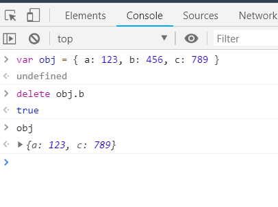
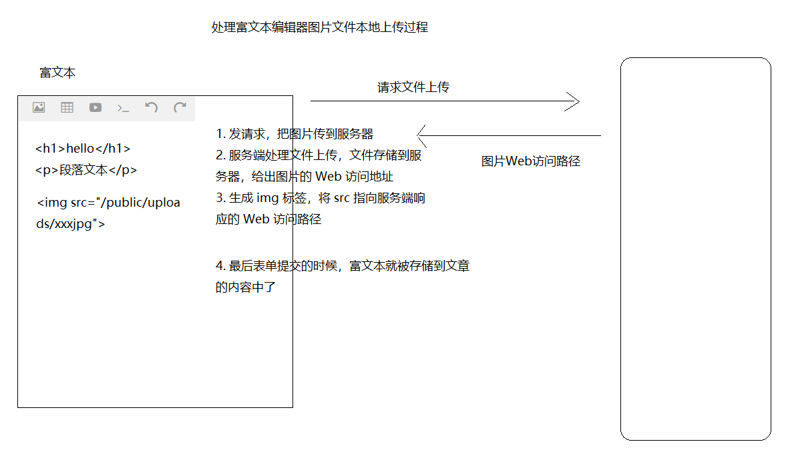
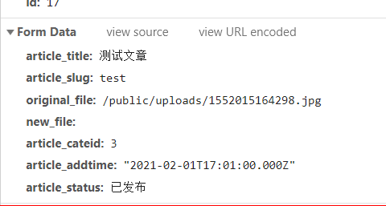
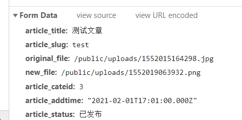

# 第13章  阿里百秀综合案例

## 起步

### 初始化项目目录结构

```
.
├── node_modules 第三方包存储目录(使用npm装包默认生成)
├── controllers 控制器
├── models 模型
├── public 静态资源（图片、样式、客户端js...）
├── views 视图(存储HTML视图文件)
├── app.js 应用程序启动入口（加载Express，启动HTTP服务。。。）
├── config.js 应用配置文件（把经常需要改动的数据放到配置文件中，修改方便）
├── utils 存储工具模块（例如用来操作数据库的模块）
├── middlewares 放置自定义中间件
├── routes 存储路由相关模块
├── package.json 项目包说明文件，用来存储项目名称，第三方包依赖等信息（通过 npm init初始化）
├── package-lock.json npm产生的包说明文件（由npm装包自动产生）
└── README.md 项目说明文件

```

### 使用 Express 创建 Web 服务

1. 安装 Express

```bash
npm i express
```

2. 在 `app.js` 中写入以下内容

```javascript
const express = require('express')
const app = express()

app.get('/', (req, res) => res.send('Hello World!'))

app.listen(3000, () => console.log('Serve listening http://127.0.0.1:3000/'))

```

3. 使用 [nodemon](https://github.com/remy/nodemon) 启动开发模式

```bash
nodemon app.js
```

4. 在浏览器中访问 `http://127.0.0.1:3000/`

### 导入并开放静态资源

1. 将模板中的 html 静态文件放到项目的 `views` 目录中
2. 将模板中的静态资源（css、图片、客户端js）放到 `public` 目录中

3. 在 Web 服务中把 `public` 目录开放出来

```javascript
...

const path = require('path')

app.use('/public', express.static(path.join(__dirname, './public')))

...

```

4. 测试访问 public 中的资源

### 使用模板引擎渲染页面

在 Node 中，不仅仅有 art-template 这个模板引擎，还有很多别的。

- ejs
- pug
- handlebars
- nunjucks
- ...

> 参考文档：
>
> - https://aui.github.io/art-template/express/

1. 安装

```bash
npm i art-template express-art-template
```

2. 配置

```bash
...

// res.render() 的时候默认去 views 中查找模板文件
// 如果想要修改，可以使用下面的方式
app.set('views', '模板文件存储路径')

// express-art-template 内部依赖了 art-template
app.engine('html', require('express-art-template'))

...
```

3. 使用

```javascript
app.get('/', (req, res, next) => {
  // render 方法内部就会去
  // 1. 读取文件
  // 2. 模板引擎解析替换
  // 3. 发送响应结果
  res.render('index.html')
})

```

4. 修改页面中的静态资源引用路径让页面中的资源正常加载
5. 浏览测试

### 提取路由模块

- 简单应用提取一个路由文件模块

- 将来路由越来越多，所以按照不同的业务分门别类的创建了多个路由文件模块放到了 routes 目录中，好管理和维护。


提取路由模块操作步骤：

1. 创建路由文件

2. 写入以下基本内容

```javascript
const express = require('express')
const router = express.Router()

// 自定义路由内容
// router.get
// router.get
// router.post
// ...

module.exports = router

```

3. 在 `app.js` 中挂载路由模块

```javascript
...
// 加载路由模块
const 路由模块 = require('路由模块路径')

...

// 挂载路由模块到 app 上
app.use(路由模块)

...
```

4. 打开浏览器访问路由路径进行测试。


### 提取模板页

> 参考文档：
>
> - [art-template 模板继承](https://aui.github.io/art-template/docs/syntax.html#Template-inheritance)
>   - extend
>   - block
> - [art-template 子模板](https://aui.github.io/art-template/docs/syntax.html#Sub-template)
>   - include


### 走通页面路由导航

| 请求路径                  | 作用                     | 备注 |
| ------------------------- | ------------------------ | ---- |
| /                         | 渲染门户端首页           |      |
| /posts                    | 渲染门户端文章列表页     |      |
| /posts/:id                | 渲染门户端文章详情页     |      |
| /admin                    | 渲染管理系统首页         |      |
| /admin/posts              | 渲染管理系统文章列表页   |      |
| /admin/categories         | 渲染管理系统文章分类页   |      |
| /admin/login              | 渲染管理系统登录页       |      |
| /admin/users              | 渲染管理系统用户管理页   |      |
| /admin/posts/new          | 渲染管理系统添加文章页面 |      |
| /admin/banners            | 渲染管理系统轮播管理页面 |      |
| /admin/website            | 渲染管理系统网站设置页面 |      |
| /admin/comments           | 渲染管理系统评论管理页面 |      |
| /admin/settings/profile   | 渲染管理系统个人中心页面 |      |
| /admin/settings/reset-pwd | 渲染管理系统设置密码页面 |      |
| ...                       | ...                      |      |


### 导入数据库

- 新建一个数据库命名为 `alishow`
- 在 `alishow` 数据库中执行下发的数据库文件 `ali.sql`
- 了解表的含义

### 封装数据库操作模块

> 参考文档：
>
> - https://github.com/mysqljs/mysql

1. 安装

```bash
npm i mysql
```

2. 基本使用

```javascript
var mysql      = require('mysql');
var connection = mysql.createConnection({
  host     : 'localhost',
  user     : 'me',
  password : 'secret',
  database : 'my_db'
});

connection.connect();

connection.query('SELECT 1 + 1 AS solution', function (error, results, fields) {
  if (error) throw error;
  console.log('The solution is: ', results[0].solution);
});

connection.end();
```

3. 上面的方式是创建了单个连接，不靠谱，一旦这个连接挂掉，就无法操作数据库。我们推荐使用连接池的方式来操作数据库，所以将单个连接的方式改为如下连接池的方式。

```javascript
var mysql = require('mysql');
var pool  = mysql.createPool({
  connectionLimit : 10,
  host            : 'example.org',
  user            : 'bob',
  password        : 'secret',
  database        : 'my_db'
});

pool.query('SELECT 1 + 1 AS solution', function (error, results, fields) {
  if (error) throw error;
  console.log('The solution is: ', results[0].solution);
});

```

4. 我们在项目的很多地方都要操作数据库，所以为了方便，我们将数据库操作封装为了一个单独的工具模块放到了 `utils/db.js` 中，哪里使用就在哪里加载。

```javascript
const mysql = require('mysql')

// 创建一个连接池
// 连接池中创建了多个连接
const pool = mysql.createPool({
  connectionLimit: 10, // 连接池的限制大小
  host: 'localhost',
  user: 'root',
  password: '123456',
  database: 'alishow63'
})

// 把连接池导出
// 谁要操作数据库，谁就加载 db.js 模块，拿到 poll，点儿出 query 方法操作
module.exports = pool

```

5. 例如在 `xxx` 模块中需要操作数据库，则可以直接

```javascript
const db = require('db模块路径')

// 执行数据库操作
db.query()...

```

### 测试渲染文章列表页

```javascript
...
const db = require('../utilds/db')
...

router.get('/admin/posts', (req, res, next) => {
  db.query('SELECT * FROM `ali_aicle`', (err, ret) => {
    if (err) {
      throw err
    }

    res.render('admin/posts.html', {
      posts: ret
    })
  })
})

...
```


### 服务端全局错误处理

利用错误处理中间件：http://expressjs.com/en/guide/error-handling.html

```javascript
app.use((err, req, res, next) => {
  // 1. 记录错误日志
  // 2. 一些比较严重的错误，还应该通知网站负责人或是开发人员等
  //    可以通过程序调用第三方服务，发短信，发邮件
  // 3. 把错误消息发送到客户端 500 Server Internal Error
  res.status(500).send({
    error: err.message
  })
})
```

> 注意：执行错误处理中间件挂载的代码必须在我们的路由执行挂载之后

然后在我们的路由处理中，如果有错误，就调用 next 函数传递错误对象，例如

```javascript
rouget.get('xxx', (req, res, next) => {
  xxx操作
  if (err) {
    // 调用 next，传递 err 错误对象
    return next(err)
  }
})
```

### 使用 errorhandler 美化错误输出页面

> 参考文档：https://github.com/expressjs/errorhandler

安装

```bash
# 注意：使用淘宝镜像源安装这个包可能会失败（淘宝镜像源也不能一劳永逸）
# 建议使用 npm 官方镜像源安装这个包
npm i errorhandler
```

配置

```javascript
...
const errorhandler = require('errorhandler')
...

// 后面讲发布部署的时候再将这种方式，不用修改代码，可以在程序的外部决定内部的执行逻辑
if (process.env.NODE_ENV === 'development') {
  app.use(errorhandler())
}

```

也可以错误消息输出到系统通知

```javascript
...
var errorhandler = require('errorhandler')
var notifier = require('node-notifier')

...

if (process.env.NODE_ENV === 'development') {
  // only use in development
  app.use(errorhandler({log: errorNotification}))
}


// 将错误输出消息输出到系统通知
function errorNotification (err, str, req) {
  var title = 'Error in ' + req.method + ' ' + req.url

  notifier.notify({
    title: title,
    message: str
  })
}
```


### 小结


## 分类管理

### 分类列表

一、页面加载，发起 Ajax 请求，获取分类列表数据，等待响应

```javascript
$.ajax({
  url: '/api/categories',
  method: 'GET',
  data: {},
  dataType: 'json',
  success: function (data) {
    // 1. 判断数据是否正确
    // 2. 使用模板引擎渲染列表数据
    // 3. 把渲染结果替换到列表容器中
    console.log(data)
  },
  error: function (err) {
    console.log('请求失败了', err)
  }
})

```


二、服务端收到请求，提供请求方法为 `GET`, 请求路径为 `/api/categories` 的路由，响应分类列表数据

```javascript
// 1. 添加接口路由
router.get('/api/categories/list', (req, res, next) => {
  // 2. 操作数据库获取数据
  db.query('SELECT * FROM `ali_cate`', function (err, data) {
    if (err) {
      throw err
    }
    
  	// 3. 把数据响应给客户端
    res.send({
      success: true,
      data
    })
  })
})

```

三、客户端正确的收到服务端响应的数据了，使用数据结合模板引擎渲染页面内容

0. 配置客户端模板引擎
   1. 下载
   2. 引用

1. 准备模板字符串

```html
<script type="text/html" id="list_template">
  
  <tr>
    <td class="text-center"><input type="checkbox"></td>
    <td></td>
    <td></td>
    <td class="text-center">
      <a href="javascript:;" class="btn btn-info btn-xs">编辑</a>
      <a data-id="" name="delete" href="javascript:;" class="btn btn-danger btn-xs">删除</a>
    </td>
  </tr>
  
</script>

<script>
  // template('script 节点 id')
  // 当前页面是由服务端渲染出来的
  // 服务端先先对当前页面进行模板引擎处理
  // 服务端处理的时候根本不关心你的内容，只关心模板语法，我要解析替换
  // 当你的服务端模板引擎语法和客户端模板引擎语法一样的时候，就会产生冲突
  //    服务端会把客户端的模板字符串页给解析掉
  //    这就是所谓的前后端模板语法冲突
  
  // 修改模板引擎的语法界定符
  template.defaults.rules[1].test = //;
</script>

```

后续处理：

```javascript
<script>
  loadList()
  
  /*
   * 加载分类列表数据
   */
  function loadList() {
    $.ajax({
      url: '/api/categories',
      method: 'GET',
      data: {},
      dataType: 'json',
      success: function (data) {
        // 1. 判断数据是否正确
        // 2. 使用模板引擎渲染列表数据
        // 3. 把渲染结果替换到列表容器中
        if (data.success) {
          var htmlStr = template('list_template', {
            listData: data.data
          })
          $('#list_container').html(htmlStr)
        }
      },
      error: function (err) {
        console.log('请求失败了', err)
      }
    })
  }
</script>
```

总结：

- 客户端发起请求，等待响应
- 服务端收到请求
- 服务端处理请求
- 服务端发送响应
- 客户端收到响应
- 客户端根据响应结果进行后续处理

### 删除分类

一、通过事件委托方式为动态渲染的删除按钮添加点击事件

- 第一种把添加事件的代码放到数据列表渲染之后
- 第二种使用事件代理（委托）的方式

```javascript
...

$('#list_container').on('click', 'a[name=delete]', handleDelete)

...
```

二、在删除处理中发起 Ajax 请求删除操作

```javascript
function handleDelete() {
  if (!window.confirm('确认删除吗？')) {
    return
  }
  var id = $(this).data('id')
  // 点击确定，发起 Ajax 请求，执行删除操作
  $.ajax({
    url: '/api/categories/delete',
    method: 'GET',
    data: {
      id: id
    },
    dataType: 'json',
    success: function (data) {
      console.log(data)
    },
    error: function (err) {
      console.log(err)
    }
  })
  return false
}
```

三、在服务端添加路由接口处理删除操作

```javascript
router.get('/api/categories/delete', (req, res, next) => {
  // 获取要删除的数据id
  const { id } = req.query

  // 操作数据库，执行删除
  db.query('DELETE FROM `ali_cate` WHERE `cate_id`=?', [id], (err, ret) => {
    if (err) {
      throw err
    }
    res.send({
      success: true,
      ret
    })
  })
})
```

四、客户端收到响应结果，判断如果删除成功，重新请求加载数据列表

```javascript
...

success: function (data) {
  if (data.success) {
    // 删除成功，重新加载列表数据
    loadList()
  }
}

...

```


### 添加分类

基本步骤：

1. 客户端发起请求，提交表单数据，等待服务端响应
2. 服务端收到请求，处理请求，发送响应
3. 客户端收到响应，根据响应结果进行后续处理

 

一、客户端发起添加请求

- 表单的 submit 提交事件
- 表单内容的获取 `$(表单).serialize()`

```javascript
// 表单提交
//  submit 提交事件
//  1. button 类型为 submit 的会触发
//  2. 文本框敲回车也会触发
$('#add_form').on('submit', handleAdd)

function handleAdd() {
  // serialize 会找到表单中所有的带有 name 的表单元素，提取对应的值，拼接成 key=value&key=value... 的格式数据
  var formData = $('#add_form').serialize()
  $.ajax({
    url: '/api/categories/create',
    method: 'POST',
    data: formData,
    // Content-Type 为 application/x-www-form-urlencoded
    // data: { // data 为对象只是为了让你写起来方便，最终在发送给服务器的时候，$.ajax 还会把对象转换为 key=value&key=value... 的数据格式
    // 普通的表单 POST 提交（没有文件），必须提交格式为 key=value&key=value... 数据，放到请求体中
    //   key: value,
    //   key2: value2
    // },
    dataType: 'json',
    success: function (resData) {
      console.log(resData)
    },
    error: function (error) {
      console.log(error)
    }
  })
  return false
}
```


二、服务端处理请求

1. 在 app.js 中配置解析表单 POST 请求体

   参考 [body-parser](https://github.com/expressjs/body-parser) 文档进行配置。

2. 执行数据库操作和发送响应数据

```javascript
/**
 * 添加分类
 */
router.post('/api/categories', (req, res, next) => {
  // 1. 获取表单 POST 数据
  const body = req.body
  // 2. 操作数据库
  db.query(
    'INSERT INTO `ali_cate` SET `cate_name`=?, `cate_slug`=?',
    [body.cate_name, body.cate_slug],
    (err, ret) => {
      if (err) {
        return next(err)
      }
      // 3. 发送响应
      res.status(200).json({
        success: true
      })
    })
})
```

三、客户端收到响应，后续处理

- 判断响应是否正确
- 如果正确，则重新加载最新的列表数据，清空表单内容

```javascript
...

success: function (resData) {
  if (data.success) {
    // 添加成功，重新加载列表数据
    loadList()
    
    // 清空表单内容
		$('#add_form').find('input[name]').val('')
  }
}

...
```


### 编辑分类

#### 动态显示编辑模态框

一、点击编辑，弹出模态框

- Bootstrap 自带的 JavaScript 组件：模态框

二、发起 Ajax 请求，获取 id=xxx 的分类数据

三、服务端收到请求，获取 id，操作数据库，发送响应

四、客户端收到服务端响应，进行后续处理

#### 提交编辑表单完成编辑操作

一、注册编辑表单的提交事件

二、在提交事件中，获取表单数据，发送 Ajax  `POST`请求 `/api/categories/update`，提交的数据放到请求体中

- **表单隐藏域的使用**

三、服务端收到请求，获取查询字符串中的 id，获取请求体，执行数据库修改数据操作，发送响应

四、客户端收到响应，根据响应结果做后续处理


## 简单优化


### 客户端表单数据验证

- 自己写，自己判断
  - if-else 正则表达式，直接上
- [HTML5 表单验证](https://developer.mozilla.org/zh-CN/docs/Learn/HTML/Forms/Data_form_validation)
  - 有兼容性问题
  - 可以在兼容性比较好的移动端去使用
  - 简单的校验需求就能满足
- 基于 jQuery 的表单验证插件
  - 官方文档：https://jqueryvalidation.org/
  - Github 仓库：https://github.com/jquery-validation/jquery-validation
  - 菜鸟教程翻译的一个参考文档：http://www.runoob.com/jquery/jquery-plugin-validate.html

### 服务端数据验证

- 基本数据校验
- 业务数据校验


### 客户端统一错误处理

- 利用 jQuery 提供的全局 Ajax 事件处理函数：https://api.jquery.com/category/ajax/global-ajax-event-handlers/

## 用户管理

### 用户列表

1. 添加路由，渲染 admin/users.html 页面
2. 在 users.html 页面中套用模板页

几个小点：

- 把 art-template 文件资源的引用放到模板页中
- 把修改模板引擎默认语法规则的代码放到模板页中
- 把注册的全局 Ajax 错误处理方法放到模板页中

### 添加用户

#### jQuery Validation Plugin 表单验证

- [官网](https://jqueryvalidation.org/)
- [Github 仓库](https://github.com/jquery-validation/jquery-validation)
- [菜鸟教程](http://www.runoob.com/jquery/jquery-plugin-validate.html)

安装

```bash
npm i jquery-validation
```

加载

```html
<script src="jquery.js"></script>
<script src="jquery.validate.js"></script>
<!-- jquery-validation 默认的提示消息是英文，引入该文件让其显式中文 -->
<script src="messages_zh.js"></script>
```

配置验证规则

```html
<form id="form">
  <input type="text" name="username" required>
  <input type="password" name="password" required minlength="6" maxlength="18">
</form>
```

注册验证

```javascript
// 该方法会自动监听表单的提交行为
// 当你提交表单的时候，它就根据你在表单控件中设置的验证规则，进行验证
// 如果验证失败，就在界面上给出提示
// 如果验证通过，则调用 submitHandler 方法，所以我们可以把请求服务端提交数据的代码写到 submitHandler 中
$('#form').validate({
  submitHandler: function (form) { // form 就是验证的表单 DOM 对象
  	console.log('验证通过')
	}
})
```

除了将验证规则写到标签上，页可以将验证规则写到 JavaScript 中（推荐，js更灵活）

```javascript
$("#signupForm").validate({
  rules: {
    firstname: "required",
    lastname: "required",
    username: {
      required: true,
      minlength: 2
    },
    password: {
      required: true,
      minlength: 5
    },
    confirm_password: {
      required: true,
      minlength: 5,
      equalTo: "#password"
    },
    email: {
      required: true,
      email: true
    },
    topic: {
      required: "#newsletter:checked",
      minlength: 2
    },
    agree: "required"
  }
})

```


如果想自定义错误提示消息，则可以通过 `messages` 选项自定义

```javascript
$("#signupForm").validate({
  rules: {
    firstname: "required",
    lastname: "required",
    username: {
      required: true,
      minlength: 2
    },
    password: {
      required: true,
      minlength: 5
    },
    confirm_password: {
      required: true,
      minlength: 5,
      equalTo: "#password"
    },
    email: {
      required: true,
      email: true
    },
    topic: {
      required: "#newsletter:checked",
      minlength: 2
    },
    agree: "required"
  },
  messages: {
    firstname: "请输入您的名字",
    lastname: "请输入您的姓氏",
    username: {
      required: "请输入用户名",
      minlength: "用户名必需由两个字母组成"
    },
    password: {
      required: "请输入密码",
      minlength: "密码长度不能小于 5 个字母"
    },
    confirm_password: {
      required: "请输入密码",
      minlength: "密码长度不能小于 5 个字母",
      equalTo: "两次密码输入不一致"
    },
    email: "请输入一个正确的邮箱",
    agree: "请接受我们的声明",
    topic: "请选择两个主题"
  }
})

```

自定义错误提示文本样式

```css
form label.error {
	color: red !important;
}

form input.error {
  border: 1px solid red !important;
}

form input.valid {
  border: 1px solid green !important;
  box-shadow: inset 0 1px 1px rgba(0,0,0,.075);
}

```


异步验证（只是提高用户体验，减小服务器压力）

- remote
  - 指定一个接口地址，它会自动发请求
  - 要求接口返回 true 或者 false
  - true 验证通过
  - false 验证失败
- 接口
  - 返回 true 或者 false


### 删除用户

### 编辑用户

### 密码加密问题

哈希散列算法Hash
是把任意长度的输入（又叫做预映射pre-image）通过散列算法变换成固定长度的输出
输出就是散列值
不可能从散列值来确定唯一的输入值，说白了就是不能解密

哈希特点：
- 只能加，不能解
- 相同的字符串得到的加密结果永远是一样的
- 用户登录
  - 把用户输入的明文加密然后和数据库存储的密码进行比对

常用 hash  算法

- md4
- md5
- sha1
- ...

e10adc3949ba59abbe56e057f20f883e

Hash 破解问题,暴力破解，穷举尝试
1 dsajbfdjbsafsa
2 bdsabdkjsab
3 bdsjab kjdsa
4 djsabdsa
12 djsabdjsa
123 djsabjdbsa
123456 e10adc3949ba59abbe56e057f20f883e
1@23465 e10adc3949ba59abbe56e057f20f88ddsa
1@23465 ysyhljt

## 用户登录

- 基本登录流程处理

  - 校验用户名是否存在
  - 校验密码是否正确

- 记录用户登录状态

- 基本的页面访问权限认真，如果用户没有登录，则让用户跳转到登录页面进行登录

  

## 找回密码（*）

- [找回密码的功能设计](http://www.ruanyifeng.com/blog/2019/02/password.html)

## 状态保持

### Cookie 和 Session

- HTTP 协议本身是无状态的
- Cookie 发橘子，往背后贴纸条
  - 纸条就是Cookie
  - Cookie 是存储在客户端
  - 不适合存储涉及安全敏感数据
  - 有大小限制，2kb
- Session 超市存物柜，东西放到柜子里，你拿着小票
  - 超市服务器，你就是客户端
  - 你去超市购物，就是会话的一个过程
  - 存物柜在超市，也就是说 Session 是把数据存储在服务器
  - 超市签发生成一个小票给你，以 Cookie 的方式保存在客户端
  - 小票由服务端签发生成，每个小票都不一样，所以客户端无法轻易伪造
  - Session 是基于 Cookie 实现的
  - Cookie 中存储访问 Session 数据的凭证
  - 每个人的 Cookie 凭证都不一样
  - 由于凭证是服务器签发生成的，所以客户端无法轻易伪造

### 使用 Session 存储登录状态

> 参考文档：https://github.com/expressjs/session

1. 安装

```bash
npm i express-session
```

2. 配置

```javascript
...
const session = require('express-session')

app.use(session({
  // 生成密文是有一套算法的来计算生成密文，如果网站都使用默认的密文生成方式， 就会有一定的重复和被破解的概率，所以为了增加这个安全性，算法对外暴露了一个混入私钥的接口，算法在生成密文的时候会混入我们添加的自定义成分
  secret: 'itcast',
  resave: false,
  // 如果为 true 无论是否往 Session 中存储数据，都直接给客户端发送一个 Cookie 小票
  // 如果为 false，则只有在往 Session 中写入数据的时候才会下发小票
  // 推荐设置为 true
  saveUninitialized: true
}))

...
```

3. 使用

```javascript
// 存储 Session 数据
// 就想操作对象一样，往 Session 中写数据
req.session.名字 = 值

// 读取 Session 中的数据
// 就是读取对象成员一样，读取 Session 中的数据
req.session.名字
```

4. 这里我们需要在用户登录成功以后记录用户的登录状态

```javascript
router.post('/api/users/login', (req, res, next) => {
  ...
  ...
  ...
  
  // 将用户登录状态记录到 Session 中
  // user 就是我们从数据库中查询到的用户数据对象
  req.session.user = user

  res.status(200).json({
    success: true,
    message: '登录成功'
  })
})

```


### 页面访问权限控制

简单一点，直接在处理页面渲染的路由中进行判定，如果没有登录，则让其跳转到登录页，否则，正常渲染页面

```javascript
router.get('/admin', (req, res) => {
  const sessionUser = req.session.user

  if (!sessionUser) {
    return res.redirect('/admin/login')
  }

  res.render('admin/index.html')
})
```

如果在每一个需要验证的页面访问路由中都做上面那样的判定就会很麻烦，所以我们可以利用中间件的方式来统一处理页面的登录状态校验

```javascript
/**
 * 统一控制后台管理系统的页面访问权限
 * 相当于为所有以 /admin/xxxxx 开头的请求设置了一道关卡
 * 
 */
app.use('/admin', (req, res, next) => {
  // 1. 如果是登录页面 /admin/login，允许通过
  if (req.originalUrl === '/admin/login') {
    // 这里 next() 就会往后匹配调用到我们的那个能处理 /admin/login 的路由
    return next()
  }

  // 2. 其他页面都一律验证登录状态
  const sessionUser = req.session.user
  //    如果没有登录页， 让其重定向到登录页
  if (!sessionUser) {
    return res.redirect('/admin/login')
  }

  // 如果登录了，则允许通过
  // 这里调用 next 就是调用与当前请求匹配的下一个中间件路由函数
  // 例如，当前请求是 /admin/users ，则 next 会找到我们那个匹配 /admin/users 的路由去处理
  //                  /admin/categories ，则 next 会找到我们添加的那个 /admin/categories 的路由去处理
  next()
})

```

为了好维护，建议将这种中间件处理封装到独立的模块中，这里我们把这个处理过程封装到了 `middlewares/check-login.js` 文件模块中

```javascript
module.exports = (req, res, next) => { // 所有以 /admin/ 开头的请求都会进入这个中间件
  // 1. 如果是 /admin/login 则直接允许通过
  if (req.originalUrl === '/admin/login') {
    return next()
  }

  // 2. 非 /admin/login 的页面都校验登录状态
  const sessionUser = req.session.user
  // 2.1 如果没有则让其去登录
  if (!sessionUser) {
    return res.redirect('/admin/login')
  }
  
  // 2.2 如果登录了则让其通过
  next()
}

```

然后在 `app.js` 中挂载这个中间件

```javascript
...
const checkLogin = require('./middlewares/check-login.js')
...

app.use('/admin', checkLogin)
...
```


### 用户退出

首先实现用户退出数据接口

```javascript
/**
 * 用户退出
 */
router.get('/admin/users/logout', (req, res) => {
  // 1. 清除登录状态
  delete req.session.user
  
  // 2. 记录用户的退出时间
  
  // 2. 跳转到登录页
  res.redirect('/admin/login')
})

```

然后将顶部的退出按钮的链接指向数据接口

```html
...
<li><a href="/admin/users/logout"><i class="fa fa-sign-out"></i>退出</a></li>
...
```

`delete` 是 JavaScript 的一个关键字，用来删除对象成员的



### Session 数据持久化

> 参考文档：https://github.com/chill117/express-mysql-session

Session 数据持久化的目的是为了解决服务器重启或者崩溃挂掉导致的 Session 数据丢失的问题。

因为默认情况下 Session 数据是存储在内存中的，服务器一旦重启就会导致 Session 数据丢失。

所了我们为了解决这个问题，把 Session 数据存储到了数据库中。

1. 安装

```bash
npm i express-mysql-session
```

2. 配置

```javascript
...

const session = require('express-session')

/**
 * 配置 Session 数据持久化
 * 参考文档：https://github.com/chill117/express-mysql-session#readme
 * 该插件会自动往数据库中创建一个 sessions 表，用来存储 Session 数据
 */

const MySQLStore = require('express-mysql-session')(session)

const sessionStore = new MySQLStore({
  host: 'localhost',
  port: 3306,
  user: 'root',
  password: '123456',
  database: 'alishow62'
})

const app = express()

app.use(session({
  secret: 'keyboard cat',
  resave: false,
  saveUninitialized: true,
  store: sessionStore, // 告诉 express-session 中间件，使用 sessionStore 持久化 Session 数据
}))

...
```

### 展示当前登录用户信息

> 参考文档：http://expressjs.com/en/4x/api.html#app.locals


简单点就是在每一次 render 页面的时候，把 `req.session.user` 传到模板中去使用。

当你需要在多个模板中使用相同的模板数据的时候，每一次 render 传递就麻烦了。所以 express  提供了一种简单的方式，我们可以把模板中公用的数据放到 `app.locals` 中。`app.locals` 中的数据可以在模板中直接使用。

```javascript
app.use('/admin', checkLogin, (req, res, next) => { // 只有在 checkLogin 中 next 了，才会执行这个中间件
  app.locals.sessionUser = req.session.user
  next()
})

```


### 记住我（*）


对称加解密：加解密使用的私钥必须一致。

加密：

```javascript
const crypto = require('crypto');
const cipher = crypto.createCipher('aes192', '私钥');

let encrypted = cipher.update('要加密的数据', 'utf8', 'hex');
encrypted += cipher.final('hex');
console.log(encrypted);
// Prints: ca981be48e90867604588e75d04feabb63cc007a8f8ad89b10616ed84d815504
```

解密：

```javascript
const crypto = require('crypto');
const decipher = crypto.createDecipher('aes192', '私钥');

const encrypted =
    '要解密的数据';
let decrypted = decipher.update(encrypted, 'hex', 'utf8');
decrypted += decipher.final('utf8');
console.log(decrypted);
// Prints: some clear text data
```

## 文章管理

### 添加文章

一、客户端表单提交（带有文件的POST请求）处理

```javascript
function handleSubmit() {
  // 1. 获取表单数据
  // multipart/form-data
  var formEl = $('#new_form')
  var formData = new FormData(formEl.get(0))

  // 2. 表单提交
  $.ajax({
    url: '/api/posts/create',
    type: 'POST',
    data: formData,
    processData: false,  // 不处理数据
    contentType: false,   // 不设置内容类型
    success: function (resData) {
      // 3. 根据响应结果做后续处理
      console.log(resData)
    },
    error: function (err) {
      console.log(err)
    }
  })
  return false
}

```

二、服务端接口处理

1. express 本身不处理文件上传
2. 使用 [multer]() 处理带有文件的表单 POST 请求

基本用法：（try-try-see）

1. 安装

```javascript
npm i multer
```

2. 基本示例

```javascript
var express = require('express')
var multer  = require('multer')
var upload = multer({ dest: 'uploads/' }) // 指定上传文件的存储路径

var app = express()

// /profile 是带有文件的 POST 请求，使用 multer 解析文件上传
// upload.single() 需要给定一个参数：告诉multer，请求体中哪个字段是文件
app.post('/profile', upload.single('avatar'), function (req, res, next) {
  // req.file 是 `avatar` 文件的相关信息（原本的文件名，新的唯一名称，文件保存路径，文件大小...)
  // req.body 是请求体中的那些普通的文本字段
  // 数据库中不存储文件，文件还是存储在磁盘上，数据库中存储文件在我们 Web 服务中的 url 资源路径
})

```

3. multer 保存的文件默认没有后缀名，如果需要的话，就需要下面这样来使用

```javascript
var storage = multer.diskStorage({
  // 可以动态处理文件的保存路径
  destination: function (req, file, cb) {
    cb(null, '/tmp/my-uploads')
  },
  // 动态的处理保存的文件名
  filename: function (req, file, cb) {
    cb(null, file.fieldname + '-' + Date.now()) // 这里的关键是这个时间戳，能保证文件名的唯一性（不严谨）
  }
})

var upload = multer({ storage: storage })

app.post('/profile', upload.single('avatar'), function (req, res, next) {
  // req.file 是 `avatar` 文件的相关信息（原本的文件名，新的唯一名称，文件保存路径，文件大小...)
  // req.body 是请求体中的那些普通的文本字段
  // 数据库中不存储文件，文件还是存储在磁盘上，数据库中存储文件在我们 Web 服务中的 url 资源路径
})
```

4. 处理多文件

有多个名字都一样的 file 类型的 input

```javascript
app.post('/photos/upload', upload.array('photos', 12), function (req, res, next) {
  // req.files is array of `photos` files
  // req.body will contain the text fields, if there were any
})
```

处理多个不同名字的 file 类型的 input：

```java
var cpUpload = upload.fields([{ name: 'avatar', maxCount: 1 }, { name: 'gallery', maxCount: 8 }])
app.post('/cool-profile', cpUpload, function (req, res, next) {
  // req.files is an object (String -> Array) where fieldname is the key, and the value is array of files
  //
  // e.g.
  //  req.files['avatar'][0] -> File
  //  req.files['gallery'] -> Array
  //
  // req.body will contain the text fields, if there were any
})
```


#### 富文本编辑器 wangEditor

常见的富文本编辑器：

- [Ueditor](https://ueditor.baidu.com/website/)
- [CKeditor](https://ckeditor.com/)
- [Quill](https://quilljs.com/)
- [wangEditor](http://www.wangeditor.com/)
- 太多了...


这里我们以使用 wangEditor 为例：

- github 仓库地址：https://github.com/wangfupeng1988/wangEditor
- 官网：http://www.wangeditor.com/
- 使用文档：http://www.kancloud.cn/wangfupeng/wangeditor3/332599
- 下载
- 使用
- 配置


富文本编辑器图片上传



### 文章列表

### 批量删除文章

客户端

```javascript
function handleBatchDelete() {
  if (!window.confirm('确认删除吗?')) {
    return
  }
  // 1. 找到所有选中行的数据项 id
  var ids = []
  $('#posts_container tr input[name=checkbox1]').each(function (index, item) {
    if (item.checked) {
      // $(item).data('id')
      ids.push(item.dataset.id)
    }
  })

  // 2. 发请求，等待响应
  $.ajax({
    url: '/api/posts/delete',
    method: 'GET',
    data: {
      id: ids.join(',')
    },
    dataType: 'json',
    success: function (resData) {
      if (resData.success) {
        // 刷新当前网页，重新渲染数据列表
        window.location.reload()
      }
    },
    error: function (err) {
      console.log(err)
    }
  })
  // 3. 根据响应结果进行后续处理
}
```

数据接口

```javascript
/**
 * 批量删除文章
 */
router.get('/api/posts/delete', (req, res, next) => {
  // 1. 获取要删除的数据 id
  const { id } = req.query
  console.log(id) // 1,2,3,4,5
  
  // 2. 数据库操作
  db.query(`DELETE FROM ali_article WHERE article_id IN(${id})`, (err, ret) => {
    if (err) {
      return next(err)
    }

    // 3. 发送响应
    res.status(200).json({
      success: true
    })
  })
})
```


### 编辑文章

#### 动态显示编辑文章页面

这里我们可以直接使用服务端渲染的方式动态渲染编辑文章页面

```javascript
router.get('/admin/posts/edit', (req, res, next) => {
  db.query('SELECT * FROM `ali_article` WHERE `article_id`=?', [req.query.id], (err, ret) => {
    if (err) {
      return next(err)
    }
    db.query('SELECT * FROM `ali_cate`', (err, categories) => {
      if (err) {
        return next(err)
      }
      res.render('admin/posts-edit.html', {
        post: ret[0], // 文章详情
        categories // 分类列表
      })
    })
  })
})
```

然后在 `posts-edit.html` 页面绑定 `post` 和 `categories` 数据。

#### 提交编辑

客户端

```javascript
function handleAdd() {
  var formData = $('#add_form').serialize()

  // 方式1，自己拼
  formData += '&article_body=' + editor.txt.html()

  // 方式2：将富文本编辑器的容器改为 textarea
  //        参考文档：https://www.kancloud.cn/wangfupeng/wangeditor3/430149
  $.ajax({
    url: '/api/posts/edit?id=' + $('#article_id').val(),
    method: 'POST',
    data: formData,
    dataType: 'json',
    success: function (resData) {
      if (resData.success) {
        window.alert('修改成功')
      }
    },
    error: function (err) {
      console.log(err)
    }
  })
}
```


没有选新文件的表单提交



有文件的表单数据



最后，在接口中就判断是否有 new_file，如果有就用，如果没有就用 盘original_file。

服务端处理

```javascript
/**
 * 编辑文章
 */
router.post('/api/posts/edit', (req, res, next) => {
  const { id } = req.query
  const body = req.body
  db.query(
    'UPDATE `ali_article` SET `article_title`=?, `article_body`=?, `article_cateid`=?, `article_slug`=?, `article_addtime`=?, `article_status`=?, `article_file`=? WHERE `article_id`=?',
    [
      body.article_title,
      body.article_body,
      body.article_cateid,
      body.article_slug,
      body.article_addtime,
      body.article_status,
      body.new_file || body.original_file,
      id
    ],
    (err, ret) => {
      if (err) {
        return next(err)
      }
      res.status(200).json({
        success: true
      })
    }
  )
})
```


### 删除文章

## 网站设置

## 个人中心

## 轮播广告管理


## 发布上线

- 24 小时不关机的电脑
  - 云服务

- 服务器操作系统
  - Windows（Windows Server / win7 / win10）
  - **Linux**（CentOS / Ubuntu / Redhat）
- 云服务
  - 阿里云
  - 腾讯云
  - ...
- Web 服务器软件
- 项目源代码
- 域名（不是必须）

### 服务器购买及配置

- [阿里云](https://www.aliyun.com/)
- 云服务器 ECS
- 乞丐版
- 操作系统选择：Linux
  - CentOS、**Ubuntu**、Fedora、....
- 在购买好的主机的后台管理系统中，会告诉你这个机器的
  - ip地址
  - 连接端口号
  - 默认是 root 用户
  - 密码由你自己设定

- 备案
  - 香港节点不用备案

### 连接到远程服务器

SSH主要用于远程登录。假定你要以用户名user，登录远程主机host，只要一条简单命令就可以了。

```bash
ssh user@host
```

如果本地用户名与远程用户名一致，登录时可以省略用户名。

```bash
ssh host
```

SSH的默认端口是22，也就是说，你的登录请求会送进远程主机的22端口。使用p参数，可以修改这个端口。

```bash
ssh -p 2222 user@host
```

上面这条命令表示，ssh直接连接远程主机的2222端口。


### 安装及配置 Web 服务器软件

让服务运行在后台，注意，

- forever
- pm2

### 上传网站到服务器

- 把代码传到 github 或者 码云之类的云仓库
- 服务端使用 git  去下载和更新你的源代码

### 域名购买及解析

ip地址

- 买域名

- 配置域名指向你的服务器 ip 地址

  

### 总结

- 多个网站服务
- 一个网站服务对应一个域名
- 80 端口号只能被占用一次
- 如果想要在一台计算机上提供多个网站服务，如何都使用 80 端口号
- 配置反向代理服务器
- 三个网站
  - www.a.com  192.168.1.125:80
  - www.b.com  192.168.1.125:80
  - www.c.com  192.168.1.125:80
- nginx
  - 监听 80
  - www.a.com 127.0.0.1:3000
  - www.b.com  127.0.0.1:4000
  - www.c.com  127.0.0.1:5000

