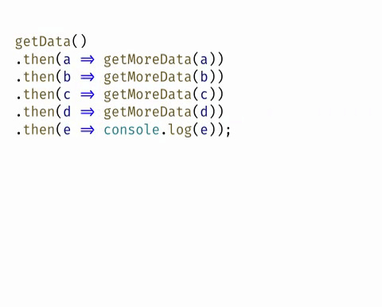
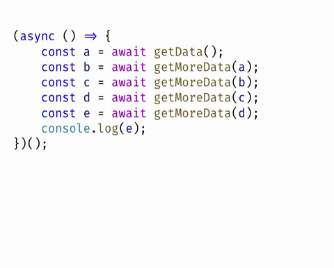

# 第14章 异步编程


回调函数（差）


Promise（好）



Async（更好）




## 回调函数

### 概念

- [知乎 - 回调函数（callback）是什么？](https://www.zhihu.com/question/19801131)

你寻求一个陌生人的帮助。

- 等待他帮你完成这件事儿
- 回去继续你的工作，**留一个电话给他（注册回调）**
  - 他帮我完整这件事儿之后我干嘛？
  - 我决定，他只需要把结果告诉我
  - 结果：有的结果由数据，有的结果无数据
- 当他完成打你的电话通知你（调用回调函数）

你到一个商店买东西，刚好你要的东西没有货，于是你在店员那里**留下了你的电话**，过了几天店里有货了，店员就**打了你的电话**，然后你接到电话后就到店里去取了货。在这个例子里，**你的电话号码就叫回调函数**，**你把电话留给店员就叫登记回调函数**，店里后来有货了叫做触发了回调关联的事件，**店员给你打电话叫做调用回调函数**，你到店里去取货叫做响应回调事件。回答完毕。 作者：常溪玲链接：https://www.zhihu.com/question/19801131/answer/13005983来源：知乎著作权归作者所有。商业转载请联系作者获得授权，非商业转载请注明出处。

我勒个去，一句话搞定的事，非得啰嗦那么多?

简单举例来说就是，我打电话找你帮忙办事，但是不确定什么时间办完，我让你办完了再电话通知我。我让你通知我就是我设定的回调函数！一般用于异步通信场景。如果我不挂电话，非等你办完了知道结果了再挂这就不属于异步通信，也无需回调！作者：柳明军链接：https://www.zhihu.com/question/19801131/answer/43799125来源：知乎著作权归作者所有。商业转载请联系作者获得授权，非商业转载请注明出处。

### JavaScript 回调函数

获取普通方法的返回值（方式一 return）：

```javascript
function add (x, y) {
  return x + y
}

const ret = fn() // => 123
```

获取普通方法的返回值（方式二 函数）：

```javascript
// 是不是傻？同步回调，闲的蛋疼！
function add (x, y, callback) {
  callback(x + y)
}

add(10, 20, function (ret) {
  console.log(ret)
})
```

对于上面的代码我们肯定会有疑问，是不是傻？干嘛搞这么麻烦，第一种明显就 OK 了，难道第二种只是一种方式问题吗，聪明人肯定会选择第一种。

那大家姑且就先把它当作一种方式吧，在这里是先让大家明白一个道理：**在 JavaScript 中函数也是一种数据类型，函数也可以当作参数进行传递** 。


那我们到底什么时候需要使用回调函数呢？

> 请记住： **当需要得到一个函数中的异步操作结果的时候，我们就必须使用回调函数了（上面的第二种方式）。**
>
> - 定时器
> - ajax
> - readFile、writeFile


请看下面的例子：


例如，获取一个函数中异步操作的结果：

```javascript
function fn () {
  setTimeout(function () {
    // 我想调用 fn 得到这里的 num
    const num = 123
  }, 1000)
}
```

想法一（行不通）：

```javascript
function fn () {
  console.log(1)
  setTimeout(function () {
    console.log(2)
    // 我想调用 fn 得到这里的 num
    const num = 123
    // 从返回值角度来讲，这里的 return 也只是返回给了当前的函数，而非外部的 fn 函数
    return num
  }, 1000)
  // 到这里 fn 函数就执行结束了，所以不可能得到里面 return 的结果
  console.log(3)
}
```

想法二（行不通）：

```javascript
function fn () {
  console.log(1, '函数开始执行')
  let num
  
  // 定时器是异步的，所以遇到定时器不会等待，函数会继续往后执行
  setTimeout(function () {
    console.log(2)
  
    // 我想调用 fn 得到这里的 num
    num = 123
  }, 1000)
  
  // 到这里 fn 函数就执行结束了（定时器还没有被调用），所以你拿到的 num 就是 undefined
  console.log(3)
}
```

正确的方式（通过函数来接收异步操作结果，这就是回调函数，因为不是立即调用，而是回头再调用）：

```javascript
// 2. 在 fn 函数中通过形参 callback 接收了 handler 函数
function fn (callback) {
  // var callback = handler
  // callback 就是我们的 handler
  console.log(1, '函数开始执行')
  
  // 定时器是异步的，所以遇到定时器不会等待，函数会继续往后执行
  setTimeout(function () {
    console.log(2)
  
    // 我想调用 fn 得到这里的 num
    const num = 123
    
    // 定时器操作结束，我们就可以在这里调用 callback（也就是我们的 handler）函数，把结果 num 传递给了该函数
    // 我们这里调用 callback 也就是在调用 handler
    callback(num)
  }, 1000)
  
  // 到这里 fn 函数就执行结束了（定时器还没有被调用），所以你拿到的 num 就是 undefined
  console.log(3)
}

function handler = function (data) {
  console.log('handler 函数被调用了：', data)
}

// 1. 这里把 handler 传递到了 fn 函数中
fn(handler)
```

上面的方式比较繁琐，我们没必要单独定义一个全局函数，我们可以可以在调用的时候直接传递一个匿名函数即可：

```javascript
function fn (callback) {
  setTimeout(function () {
    const num = 123
    callback(num)
  })
}

fn(function (data) {
  console.log('回调函数被执行了：', data)
})
```

### 示例：封装原生的 `ajax` 操作

> [MDN - Using XMLHttpRequest](https://developer.mozilla.org/zh-CN/docs/Web/API/XMLHttpRequest/Using_XMLHttpRequest)

```javascript
function reqListener () {
  console.log(this.responseText);
}

var oReq = new XMLHttpRequest();
oReq.onload = reqListener;
oReq.open("get", "yourFile.txt", true);
oReq.send();
```

### 示例：实现拷贝方法

已知 `fs.readFile` 可以读取文件，`fs.writeFile` 可以写文件。请帮我封装一个方法：`copy`。要求调用方式如下：

```javascript
copy('被复制文件', '复制到的目标文件', function (err) {
  // err 成功是 null 错误是一个 错误对象
})
```

### 示例：读取文件中的 todos 列表数据

已知一个 json 文件内容如下：

```json
{
  "todos": ["吃饭", "睡觉", "打豆豆"]
}
```

请帮我写一个方法，调用该方法得到的结果就是 todos **数组** 。

### 示例：把任务持久化保存到文件中

已知有一个 json 文件内容如下：

```json
{
  "todos": ["吃饭", "睡觉", "打豆豆"]
}
```

请帮我写一个方法，调用该方法可以帮我把指定的数据存储到 json 文件中的 todos 中。例如：

```javascript
// 该方法肯定是异步的，所以无论操作成功与否你都必须告诉我
// err 是错误的标志，如果有错你就告诉我，如果没错就给我一个 null
// 那调用者就可以通过 err 参数来判定 addTodo 的操作结果到底成功与否
addTodo('写代码', function (err) {
  
})
```

---

## 异常处理

- try-catch
- 回调函数 Error First
- **如果封装的函数中有错误，不要在函数中自行处理，一般是把错误对象放到回调函数的第一个参数，这是一种约定规则，错误优先，由调用者决定如何处理这个错误**
- 在自己封装的回调函数中不要自己处理错误
- 如果有错，则把错误对象作为回调函数的第一个参数传递给回调函数
- 错误优先：Error First

### try-catch 处理异常

### Callback 处理异常

### 问题：回调地狱


```javascript
const fs = require('fs')

fs.readFile('./data/a.txt', 'utf8', (err, dataA) => {
  if (err) {
    throw err
  }
  fs.readFile('./data/b.txt', 'utf8', (err, dataB) => {
    if (err) {
      throw err
    }

    fs.readFile('./data/c.txt', 'utf8', (err, dataC) => {
      if (err) {
        throw err
      }
      fs.writeFile('./data/d.txt', dataA + dataB + dataC, err => {
        if (err) {
          throw err
        }
        console.log('success')
      })
    })
  })
})

```


## Promise

- 一个容器，用来封装一个异步任务
- 三种状态
  - Pending
  - Resolved
  - Rejected
- 成功调用 resolve
- 失败调用 reject

### Promise 基本用法

### 几个例子

实例一：Promise 版本的定时器

```javascript
function sleep(time) {
  return new Promise((resolve, reject) => {
    setTimeout(function () {
      resolve()
    }, time)
  })
}

sleep(1000)
  .then(() => {
    console.log('吃饭')
    return sleep(2000)
  })
  .then(() => {
    console.log('睡觉')
    return sleep(3000)
  })
  .then(() => {
    console.log('坐火车回家')
  })
```

封装 Promise 版本的 `readFile` ：

```javascript
function readFile(...args) {
  return new Promise((resolve, reject) => {
    fs.readFile(...args, (err, data) => {
      err ? reject(err) : resolve(data)
    })
  })
}

readFile('./data/a.txt', 'utf8')
  .then(data => {
    console.log(data)
  })
```

另一个例子：读取文件

```javascript
function readFile(...args) {
  return new Promise((resolve, reject) => {
    fs.readFile(...args, (err, data) => {
      err ? reject(err) : resolve(data)
    })
  })
}

function writeFile(...args) {
  return new Promise((resolve, reject) => {
    fs.writeFile(...args, err => {
      err ? reject(err) : resolve()
    })
  })
}

let ret = ''

readFile('./data/a.txt', 'utf8')
  .then(data => {
    ret += data
    return readFile('./data/b.txt', 'utf8')
  })
  .then(data => {
    ret += data
    return readFile('./data/c.txt', 'utf8')
  })
  .then(data => {
    ret += data
    // fs.writeFile('./data/e.txt', ret, err => {
    // })
    return writeFile('./data/e.txt', ret)
  })
  .then(() => {
    console.log('success')
  })
```

示例：封装 Promise 版本的 ajax

```javascript
var ajax = {}

ajax.get = function (url) {
  return new Promise((resolve, reject) => {
    var oReq = new XMLHttpRequest();
    oReq.onload = function () {
      resolve(this.responseText)
    }
    oReq.open("get", url, true);
    oReq.send()
  })
}
```

带有业务的封装：

```javascript
var ajax = {}

ajax.get = function (url) {
  return new Promise((resolve, reject) => {
    var oReq = new XMLHttpRequest();
    oReq.onload = function () {
      // callback(this.responseText)
      resolve(this.responseText)
    }
    oReq.open("get", url, true);
    oReq.send()
  })
}

function duquabc() {
  return new Promise((resolve, reject) => {
    let ret = ''
    ajax.get('./data/a.txt')
      .then(data => {
      ret += data
      return ajax.get('./data/b.txt')
    })
      .then(data => {
      ret += data
      return ajax.get('./data/c.txt')
    })
      .then(data => {
      ret += data
      resolve(ret)
    })
  })
}

duquabc().then(ret => {
  console.log(ret)
})
```

### 错误处理

- then 方法的第二个参数
  - 仅捕获 Promise 本身的异常
- catch 方法（推荐）
  - 不仅可以捕获 Promise 的异常
  - 还是可以捕获 resolve 函数中的异常
  - 如果后面还有 then 无法阻止
- then 方法无法被阻止

### Promise.all()

### Promise.race()

## Async 函数

### 含义

ES2017 标准引入了 async 函数，使得异步操作变得更加方便。

async 函数是什么？一句话，它就是 Generator 函数的语法糖。

前文有一个 Generator 函数，依次读取两个文件。

```
const fs = require('fs');

const readFile = function (fileName) {
  return new Promise(function (resolve, reject) {
    fs.readFile(fileName, function(error, data) {
      if (error) return reject(error);
      resolve(data);
    });
  });
};

const gen = function* () {
  const f1 = yield readFile('/etc/fstab');
  const f2 = yield readFile('/etc/shells');
  console.log(f1.toString());
  console.log(f2.toString());
};
```

上面代码的函数`gen`可以写成`async`函数，就是下面这样。

```
const asyncReadFile = async function () {
  const f1 = await readFile('/etc/fstab');
  const f2 = await readFile('/etc/shells');
  console.log(f1.toString());
  console.log(f2.toString());
};
```

一比较就会发现，`async`函数就是将 Generator 函数的星号（`*`）替换成`async`，将`yield`替换成`await`，仅此而已。

`async`函数对 Generator 函数的改进，体现在以下四点。

（1）内置执行器。

Generator 函数的执行必须靠执行器，所以才有了`co`模块，而`async`函数自带执行器。也就是说，`async`函数的执行，与普通函数一模一样，只要一行。

```
asyncReadFile();
```

上面的代码调用了`asyncReadFile`函数，然后它就会自动执行，输出最后结果。这完全不像 Generator 函数，需要调用`next`方法，或者用`co`模块，才能真正执行，得到最后结果。

（2）更好的语义。

`async`和`await`，比起星号和`yield`，语义更清楚了。`async`表示函数里有异步操作，`await`表示紧跟在后面的表达式需要等待结果。

（3）更广的适用性。

`co`模块约定，`yield`命令后面只能是 Thunk 函数或 Promise 对象，而`async`函数的`await`命令后面，可以是 Promise 对象和原始类型的值（数值、字符串和布尔值，但这时会自动转成立即 resolved 的 Promise 对象）。

（4）返回值是 Promise。

`async`函数的返回值是 Promise 对象，这比 Generator 函数的返回值是 Iterator 对象方便多了。你可以用`then`方法指定下一步的操作。

进一步说，`async`函数完全可以看作多个异步操作，包装成的一个 Promise 对象，而`await`命令就是内部`then`命令的语法糖。

### 基本用法

`async`函数返回一个 Promise 对象，可以使用`then`方法添加回调函数。当函数执行的时候，一旦遇到`await`就会先返回，等到异步操作完成，再接着执行函数体内后面的语句。

下面是一个例子。

```
async function getStockPriceByName(name) {
  const symbol = await getStockSymbol(name);
  const stockPrice = await getStockPrice(symbol);
  return stockPrice;
}

getStockPriceByName('goog').then(function (result) {
  console.log(result);
});
```

上面代码是一个获取股票报价的函数，函数前面的`async`关键字，表明该函数内部有异步操作。调用该函数时，会立即返回一个`Promise`对象。

下面是另一个例子，指定多少毫秒后输出一个值。

```
function timeout(ms) {
  return new Promise((resolve) => {
    setTimeout(resolve, ms);
  });
}

async function asyncPrint(value, ms) {
  await timeout(ms);
  console.log(value);
}

asyncPrint('hello world', 50);
```

上面代码指定 50 毫秒以后，输出`hello world`。

由于`async`函数返回的是 Promise 对象，可以作为`await`命令的参数。所以，上面的例子也可以写成下面的形式。

```
async function timeout(ms) {
  await new Promise((resolve) => {
    setTimeout(resolve, ms);
  });
}

async function asyncPrint(value, ms) {
  await timeout(ms);
  console.log(value);
}

asyncPrint('hello world', 50);
```

async 函数有多种使用形式。

```
// 函数声明
async function foo() {}

// 函数表达式
const foo = async function () {};

// 对象的方法
let obj = { async foo() {} };
obj.foo().then(...)

// Class 的方法
class Storage {
  constructor() {
    this.cachePromise = caches.open('avatars');
  }

  async getAvatar(name) {
    const cache = await this.cachePromise;
    return cache.match(`/avatars/${name}.jpg`);
  }
}

const storage = new Storage();
storage.getAvatar('jake').then(…);

// 箭头函数
const foo = async () => {};
```

### 语法

`async`函数的语法规则总体上比较简单，难点是错误处理机制。

### 返回 Promise 对象

`async`函数返回一个 Promise 对象。

`async`函数内部`return`语句返回的值，会成为`then`方法回调函数的参数。

```
async function f() {
  return 'hello world';
}

f().then(v => console.log(v))
// "hello world"
```

上面代码中，函数`f`内部`return`命令返回的值，会被`then`方法回调函数接收到。

`async`函数内部抛出错误，会导致返回的 Promise 对象变为`reject`状态。抛出的错误对象会被`catch`方法回调函数接收到。

```
async function f() {
  throw new Error('出错了');
}

f().then(
  v => console.log(v),
  e => console.log(e)
)
// Error: 出错了
```

### Promise 对象的状态变化

`async`函数返回的 Promise 对象，必须等到内部所有`await`命令后面的 Promise 对象执行完，才会发生状态改变，除非遇到`return`语句或者抛出错误。也就是说，只有`async`函数内部的异步操作执行完，才会执行`then`方法指定的回调函数。

下面是一个例子。

```
async function getTitle(url) {
  let response = await fetch(url);
  let html = await response.text();
  return html.match(/<title>([\s\S]+)<\/title>/i)[1];
}
getTitle('https://tc39.github.io/ecma262/').then(console.log)
// "ECMAScript 2017 Language Specification"
```

上面代码中，函数`getTitle`内部有三个操作：抓取网页、取出文本、匹配页面标题。只有这三个操作全部完成，才会执行`then`方法里面的`console.log`。

### await 命令

正常情况下，`await`命令后面是一个 Promise 对象，返回该对象的结果。如果不是 Promise 对象，就直接返回对应的值。

```
async function f() {
  // 等同于
  // return 123;
  return await 123;
}

f().then(v => console.log(v))
// 123
```

上面代码中，`await`命令的参数是数值`123`，这时等同于`return 123`。

另一种情况是，`await`命令后面是一个`thenable`对象（即定义`then`方法的对象），那么`await`会将其等同于 Promise 对象。

```
class Sleep {
  constructor(timeout) {
    this.timeout = timeout;
  }
  then(resolve, reject) {
    const startTime = Date.now();
    setTimeout(
      () => resolve(Date.now() - startTime),
      this.timeout
    );
  }
}

(async () => {
  const actualTime = await new Sleep(1000);
  console.log(actualTime);
})();
```

上面代码中，`await`命令后面是一个`Sleep`对象的实例。这个实例不是 Promise 对象，但是因为定义了`then`方法，`await`会将其视为`Promise`处理。

`await`命令后面的 Promise 对象如果变为`reject`状态，则`reject`的参数会被`catch`方法的回调函数接收到。

```
async function f() {
  await Promise.reject('出错了');
}

f()
.then(v => console.log(v))
.catch(e => console.log(e))
// 出错了
```

注意，上面代码中，`await`语句前面没有`return`，但是`reject`方法的参数依然传入了`catch`方法的回调函数。这里如果在`await`前面加上`return`，效果是一样的。

任何一个`await`语句后面的 Promise 对象变为`reject`状态，那么整个`async`函数都会中断执行。

```
async function f() {
  await Promise.reject('出错了');
  await Promise.resolve('hello world'); // 不会执行
}
```

上面代码中，第二个`await`语句是不会执行的，因为第一个`await`语句状态变成了`reject`。

有时，我们希望即使前一个异步操作失败，也不要中断后面的异步操作。这时可以将第一个`await`放在`try...catch`结构里面，这样不管这个异步操作是否成功，第二个`await`都会执行。

```
async function f() {
  try {
    await Promise.reject('出错了');
  } catch(e) {
  }
  return await Promise.resolve('hello world');
}

f()
.then(v => console.log(v))
// hello world
```

另一种方法是`await`后面的 Promise 对象再跟一个`catch`方法，处理前面可能出现的错误。

```
async function f() {
  await Promise.reject('出错了')
    .catch(e => console.log(e));
  return await Promise.resolve('hello world');
}

f()
.then(v => console.log(v))
// 出错了
// hello world
```

### 错误处理

如果`await`后面的异步操作出错，那么等同于`async`函数返回的 Promise 对象被`reject`。

```
async function f() {
  await new Promise(function (resolve, reject) {
    throw new Error('出错了');
  });
}

f()
.then(v => console.log(v))
.catch(e => console.log(e))
// Error：出错了
```

上面代码中，`async`函数`f`执行后，`await`后面的 Promise 对象会抛出一个错误对象，导致`catch`方法的回调函数被调用，它的参数就是抛出的错误对象。具体的执行机制，可以参考后文的“async 函数的实现原理”。

防止出错的方法，也是将其放在`try...catch`代码块之中。

```
async function f() {
  try {
    await new Promise(function (resolve, reject) {
      throw new Error('出错了');
    });
  } catch(e) {
  }
  return await('hello world');
}
```

如果有多个`await`命令，可以统一放在`try...catch`结构中。

```
async function main() {
  try {
    const val1 = await firstStep();
    const val2 = await secondStep(val1);
    const val3 = await thirdStep(val1, val2);

    console.log('Final: ', val3);
  }
  catch (err) {
    console.error(err);
  }
}
```

下面的例子使用`try...catch`结构，实现多次重复尝试。

```
const superagent = require('superagent');
const NUM_RETRIES = 3;

async function test() {
  let i;
  for (i = 0; i < NUM_RETRIES; ++i) {
    try {
      await superagent.get('http://google.com/this-throws-an-error');
      break;
    } catch(err) {}
  }
  console.log(i); // 3
}

test();
```

上面代码中，如果`await`操作成功，就会使用`break`语句退出循环；如果失败，会被`catch`语句捕捉，然后进入下一轮循环。

### 使用注意点

第一点，前面已经说过，`await`命令后面的`Promise`对象，运行结果可能是`rejected`，所以最好把`await`命令放在`try...catch`代码块中。

```
async function myFunction() {
  try {
    await somethingThatReturnsAPromise();
  } catch (err) {
    console.log(err);
  }
}

// 另一种写法

async function myFunction() {
  await somethingThatReturnsAPromise()
  .catch(function (err) {
    console.log(err);
  });
}
```

第二点，多个`await`命令后面的异步操作，如果不存在继发关系，最好让它们同时触发。

```
let foo = await getFoo();
let bar = await getBar();
```

上面代码中，`getFoo`和`getBar`是两个独立的异步操作（即互不依赖），被写成继发关系。这样比较耗时，因为只有`getFoo`完成以后，才会执行`getBar`，完全可以让它们同时触发。

```
// 写法一
let [foo, bar] = await Promise.all([getFoo(), getBar()]);

// 写法二
let fooPromise = getFoo();
let barPromise = getBar();
let foo = await fooPromise;
let bar = await barPromise;
```

上面两种写法，`getFoo`和`getBar`都是同时触发，这样就会缩短程序的执行时间。

第三点，`await`命令只能用在`async`函数之中，如果用在普通函数，就会报错。

```
async function dbFuc(db) {
  let docs = [{}, {}, {}];

  // 报错
  docs.forEach(function (doc) {
    await db.post(doc);
  });
}
```

上面代码会报错，因为`await`用在普通函数之中了。但是，如果将`forEach`方法的参数改成`async`函数，也有问题。

```
function dbFuc(db) { //这里不需要 async
  let docs = [{}, {}, {}];

  // 可能得到错误结果
  docs.forEach(async function (doc) {
    await db.post(doc);
  });
}
```

上面代码可能不会正常工作，原因是这时三个`db.post`操作将是并发执行，也就是同时执行，而不是继发执行。正确的写法是采用`for`循环。

```
async function dbFuc(db) {
  let docs = [{}, {}, {}];

  for (let doc of docs) {
    await db.post(doc);
  }
}
```

如果确实希望多个请求并发执行，可以使用`Promise.all`方法。当三个请求都会`resolved`时，下面两种写法效果相同。

```
async function dbFuc(db) {
  let docs = [{}, {}, {}];
  let promises = docs.map((doc) => db.post(doc));

  let results = await Promise.all(promises);
  console.log(results);
}

// 或者使用下面的写法

async function dbFuc(db) {
  let docs = [{}, {}, {}];
  let promises = docs.map((doc) => db.post(doc));

  let results = [];
  for (let promise of promises) {
    results.push(await promise);
  }
  console.log(results);
}
```

目前，[`esm`](https://www.npmjs.com/package/esm)模块加载器支持顶层`await`，即`await`命令可以不放在 async 函数里面，直接使用。

```
// async 函数的写法
const start = async () => {
  const res = await fetch('google.com');
  return res.text();
};

start().then(console.log);

// 顶层 await 的写法
const res = await fetch('google.com');
console.log(await res.text());
```

上面代码中，第二种写法的脚本必须使用`esm`加载器，才会生效。

第四点，async 函数可以保留运行堆栈。

```
const a = () => {
  b().then(() => c());
};
```

上面代码中，函数`a`内部运行了一个异步任务`b()`。当`b()`运行的时候，函数`a()`不会中断，而是继续执行。等到`b()`运行结束，可能`a()`早就运行结束了，`b()`所在的上下文环境已经消失了。如果`b()`或`c()`报错，错误堆栈将不包括`a()`。

现在将这个例子改成`async`函数。

```
const a = async () => {
  await b();
  c();
};
```

上面代码中，`b()`运行的时候，`a()`是暂停执行，上下文环境都保存着。一旦`b()`或`c()`报错，错误堆栈将包括`a()`。

### async 函数的实现原理

async 函数的实现原理，就是将 Generator 函数和自动执行器，包装在一个函数里。

```
async function fn(args) {
  // ...
}

// 等同于

function fn(args) {
  return spawn(function* () {
    // ...
  });
}
```

所有的`async`函数都可以写成上面的第二种形式，其中的`spawn`函数就是自动执行器。

下面给出`spawn`函数的实现，基本就是前文自动执行器的翻版。

```
function spawn(genF) {
  return new Promise(function(resolve, reject) {
    const gen = genF();
    function step(nextF) {
      let next;
      try {
        next = nextF();
      } catch(e) {
        return reject(e);
      }
      if(next.done) {
        return resolve(next.value);
      }
      Promise.resolve(next.value).then(function(v) {
        step(function() { return gen.next(v); });
      }, function(e) {
        step(function() { return gen.throw(e); });
      });
    }
    step(function() { return gen.next(undefined); });
  });
}
```

### 与其他异步处理方法的比较

我们通过一个例子，来看 async 函数与 Promise、Generator 函数的比较。

假定某个 DOM 元素上面，部署了一系列的动画，前一个动画结束，才能开始后一个。如果当中有一个动画出错，就不再往下执行，返回上一个成功执行的动画的返回值。

首先是 Promise 的写法。

```
function chainAnimationsPromise(elem, animations) {

  // 变量ret用来保存上一个动画的返回值
  let ret = null;

  // 新建一个空的Promise
  let p = Promise.resolve();

  // 使用then方法，添加所有动画
  for(let anim of animations) {
    p = p.then(function(val) {
      ret = val;
      return anim(elem);
    });
  }

  // 返回一个部署了错误捕捉机制的Promise
  return p.catch(function(e) {
    /* 忽略错误，继续执行 */
  }).then(function() {
    return ret;
  });

}
```

虽然 Promise 的写法比回调函数的写法大大改进，但是一眼看上去，代码完全都是 Promise 的 API（`then`、`catch`等等），操作本身的语义反而不容易看出来。

接着是 Generator 函数的写法。

```
function chainAnimationsGenerator(elem, animations) {

  return spawn(function*() {
    let ret = null;
    try {
      for(let anim of animations) {
        ret = yield anim(elem);
      }
    } catch(e) {
      /* 忽略错误，继续执行 */
    }
    return ret;
  });

}
```

上面代码使用 Generator 函数遍历了每个动画，语义比 Promise 写法更清晰，用户定义的操作全部都出现在`spawn`函数的内部。这个写法的问题在于，必须有一个任务运行器，自动执行 Generator 函数，上面代码的`spawn`函数就是自动执行器，它返回一个 Promise 对象，而且必须保证`yield`语句后面的表达式，必须返回一个 Promise。

最后是 async 函数的写法。

```
async function chainAnimationsAsync(elem, animations) {
  let ret = null;
  try {
    for(let anim of animations) {
      ret = await anim(elem);
    }
  } catch(e) {
    /* 忽略错误，继续执行 */
  }
  return ret;
}
```

可以看到 Async 函数的实现最简洁，最符合语义，几乎没有语义不相关的代码。它将 Generator 写法中的自动执行器，改在语言层面提供，不暴露给用户，因此代码量最少。如果使用 Generator 写法，自动执行器需要用户自己提供。

### 实例：按顺序完成异步操作

实际开发中，经常遇到一组异步操作，需要按照顺序完成。比如，依次远程读取一组 URL，然后按照读取的顺序输出结果。

Promise 的写法如下。

```
function logInOrder(urls) {
  // 远程读取所有URL
  const textPromises = urls.map(url => {
    return fetch(url).then(response => response.text());
  });

  // 按次序输出
  textPromises.reduce((chain, textPromise) => {
    return chain.then(() => textPromise)
      .then(text => console.log(text));
  }, Promise.resolve());
}
```

上面代码使用`fetch`方法，同时远程读取一组 URL。每个`fetch`操作都返回一个 Promise 对象，放入`textPromises`数组。然后，`reduce`方法依次处理每个 Promise 对象，然后使用`then`，将所有 Promise 对象连起来，因此就可以依次输出结果。

这种写法不太直观，可读性比较差。下面是 async 函数实现。

```
async function logInOrder(urls) {
  for (const url of urls) {
    const response = await fetch(url);
    console.log(await response.text());
  }
}
```

上面代码确实大大简化，问题是所有远程操作都是继发。只有前一个 URL 返回结果，才会去读取下一个 URL，这样做效率很差，非常浪费时间。我们需要的是并发发出远程请求。

```
async function logInOrder(urls) {
  // 并发读取远程URL
  const textPromises = urls.map(async url => {
    const response = await fetch(url);
    return response.text();
  });

  // 按次序输出
  for (const textPromise of textPromises) {
    console.log(await textPromise);
  }
}
```

上面代码中，虽然`map`方法的参数是`async`函数，但它是并发执行的，因为只有`async`函数内部是继发执行，外部不受影响。后面的`for..of`循环内部使用了`await`，因此实现了按顺序输出。